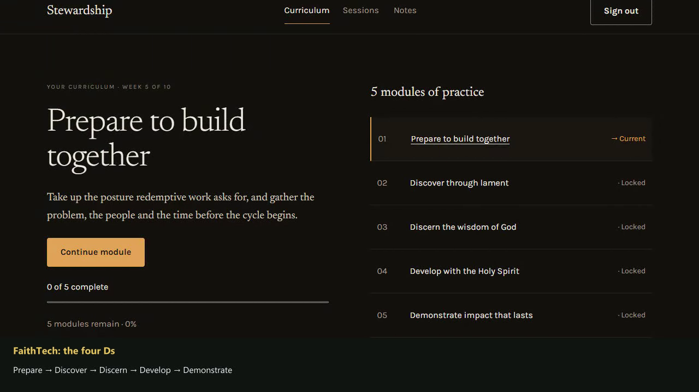

# Stewardship participant demo

A narrated participant walkthrough with the real Angular application, HTTPS API,
and SQL Server persistence. Microsoft David Desktop supplies the Windows male
synthetic narration selected for this run. Windows does not identify this voice
as Black. There is no music or external speech service.

<!-- generated-demo:start -->
**Recorded and reviewed:** 2026-09-07. [Watch the narrated walkthrough](stewardship-participant.webm).

[](stewardship-participant.webm)

5:32 (332.12 seconds) · 1280 × 720 · 10.62 MiB · VP9 / Opus.

[Captions](stewardship-participant.vtt) · [Transcript](stewardship-participant-transcript.md) · [Chapter metadata](stewardship-participant-chapters.json) · [Verification](stewardship-participant-verification.json)

| Time | Verified workflow |
| --- | --- |
| 0:00 | Welcome to Stewardship |
| 0:23 | FaithTech: the four Ds |
| 0:50 | Read, practise, prepare |
| 1:20 | Progress that stays with you |
| 1:50 | Save a reflection |
| 2:18 | Make time with your mentor |
| 2:52 | Bring a thoughtful question |
| 3:17 | Develop: the five Rs |
| 3:43 | Request and Receive |
| 4:01 | Review and Render |
| 4:22 | Rejoice, then begin again |
| 4:46 | Carry the programme with you |
| 5:12 | Continue with intention |

All 13 chapters passed against the real API (108 observed HTTP responses; no unexpected failures or browser exceptions). Full media decode, normal-speed browser playback, and chapter-frame visual review passed. Cleanup completed without errors.

Source base revision: `e041a87476c0de25c12e190f6aaa2f1d3c5f73f3`, plus the recording changes delivered alongside these artifacts. SHA-256: `d8f060d2054378699827e6a500acebea49090038e17767cf06cbafe5d36b9969`.
<!-- generated-demo:end -->

## Application inventory

| Application         | Audience and purpose                                    | Entrypoint / run command                                                   | Surface                                                   | Status                                                              |
| ------------------- | ------------------------------------------------------- | -------------------------------------------------------------------------- | --------------------------------------------------------- | ------------------------------------------------------------------- |
| Stewardship web app | Participants: learn, reflect, and meet a mentor         | `npm run build`, then API host                                             | `https://localhost:7340` during capture                   | Recorded status above                                               |
| Stewardship API     | Integrators: curriculum, notes, sessions, and authoring | `dotnet run --project backend/src/QuinntyneBrownStewardship.Api`           | HTTPS JSON endpoints; SQL Server; cookie session and CSRF | Separate video excluded by user scope; real dependency in web video |
| Stewardship CLI     | Operators: migrate, provision, import, enroll           | `dotnet run --project backend/src/QuinntyneBrownStewardship.Cli -- <verb>` | Terminal and SQL Server                                   | Separate video excluded by user scope; used for preparation         |
| Design-system site  | Designers and engineers: tokens and component catalogue | `npm --prefix design-system start`                                         | Independent static site at `http://localhost:4318`        | Separate video excluded by user scope                               |

The Angular libraries, tests, build scripts, and demo player are not additional
product applications. Administrator authoring is part of the web application but
is outside this participant walkthrough.

## Reproduce on Windows

Working directory: repository root. Prerequisites: PowerShell 7, Windows
PowerShell 5.1 with System.Speech and **Microsoft David Desktop**, Node 22.21+,
.NET SDK 10.0.101 (or the repository's compatible .NET 10 feature band), SQL
Server LocalDB, Google Chrome, and a full FFmpeg build with `ffprobe`, VP9, Opus,
and libass support. Use the HTTPS development certificate from normal setup.

```powershell
npm ci
npm --prefix frontend ci
npm --prefix design-system ci
npm --prefix e2e ci
npm install --global @playwright/cli@0.1.0
dotnet dev-certs https --trust
$env:FFMPEG_PATH = 'C:/tools/ffmpeg/bin/ffmpeg.exe'
node --test scripts/tests/build-curriculum.test.mjs
pwsh -NoProfile -File scripts/record-participant-demo.ps1 -Port 7340
```

Set `PLAYWRIGHT_CLI_PATH` if the CLI entrypoint is installed elsewhere. The runner
also recognizes the earlier full FFmpeg distribution under `.local/live-demo/ffmpeg/`
and a repository-local SDK under `.local/dotnet`. To install that exact SDK using
Microsoft's official installer when needed:

```powershell
New-Item -ItemType Directory -Force .local | Out-Null
Invoke-WebRequest https://builds.dotnet.microsoft.com/dotnet/scripts/v1/dotnet-install.ps1 -OutFile .local/dotnet-install.ps1
& .local/dotnet-install.ps1 -Version 10.0.101 -Architecture x64 -InstallDir "$PWD/.local/dotnet" -NoPath
```

The runner prints its unique `.local/participant-demo-<id>` directory. It builds,
generates narration, seeds, rehearses with a separate participant, captures the
real participant, renders, and verifies. Each run owns its server on the chosen
HTTPS port and the HTTP redirect port 2000 below it. It refuses occupied ports.
`-SkipBuild` is available only when the production build and generated curriculum
are already current. Normal reruns should omit it. `-RehearseOnly` verifies fresh
preparation, all participant workflows, and cleanup without making another video.

The startup health probe allows two retries only for a connection reset, using
[Playwright's transport retry option](https://playwright.dev/docs/api/class-apirequestcontext#api-request-context-get-option-max-retries).
It still requires HTTP 200 and a Healthy database response. Scenes and takes have
no automatic retries.

All child steps have finite deadlines. In `finally`, the runner checks process
identity, stops the owned API, and drops only the exact uniquely named demo
database recorded for the run. It restores changed environment settings and
records cleanup errors explicitly. It never resets the development database or
starts with reset-on-start configuration. The existing LocalDB infrastructure
can remain running. Raw captures, audio clips, credentials, logs, and failure
artifacts remain ignored in the run directory, which is not served by the player.

After the runner succeeds, review and promote its encoded artifact:

```powershell
$env:DEMO_OUTPUT = 'C:/projects/quinntyne-brown-stewardship/.local/participant-demo-<id>'
node e2e/demo/participant-review.mjs
# Inspect the decoded PNGs under $env:DEMO_OUTPUT/review as well as normal-speed playback.
# After inspection, record the exact inspected video hash and your observations:
$media = Get-Content "$env:DEMO_OUTPUT/media-verification.json" -Raw | ConvertFrom-Json
@{sha256=$media.sha256; notes='Describe the opening, chapter frames, captions, mobile framing, and ending you inspected.'} | ConvertTo-Json | Set-Content "$env:DEMO_OUTPUT/visual-review.json"
node e2e/demo/participant-promote.mjs
```

The review command plays the complete encoded WebM at normal speed in Chrome,
checks playback without seeking, and extracts chapter frames. Visual review
checks the opening, every chapter, captions, mobile centering, and the ending.
Promotion verifies matching media, playback, and visual-review hashes, then
backs up and replaces the video, poster, metadata, captions, transcript, and
generated README section together. A failure restores the previous set and
preserves unrelated files and manual README content.

Individual stages can be rerun with the same `DEMO_OUTPUT`:
`node e2e/demo/participant-render.mjs --narrate`,
`node e2e/demo/participant-render.mjs`, and
`node e2e/demo/participant-verify.mjs`. Recording itself requires fresh
preparation and a running isolated API, so rerun the orchestrator for another
take. A failed take is never spliced into the successful recording.

## Curriculum and demonstrated behavior

The import uses the existing five-module [manuscript](../curriculum/starter.md)
and generated CLI JSON, with stable module identifiers. The run imports drafts
through the CLI, explicitly publishes them in disposable fixture storage, and
provisions accounts, mentors, cohort enrollment, and availability. Publication,
historical notes/bookings, and starting completions are setup fixtures. All
participant actions shown in the video use real services and persistence; no
HTTP responses are mocked and no authentication is bypassed.

The original participant starts with two completed Prepare sections. The advanced
participant has completed Prepare through Develop, making all five R readings
available for review. The narration identifies this account switch. The footage
does not claim that these prerequisites were completed during the take.

FaithTech's [Playbook](https://www.faithtech.com/playbook) supplies Discover,
Discern, Develop, and Demonstrate. The [Workbook](https://github.com/FaithTechCreate/workbook)
is adapted under [CC BY 4.0](https://creativecommons.org/licenses/by/4.0/).
[Liturgy](https://github.com/QuinntyneBrown/Liturgy) corroborates Request, Receive,
Review, Render, and Rejoice inside Develop. Source review: September 7, 2026.
Stewardship's teaching is an adaptation; FaithTech does not endorse this software.
The demo does not claim Liturgy's board or phase-gate functionality.

See [acceptance criteria](acceptance.md), [recording scenes](../../e2e/demo/participant-scenes.mjs),
and [module page object](../../e2e/demo/page-objects/module-page.mjs).
The Windows curriculum-generator regression check verifies that CRLF manuscripts
retain preparation prompts instead of turning them into an extra reading section.
No application API, schema, or frontend service contract changes are required.

Burned-in captions summarize chapter outcomes after their assertions pass.
The separate WebVTT provides the complete spoken transcript in sentence cues;
sentence timing is apportioned within each measured audio clip, not word alignment.
The WebM preserves the continuous take; rendering adds narration and a caption
strip and centers the mobile footage without scaling it down.
