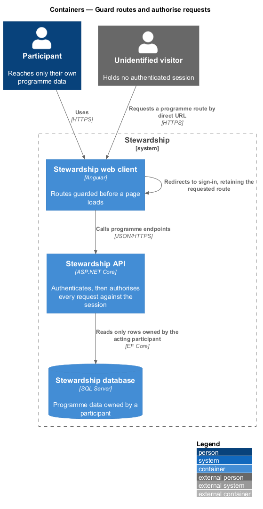
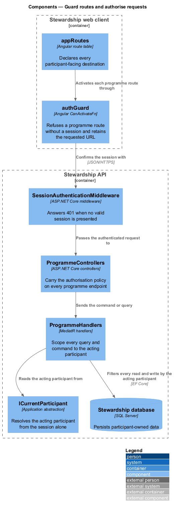
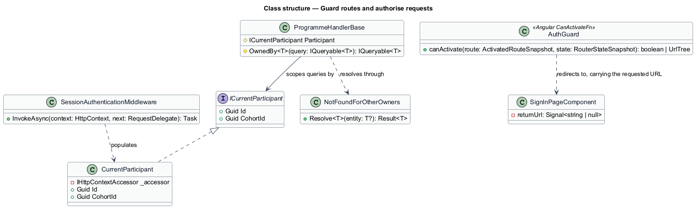
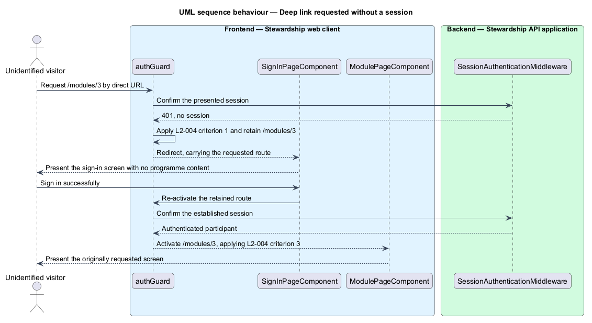
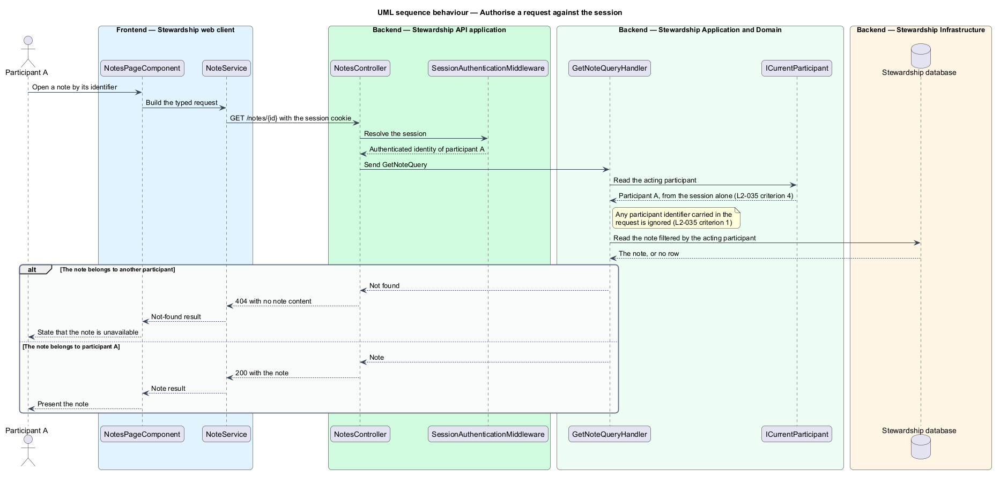

# Guard routes and authorise requests

## Overview

Stewardship holds a participant's progress, their bookings, and their private notes.
Two rules protect that material, and this feature owns both. Nothing programme-related
is reachable without an authenticated session, and a participant holding a session
reaches only their own data.

**programme route** — participant-facing destination that presents cohort content:
the curriculum, a module, the sessions screen, or the notes destination

**acting participant** — participant whose identity the API derives from the presented
session, and against whom every read and write is scoped

The first rule operates in two places. The Angular route guard refuses a programme
route in the browser, and the API answers `401` to any programme endpoint called
without a valid session. The guard exists for the participant's benefit, so a direct
URL leads to the sign-in screen rather than a broken page; the API check is the one
that actually protects the data, because a client can be bypassed and an HTTP call
cannot.

The second rule fixes where identity comes from. The acting participant is read from
the session and from nowhere else — never from a route parameter, a query string, or a
request body. A request naming another participant's resource is answered `404` rather
than `403`, so the response discloses nothing about whether that resource exists.

Establishing the session belongs to `sign-in`, and its lifetime to `maintain-session`.
Validating the shape of what a request carries belongs to `platform/secure-boundary`.

## Description

**Web client.**

- **`appRoutes`** — the route table in the application project. Every programme route
  is declared with the guard attached; the sign-in route is the only one without it.
- **`authGuard`** — functional `CanActivateFn` in the application project. It confirms
  the session, and on refusal returns a `UrlTree` to the sign-in route carrying the
  requested URL, so the retained destination is a routing value rather than stored
  state.
- **`SignInPageComponent`** — holds the retained route in a signal and navigates to it
  once sign-in succeeds.

**API.**

- **`SessionAuthenticationMiddleware`** — shared with `maintain-session`. It resolves
  the session cookie and answers `401` before any controller runs.
- **`ProgrammeControllers`** — the participant-facing controllers, each carrying the
  authorisation policy. No programme endpoint is reachable anonymously.
- **`ICurrentParticipant`** — application abstraction exposing the acting participant
  and their cohort. **`CurrentParticipant`** implements it over the authenticated
  session claims, in `Infrastructure`. A handler that needs to know who is asking
  injects the abstraction, so no handler reads identity out of a request object.
- **`ProgrammeHandlerBase`** — base type giving handlers `OwnedBy<T>`, which applies the
  acting participant to a query before it reaches the database. Scoping is applied at
  the query rather than checked after the read, so a row belonging to another
  participant is never loaded into memory.
- **`NotFoundForOtherOwners`** — resolves an absent or unowned entity to the same
  not-found result, which is what makes the two indistinguishable to a caller.

The two components together give one property worth stating plainly: an unowned
resource and a non-existent resource produce identical responses.

## Requirements

The feature realises the following level-2 (L2) requirements. Each L2 requirement
refines a level-1 (L1) requirement, cited by identifier. Requirement text is quoted from
`docs/specs/L2.md` unchanged.

| L2 ID | Refines (L1) | Requirement |
|-------|--------------|-------------|
| `L2-004` | `L1-001` | Every participant-facing route and every programme API endpoint must require an authenticated session. |
| `L2-035` | `L1-009` | Identity from the session, never from the request body, determines what data is returned. A participant reaches only their own data. |

## Diagrams

### Containers

An unidentified visitor reaching a programme route by direct URL is turned back by the
web client, and the API refuses the same call independently. A context view is omitted:
the visitor and the participant are the only parties, and both already appear here.

### Components

The guard and the route table sit in the web client; the middleware, the controllers,
`ICurrentParticipant`, and the handlers sit in the API. The two enforcement points are
independent — neither relies on the other having run.

### Class structure

`CurrentParticipant` realises `ICurrentParticipant`, and `ProgrammeHandlerBase` scopes
its queries through it. `NotFoundForOtherOwners` collapses the unowned and the absent
cases into one result.

### Behaviour — deep link requested without a session

The guard retains the requested route, the visitor signs in, and the retained route is
re-activated. L2-004 criterion 1 governs the refusal and criterion 3 the return.

### Behaviour — authorise a request against the session

The handler reads the acting participant from `ICurrentParticipant` and applies it to
the query. A note belonging to another participant leaves by the not-found path with no
content, which is what L2-035 criterion 1 requires.

