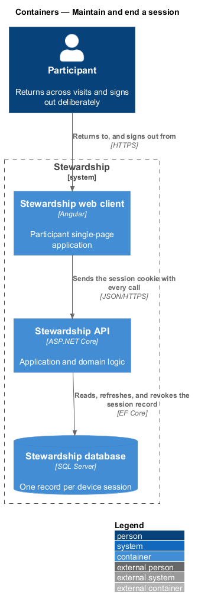
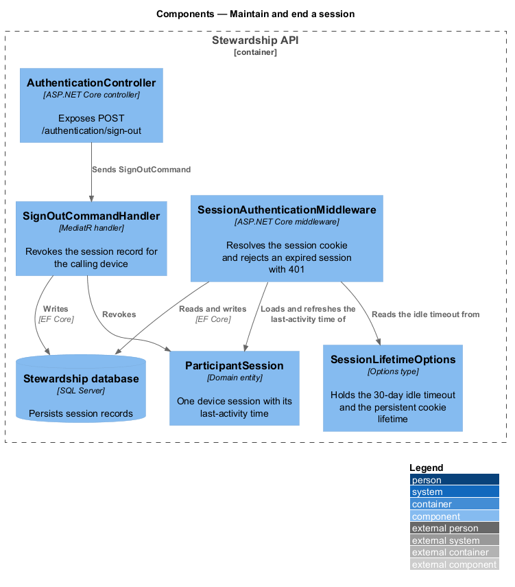
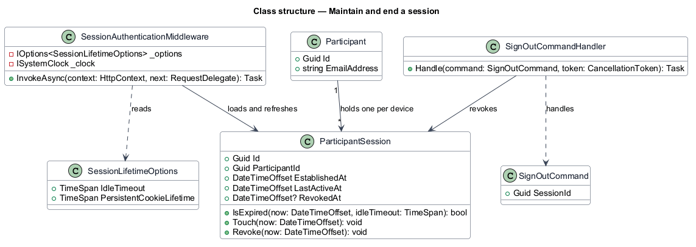
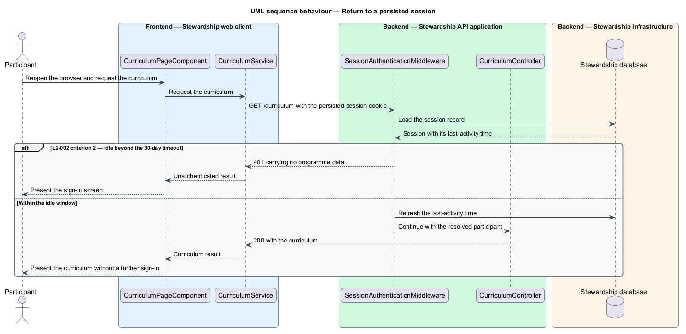
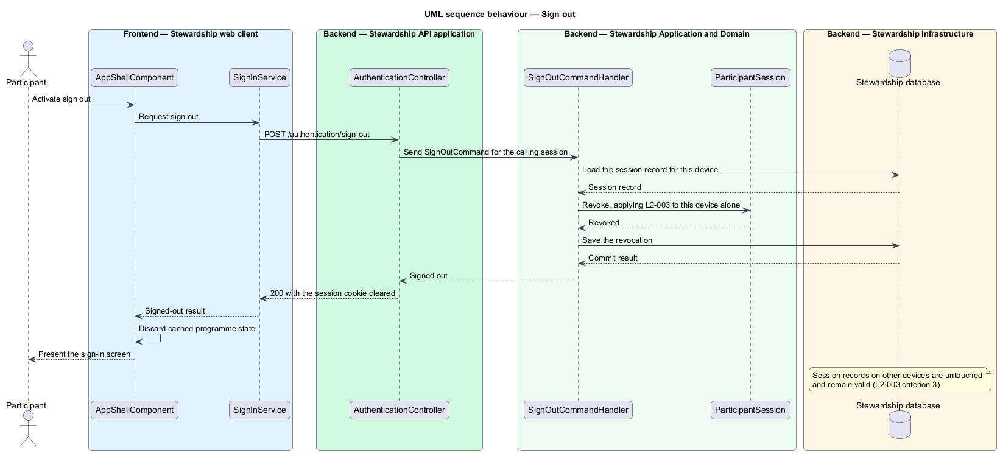

# Maintain and end a session

## Overview

A participant returns to Stewardship over the weeks of a cohort, often from more
than one device, and neither signs in on every visit nor stays signed in indefinitely.
This feature governs the life of an authenticated session between the moment sign-in
creates it and the moment it ends.

**device session** — record of one browser's authenticated association with one
participant, distinct from that participant's sessions on other devices

**idle timeout** — interval of inactivity after which a device session ceases to be valid

A session survives closing and reopening the browser, because the cookie carrying it is
persistent rather than tied to the browser process. It ends in one of two ways: it falls
idle past the timeout, or the participant signs out. Signing out is scoped to the device
in use — a participant signed in on a phone and a laptop who signs out on the laptop
keeps the phone session.

The two lifetime criteria in L2-002 resolve to a single rule. A return within 14 days of
closing the browser requires no further sign-in, and a session idle for 30 days requires
one. A persistent cookie with a 30-day idle timeout, refreshed on activity, satisfies
both, because the shorter interval falls inside the longer.

Establishing the session belongs to the `sign-in` feature. Refusing content to a visitor
holding no session belongs to `guard-routes`.

## Description

- **`AppShellComponent`** — routed shell component in the application project. It owns
  the header, offers the sign-out action, and discards cached programme state once the
  call returns.
- **`ISignInService`** / **`SIGN_IN_SERVICE`** / **`SignInService`** — the contract, its
  `InjectionToken`, and the HTTP implementation in the `api` library, shared with the
  `sign-in` feature. The shell calls `inject(SIGN_IN_SERVICE)` and reaches no concrete
  implementation.
- **`AuthenticationController`** — ASP.NET Core controller exposing
  `POST /authentication/sign-out`.
- **`SignOutCommand`** and **`SignOutCommandHandler`** — the request and the MediatR
  handler that revokes the calling device's session record.
- **`SessionAuthenticationMiddleware`** — ASP.NET Core middleware that resolves the
  session cookie on every request, loads the session record, answers `401` for an
  expired or revoked session, and refreshes the last-activity time otherwise.
- **`ParticipantSession`** — domain entity for one device session. It owns `IsExpired`,
  `Touch`, and `Revoke`, so the expiry rule lives in the domain rather than in
  middleware.
- **`SessionLifetimeOptions`** — Options type bound from configuration, holding the idle
  timeout and the persistent cookie lifetime. Both intervals are configuration rather
  than constants in code.
- **`ISystemClock`** — application abstraction over the current time, so an expiry
  boundary is exercised in a test without waiting for it.

Revocation is recorded state on the session rather than a deletion, so a revoked session
is distinguishable from one that never existed. The shell discards its cached programme
state on sign-out, which is what prevents the browser back button from re-presenting
content the participant has just left.

## Requirements

The feature realises the following level-2 (L2) requirements. Each L2 requirement
refines a level-1 (L1) requirement, cited by identifier. Requirement text is quoted from
`docs/specs/L2.md` unchanged.

| L2 ID | Refines (L1) | Requirement |
|-------|--------------|-------------|
| `L2-002` | `L1-001` | An authenticated session must survive browser restarts for a bounded lifetime and must end on expiry. |
| `L2-003` | `L1-001` | A participant must be able to end their session deliberately from the device in use. |

## Diagrams

### Containers

Every call from the web client carries the session cookie, and the API keeps one record
per device in the database. A context view is omitted: no party outside the system takes
part, so it would restate the container view with less detail.

### Components

`SessionAuthenticationMiddleware` reads the idle timeout from `SessionLifetimeOptions`
and refreshes `ParticipantSession` on each request. Sign-out takes a separate path
through `AuthenticationController` to `SignOutCommandHandler`.

### Class structure

`ParticipantSession` owns the expiry and revocation rules. One participant holds many
session records, one per device, which is what makes a per-device sign-out possible.

### Behaviour — return to a persisted session

The middleware decides before any controller runs. A session idle past the timeout
answers `401` carrying no programme data (L2-002 criteria 2 and 3); a session inside the
window has its last-activity time refreshed and the request proceeds.

### Behaviour — sign out

The handler revokes only the session record belonging to the calling device, and the
shell discards its cached state so no programme content survives in the browser history.

