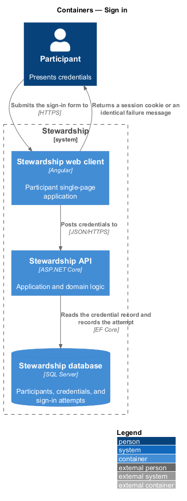
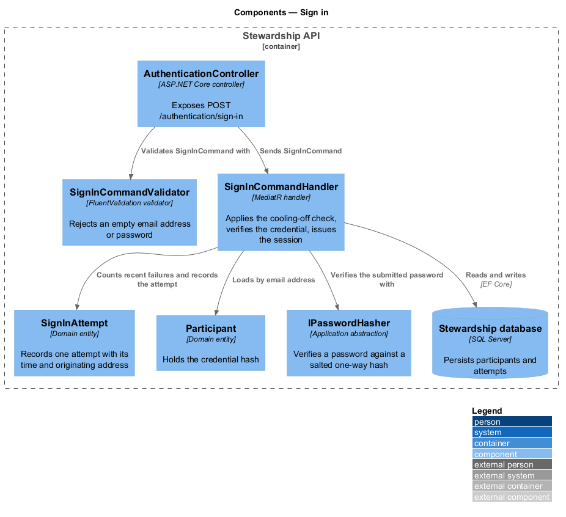
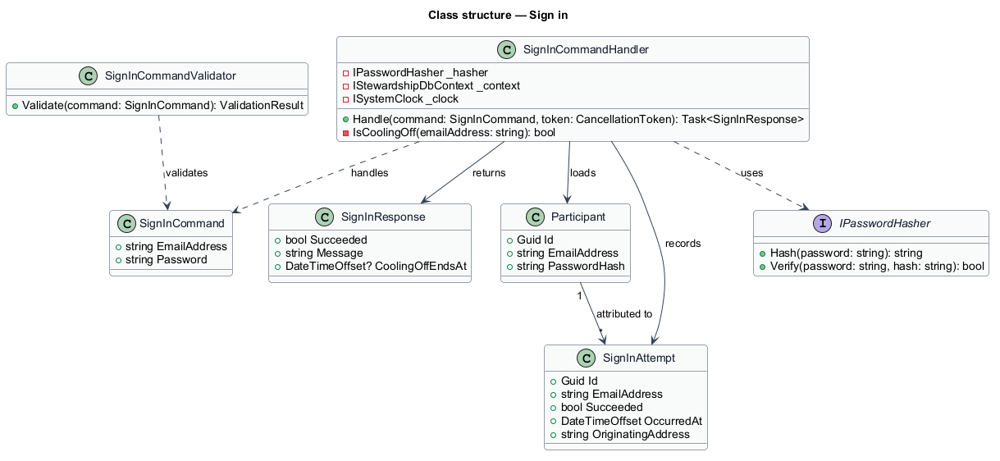
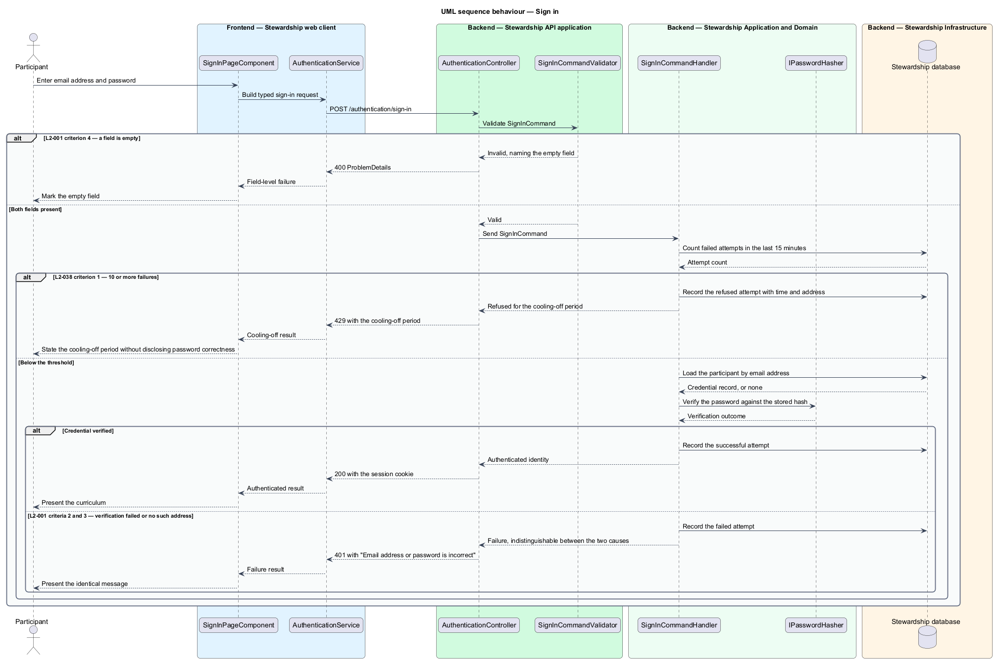

# Sign in

## Overview

Stewardship is a responsive web application through which a participant learns to build
redemptive technology by way of a structured curriculum, twelve learning modules, and
1-on-1 sessions with a mentor. None of that content is reachable by an unidentified
visitor, so establishing identity is the first thing the system does.

**participant** — person enrolled in a Stewardship cohort

**authenticated session** — server-recognised association between a browser and one
participant, established by a successful sign-in

**cooling-off period** — interval during which further sign-in attempts for one email
address are refused regardless of the password submitted

This feature covers the act of presenting a registered email address and password and
receiving an authenticated session in return. Two properties shape the design more than
the happy path does. A failure discloses nothing about whether the submitted address is
registered: the message and the response time are the same whether the address is
unknown or the password is wrong. Repeated failures for one address slow to a stop, so
that guessing a password becomes impractical.

Sign-in sits at the edge of the `access` subsystem. What happens to the session
afterwards — how long it survives, how it ends — belongs to the `maintain-session`
feature, and the refusal of content to visitors who never signed in belongs to
`guard-routes`.

## Description

The slice runs from the sign-in page to the credential store.

- **`SignInPageComponent`** — routed Angular page component in the application project.
  It owns the form, holds its state in signals, and presents the outcome.
- **`ISignInService`** / **`SIGN_IN_SERVICE`** / **`SignInService`** — the contract, its
  `InjectionToken`, and the HTTP implementation, each in its own file in the `api`
  library. `SignInPageComponent` calls `inject(SIGN_IN_SERVICE)` and never references
  the implementation, so a Playwright run binds the token to a mock instead.
- **`AuthenticationController`** — ASP.NET Core controller exposing
  `POST /authentication/sign-in`. It binds, dispatches through MediatR, and returns.
- **`SignInCommand`** — request object carrying `EmailAddress` and `Password`.
- **`SignInCommandValidator`** — FluentValidation validator that refuses an empty email
  address or an empty password before the command reaches the handler.
- **`SignInCommandHandler`** — MediatR handler holding the application logic. It applies
  the cooling-off check, loads the credential record, verifies the password, records the
  attempt, and issues the session.
- **`SignInResponse`** — result carrying the outcome, the single failure message, and
  the end of any cooling-off period.
- **`Participant`** — domain entity holding the email address and the password hash.
- **`SignInAttempt`** — domain entity recording one attempt with its outcome, its time,
  and its originating address. The count of recent failures for an address is read from
  these records rather than held as a counter on the participant.
- **`IPasswordHasher`** — application abstraction over the password-hashing algorithm,
  implemented in `Infrastructure`. The handler verifies through it and never compares
  password text.

The handler evaluates the cooling-off check before it loads the credential record, so a
refusal during cooling-off cannot be distinguished by timing from any other refusal.
The failure path performs the same hash verification whether or not the address
resolves to a participant, which is what keeps the two failures indistinguishable in
duration.

The exact hashing algorithm and work factor are `<TO SUPPLY>`; L2-037 requires a salted
one-way hash from a current algorithm and is designed in `platform/secure-boundary`.

## Requirements

The feature realises the following level-2 (L2) requirements. Each L2 requirement
refines a level-1 (L1) requirement, cited by identifier. Requirement text is quoted from
`docs/specs/L2.md` unchanged.

| L2 ID | Refines (L1) | Requirement |
|-------|--------------|-------------|
| `L2-001` | `L1-001` | A participant must present a registered email address and password to obtain an authenticated session. Failed attempts must not reveal whether the email address is registered. |
| `L2-038` | `L1-009` | Credential guessing is slowed at the account and the origin. |

## Diagrams

### Containers

The credentials travel from the Angular web client to the Stewardship API, which reads
the credential record and writes the attempt record in the Stewardship database. A
context view is omitted: no party outside the system takes part in signing in, so it
would restate the container view with less detail.

### Components

Inside the API, `AuthenticationController` validates and dispatches, and
`SignInCommandHandler` reaches three collaborators — the attempt records for the
cooling-off check, the participant record for the credential, and `IPasswordHasher` for
verification.

### Class structure

`SignInCommandHandler` handles `SignInCommand` and returns `SignInResponse`. It depends
on `IPasswordHasher` rather than a concrete algorithm, loads `Participant`, and records
`SignInAttempt`. One participant accumulates many attempts.

### Behaviour — sign in

The sequence shows all three outcomes in one view. Validation refuses an empty field
(L2-001 criterion 4). The cooling-off branch applies L2-038 criterion 1 and answers
without disclosing whether the password was correct. Both remaining failures — an
unregistered address and a wrong password — leave by the same path with the same
message, which is what L2-001 criteria 2 and 3 require.

