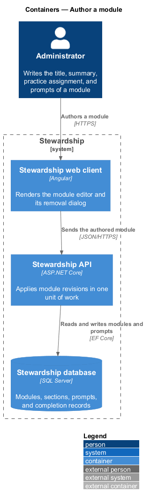
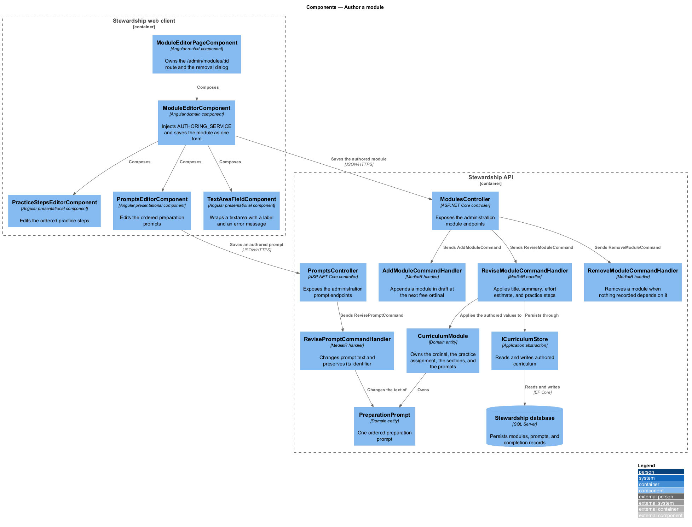
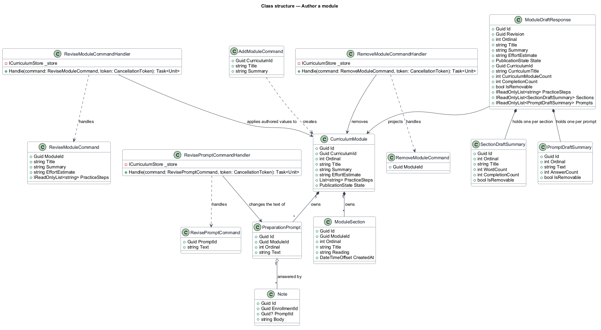
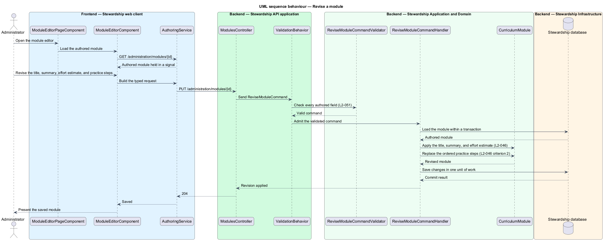
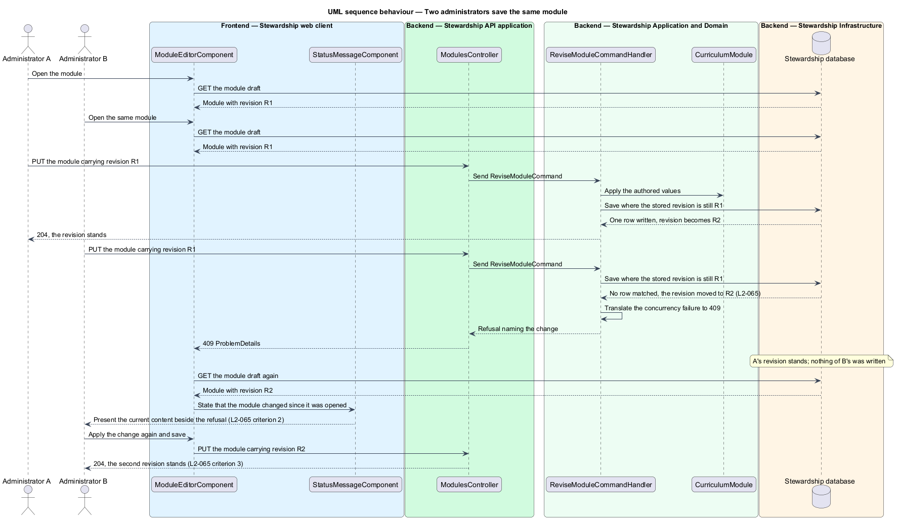
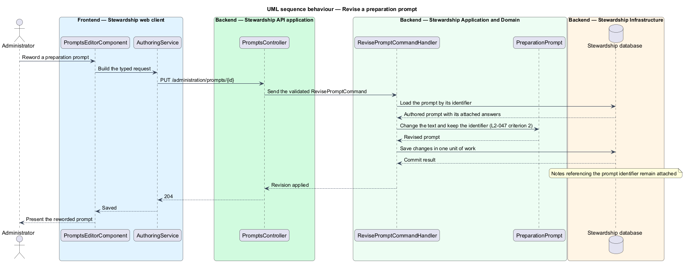

# Author a module

## Overview

A module is one week of a Stewardship programme, and it is the unit an administrator
spends most of their time in. It carries what a participant reads about the week, the
practice assignment they attempt, and the prompts that prepare them for the session that
follows. This feature is the editor for all three.

**module** — one ordered unit of a programme, owning its sections, its practice
assignment, and its preparation prompts

**practice assignment** — the effort estimate and the ordered steps a participant attempts
after reading a module

**preparation prompt** — question authored against a module and carried to the session
that follows it

A module is created within a programme, takes a title and a summary, and is placed last in
the programme's order (L2-045 criterion 1). It is created in draft, so adding a module to a
programme participants are already reading does not disturb them until the programme is
published again.

The practice assignment is authored, not derived. An effort estimate and an ordered list of
steps belong to the module, and both reach a participant exactly as authored (L2-046).
Steps are reordered and removed on this screen, and the remaining steps keep a contiguous
order, so no gap appears in what a participant reads. A module carrying no steps renders no
empty practice area, which keeps a partly authored module readable rather than broken.

Preparation prompts are authored the same way and travel further. A prompt written here
appears against the session that follows its module (L2-047 criterion 1), and a participant
answer already attached to a prompt survives a revision of the prompt text (L2-047
criterion 2). Revising the wording of a question does not discard the answer someone gave
it.

Removal is bounded by what participants have recorded. A module is removable while nothing
recorded depends on it (L2-045 criterion 3). Three kinds of record can depend on it: a
completed section, a note attached to the module, and an answered preparation prompt. All
three are counted before anything is removed, because the module removal cascades to the
sections and prompts it owns and would otherwise fail against their foreign keys rather
than against the rule. That rule, and the refusals it produces, are designed in
`administration/author-section`.

The editor guards unsaved work. An administrator who has changed the title, the summary,
the effort estimate, a practice step, or a prompt and has not saved it is warned before a
navigation or a tab close discards the change (L2-063). The warning is driven by a single
`dirty` signal over the whole form, so a change to any part of the module raises it.

Curriculum is shared, which is what separates it from a note. A participant's note belongs
to one participant, and it still carries a revision token so a second save cannot silently
overwrite the first. A module belongs to every administrator, so the same protection
matters more, not less: two administrators may hold one module open, and the later save is
refused rather than allowed to discard the earlier one (L2-065). The refusal states that
the content changed and offers the current content, so the administrator can see what they
would have overwritten before deciding.

A failed save keeps the work. The editor reports the failure and leaves every unsaved change
in the form, including when the session has expired, because redirecting to sign-in with
long-form authored content in a textarea would discard exactly what L2-063 exists to protect
(L2-065 criterion 5).

The editor states where the module sits: its position in the programme, and the week it
would be read in at the intended pace of one module per week. The second figure is a
planning aid for the author and not a schedule. Nothing unlocks a module because a week
passed, and no participant is told which week they are on from the module they reached, so
the figure appears here and on no participant screen.

The authoring routes are flat. `/admin/modules/:id` names a module and not the programme
holding it, and `/admin/sections/:id` names neither, so no authoring screen can be placed
from its URL alone. Every one of them therefore renders a trail: the programme index, then
the programme, then the module, then the section, each level a link to the screen above it.
The trail deepens with the screen, from one level on the programme index to four in the
section editor, and it is the only route back from a section to the module holding it.

At XS the trail condenses to a single label naming the level above, `Authoring - module 03`
rather than the full path, because four levels of link would take more of a narrow screen
than the content they lead away from. The way back stays visible at every width, which is
what `platform/responsive-shell` requires of a screen that shows one place at a time
(L2-059).

An author cannot see what they are writing. Reading content is one string in a textarea,
and the participant screen splits it on a blank line and renders each part as a paragraph,
so the structure of what a participant reads is a convention the editor never shows. Until
now the only way to learn whether a section reads as one block or five was to publish it to
the cohorts already following the programme, which is the thing draft state exists to avoid.
The editor therefore previews the module as a participant reads it (L2-066).

The preview needs nothing from the server. The editor already holds the authored module, so
the preview renders from what is in hand: no request, no endpoint, and no second source that
could disagree with the first. It offers no completion action, because a completion is a
participant's record and an administrator has none to add to, and returning from it leaves
every unsaved change where it was typed (L2-066 criteria 3 and 4).

What a section holds belongs to `administration/author-section`. Reordering the modules of
a programme belongs to `administration/order-curriculum`. When the authored module becomes
visible belongs to `administration/publish-curriculum`. How a prompt reaches a session
belongs to `notes/prepare-for-session`, which this feature supplies but does not change.

## Description

**Web client.**

- **`ModuleEditorPageComponent`** — routed page component in the application project
  owning `/admin/modules/:id`. It composes the editor, owns the removal dialog, and renders
  the link back to the programme that holds the module.
- **`ModuleEditorComponent`** — component in the `domain` library. It calls
  `inject(AUTHORING_SERVICE)`, holds the authored module in a signal, and saves revisions.
  It belongs in `domain` because it injects an `api` contract.
- **`PracticeStepsEditorComponent`** — presentational component in the `components`
  library. It takes the ordered steps as an input, emits the revised list as an output,
  and injects nothing.
- **`PromptsEditorComponent`** — presentational component in the `components` library over
  the ordered prompts, with the same input-and-output shape.
- **`TextAreaFieldComponent`** — presentational component in the `components` library
  wrapping a `textarea` with a label, a maximum length, and an error message. It mirrors
  the existing `TextFieldComponent` and injects nothing.
- **`ConfirmDialogComponent`** — presentational component in the `components` library over
  a native `dialog`, used before a removal. It takes the prompt text as an input and emits
  the decision.
- **`ModuleDraftResult`**, **`SectionDraftResult`**, and **`PromptDraftResult`** — `api`
  result types carrying the authored module and its parts. Each mirrors the response record
  it deserialises.

Three things the module editor shows are not properties of the module, and the response
carries them so the screen needs no second request. The trail names the programme, so the
response names it too. The position reads as one of a total, so it carries the count of
modules in the programme. Each section and prompt row states whether it can be removed, and
that shall be a field rather than a comparison the client makes: removability follows from
completions, attached notes and answered prompts together (L2-050), so a client deriving it
from a completion count alone would mark a section removable that the server refuses. The
response also carries the module's revision, which the client returns on a save so a stale
one is refused (L2-065).
- **`ModuleEditorPageComponent.canLeave`** — `CanDeactivateFn` guard on the module route,
  with a `beforeunload` handler for the tab-close case. It reads the editor's `dirty`
  signal and warns before unsaved authored content is discarded (L2-063).
- **`StatusMessageComponent`** — existing presentational component in the `components`
  library rendering a `role="status"` region. The editor writes the outcome of a save into
  it, because a save returns no new content to render and would otherwise pass unremarked
  (L2-060).
- **`ModulePreviewPageComponent`** — routed page component owning `/admin/modules/:id/preview`.
  It composes the participant reader over the authored module and offers the way back to the
  editor.
- **`ModuleReaderComponent`** — existing `domain` component rendering a module for a
  participant. It gains an input suppressing the completion action, so one component renders
  both the read and the preview and the two cannot drift into rendering the same content
  differently.
- **`BreadcrumbComponent`** — presentational component in the `components` library. It takes
  the ordered trail as an input, renders each level above the current one as a link and the
  current one as plain text, and condenses to the single level above at XS. It injects
  nothing but Angular's `RouterLink`, which `AGENTS.md` permits a presentational component,
  so it stays publishable with the rest of the library. All four authoring page components
  compose it.

**API.**

- **`ModulesController`** — controller in `Api/Controllers/Administration`, namespaced
  `QuinntyneBrownStewardship.Api.Controllers.Administration` so it does not collide with
  the participant-facing controller of the same name. It exposes
  `POST /administration/curricula/{id}/modules`, `GET /administration/modules/{id}`,
  `PUT /administration/modules/{id}`, and `DELETE /administration/modules/{id}`. The two
  ordering routes it also carries are designed in `administration/order-curriculum`.
- **`PromptsController`** — controller in the same folder exposing
  `POST /administration/modules/{id}/prompts`, `PUT /administration/prompts/{id}`, and
  `DELETE /administration/prompts/{id}`.
- **`GetModuleDraftQuery`** and **`GetModuleDraftQueryHandler`** — the read behind the
  editor, returning `ModuleDraftResponse` whatever the module's publication state. It is the
  authoring counterpart of the participant-facing `GetModuleQuery`, which refuses a module a
  participant has not unlocked.
- **`AddModuleCommand`**, **`AddModuleCommandHandler`**, and
  **`AddModuleCommandValidator`** — the creation slice. The handler appends the module at
  the next free ordinal and creates it in draft.
- **`ReviseModuleCommand`**, **`ReviseModuleCommandHandler`**, and
  **`ReviseModuleCommandValidator`** — one revision slice covering the title, the summary,
  the effort estimate, and the ordered practice steps, because the editor saves them as
  one form.
- **`RemoveModuleCommand`** and **`RemoveModuleCommandHandler`** — the removal slice. The
  handler refuses while a completion record depends on the module, and otherwise removes
  the module with its sections and prompts and closes the gap in the programme order.
- **`AddPromptCommand`**, **`RevisePromptCommand`**, and **`RemovePromptCommand`**, each
  with its handler — the preparation prompt slices. `RevisePromptCommand` changes the text
  and leaves the identifier alone, which is what preserves an attached answer.
- **`CurriculumModule`** — domain entity for one module, owning its ordinal, title,
  summary, effort estimate, practice steps, sections, and prompts. It gains a `Guid
  Revision` configured as a concurrency token, mirroring `Note.Revision`, so a stale save
  fails at the database rather than overwriting.
- **`PreparationPrompt`** — domain entity for one prompt, owning its ordinal and its text.
- **`OrdinalSequence`** — domain service that assigns contiguous positions to an ordered
  set of children. It is described in `administration/order-curriculum` and used here when
  a removal closes a gap.

`CurriculumModule.PracticeSteps` persists as a single `nvarchar(max)` column through an
Entity Framework Core primitive collection. The steps are read and written whole, never
queried individually, so the column shape carries no cost for this feature.

## Requirements

The feature realises the following level-2 (L2) requirements. Each L2 requirement refines
a level-1 (L1) requirement, cited by identifier. Requirement text is quoted from
`docs/specs/L2.md` unchanged.

| L2 ID | Refines (L1) | Requirement |
|-------|--------------|-------------|
| `L2-045` | `L1-012` | Modules are created within a programme, carry a title and a summary, and are removable while nothing recorded depends on them. |
| `L2-046` | `L1-012` | Each module carries an effort estimate and an ordered list of practice steps, both authored. |
| `L2-047` | `L1-012` | Preparation prompts are authored per module and carried to the session that follows it. |
| `L2-063` | `L1-012` | Authored content is long, and a section of reading is the longest of it. An administrator who leaves an authoring screen holding unsaved changes must be warned before those changes are lost. |
| `L2-066` | `L1-012` | Reading content is stored as one string and rendered as paragraphs, so what an administrator types and what a participant reads are not the same text. An administrator must be able to see authored content rendered before publishing it, and publication must not be the only way to find out how it reads. |
| `L2-065` | `L1-012` | Curriculum is shared, and two administrators may hold the same module or section open. A save must not overwrite a revision made since the content was loaded, and a failed save must not cost the administrator their work. |

## Diagrams

### Containers

The module editor is one screen against one API, and the authored module is rows in the
same database a participant reads from. A context view is omitted: the administrator is
the only party to this feature, so the view would restate the container view with less
detail.

### Components

The editor saves the module as one form, which is why one revision handler covers the
title, the summary, the effort estimate, and the practice steps. Prompts have their own
slices because a prompt carries an identifier a participant answer refers to (L2-047
criterion 2).

### Class structure

`CurriculumModule` owns its sections and prompts by composition, and carries the practice
assignment as its own fields. `PreparationPrompt` keeps a stable identifier across a
revision, which is what lets an answer stay attached.

### Behaviour — revise a module

The editor saves the module as one form, and the handler applies the title, the summary,
the effort estimate, and the ordered practice steps in one unit of work (L2-046). The
revision reaches a participant on their next read of a published module.

### Behaviour — two administrators save the same module

The later save carries a revision the database has already moved past, so no row matches
and nothing of it is written. The refusal names the change and the editor offers the current
content, so the administrator sees what they would have overwritten before applying their
own change again (L2-065 criteria 1 to 3).

### Behaviour — revise a preparation prompt

The handler changes the prompt text and leaves its identifier untouched, so the note a
participant wrote against it stays attached (L2-047 criterion 2).

