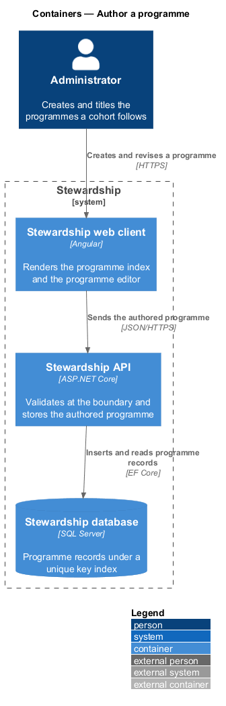
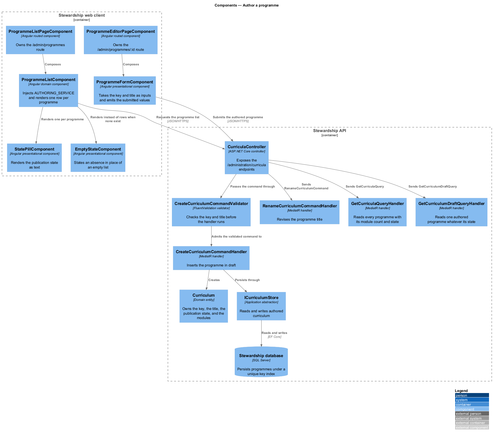
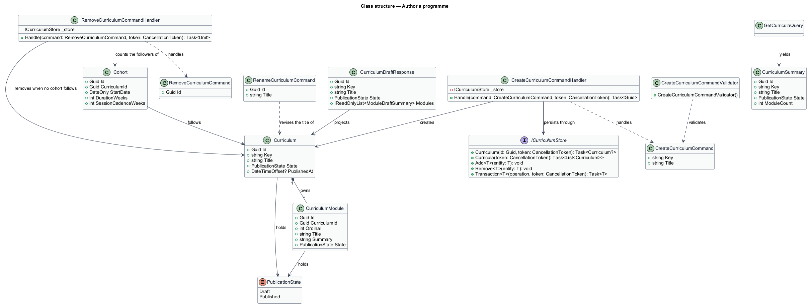
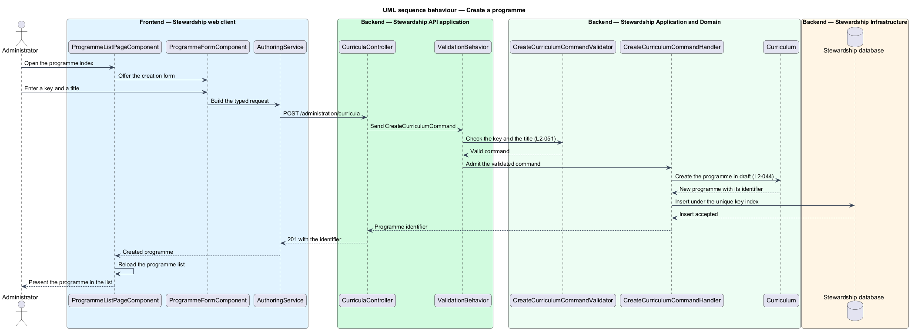
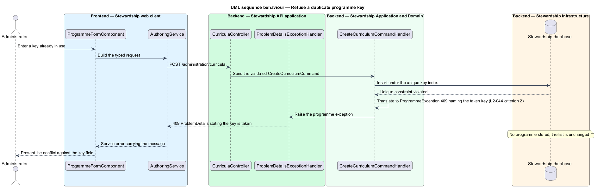

# Author a programme

## Overview

A cohort follows a programme, and until now the programme existed only as a string. Every
curriculum module carried a `CurriculumKey` of `"starter"`, every cohort carried the same
literal, and no row anywhere described the programme those keys named. This feature gives
the programme a record of its own, and gives an administrator the screen on which to
create and revise it.

**programme** — named body of curriculum a cohort follows, owning its modules and its
publication state

**programme key** — short stable identifier for a programme, unique across programmes

**programme list** — the administrator's index of every programme, each with its title,
its key, its module count, and its publication state

The domain type behind a programme is `Curriculum`, not `Programme`. The `Programme` prefix
is already taken in this codebase by `ProgrammeReader`, `IProgrammeStore` and
`ProgrammeException`, which concern a participant's progress through a cohort rather than
the content a cohort follows. Every type this subsystem introduces for authored content
therefore carries the `Curriculum` prefix, matching `CurriculumModule` and `CurriculumKey`
already in the domain.

A programme is created with a key and a title, and the key is unique (L2-044). A second
programme offering a key already taken is refused, the refusal names the conflict, and
nothing is stored. Uniqueness is enforced by a unique index on the column rather than by a
read-then-write check, so two administrators creating the same key at the same moment
cannot both succeed.

Validation happens at the boundary and a rejected edit changes nothing (L2-051). A
`FluentValidation` validator runs inside the existing `ValidationBehavior` pipeline
behaviour, before the handler is reached, so a refused request never opens a transaction.
Reading content authored on this screen and the screens beside it reaches participants as
literal text and never as markup, which the client guarantees by interpolating rather than
binding to `innerHTML`.

The programme record replaces the `CurriculumKey` string on both `CurriculumModule` and
`Cohort` with a foreign key to the programme it belongs to. That substitution is what
removes the `"starter"` literal from the domain, and it is the reason this feature is a
prerequisite for the other five.

A programme is removable while no cohort follows it (L2-044 criterion 5). A key is typed by
hand and a mistyped one would otherwise be permanent, so the screen offers removal for the
programme nothing depends on. The guard is the cohort rather than the completion record,
and it is the stronger of the two: a cohort is what binds participants to a programme, so a
programme no cohort follows can hold no progress to discard. A programme a cohort does
follow is refused, and the refusal counts the cohorts (L2-044 criterion 6).

One entry point survives from before these screens existed. The command-line tool retains
its `import-curriculum` verb as the way to bootstrap an environment that has no
administrator account yet, and the starter curriculum reaches a new database through it
once. Two things about it change. Its validator no longer requires twelve modules numbered
1 through 12, because the module count is now a fact about the programme (L2-056). Its
handler no longer needs the append-only rule that refused removal and reordering, because
an import now creates a new draft programme rather than merging into an existing one;
everything after the first import happens on these screens. What it creates is draft like
anything else, so importing publishes nothing (L2-052).

What a programme contains belongs to `administration/author-module` and
`administration/author-section`. The order of its modules belongs to
`administration/order-curriculum`. Its publication state, and what a participant sees as a
result, belong to `administration/publish-curriculum`. Who may reach this screen belongs
to `administration/authorise-administrator`.

## Description

**Web client.**

- **`ProgrammeListPageComponent`** — routed page component in the application project. It
  composes the programme index and owns the `/admin/programmes` route.
- **`ProgrammeEditorPageComponent`** — routed page component owning
  `/admin/programmes/:id`. It composes the editor and the module list.
- **`ProgrammeListComponent`** — component in the `domain` library. It calls
  `inject(AUTHORING_SERVICE)`, holds the result in a signal, and renders one row per
  programme. It belongs in `domain` rather than `components` because it injects an `api`
  contract.
- **`ProgrammeFormComponent`** — presentational component in the `components` library. It
  takes the key and the title as inputs, emits the submitted values as an output, and
  injects nothing. It reports the field-level validation message the API returns.
- **`StatePillComponent`** — presentational component in the `components` library
  rendering a publication state as text within a pill. It injects nothing, and its label
  is the state name so the state survives greyscale and a screen reader.
- **`IAuthoringService`** / **`AUTHORING_SERVICE`** / **`AuthoringService`** — the
  contract, its `InjectionToken`, and the HTTP implementation, each in its own file in the
  `api` library. `AuthoringServiceMock` binds to the same token under Playwright.
- **`CurriculumSummaryResult`** and **`CurriculumDraftResult`** — `api` result types
  carrying one programme row and the full authored programme. They take the `Curriculum`
  prefix rather than a `Programme` one, so they match the response records they deserialise
  and the existing `CurriculumResult` beside them in the `api` library.

**API.**

- **`CurriculaController`** — exposes `GET /administration/curricula`,
  `POST /administration/curricula`, `GET /administration/curricula/{id}`, and
  `PUT /administration/curricula/{id}`. It carries the administration policy and binds,
  dispatches, and returns.
- **`GetCurriculaQuery`** and **`GetCurriculaQueryHandler`** — the query and the MediatR
  handler behind the programme index. The handler reads every programme with its module
  count and publication state.
- **`GetCurriculumDraftQuery`** and **`GetCurriculumDraftQueryHandler`** — the query
  behind the editor. It returns the authored programme whatever its publication state,
  which is what distinguishes it from the participant-facing `GetCurriculumQuery`.
- **`CreateCurriculumCommand`**, **`CreateCurriculumCommandHandler`**, and
  **`CreateCurriculumCommandValidator`** — the creation slice. The validator requires a
  key and a title and bounds their length; the handler inserts the programme in draft and
  returns its identifier.
- **`RenameCurriculumCommand`**, **`RenameCurriculumCommandHandler`**, and
  **`RenameCurriculumCommandValidator`** — the revision slice for the title.
- **`RemoveCurriculumCommand`** and **`RemoveCurriculumCommandHandler`** — the removal
  slice. The handler counts the cohorts that follow the programme, refuses with `409` when
  any do, and otherwise removes the programme with its modules, sections and prompts in one
  transaction.
- **`ImportCurriculumCommand`**, **`ImportCurriculumCommandHandler`**, and
  **`ImportCurriculumCommandValidator`** — the retained bootstrap slice behind the
  command-line `import-curriculum` verb. The validator drops its twelve-module rule and the
  handler drops its append-only rule; the command creates one draft programme from a
  supplied document and does not merge into an existing one.
- **`Curriculum`** — domain entity for one programme, owning its key, its title, its
  publication state, and its modules.
- **`PublicationState`** — enumeration of `Draft` and `Published`. A programme holds
  exactly one.
- **`ICurriculumStore`** — application abstraction over reads and writes of authored
  curriculum. It extends the store abstraction the participant features already use with
  the lookups and the removal this subsystem needs.
- **`CurriculumSummary`**, **`CurriculumDraftResponse`**, and **`ModuleDraftSummary`** —
  the response records the two queries return.

The unique key is enforced by a unique index on `Curriculum.Key`. The handler does not
read before it writes; it inserts and lets the constraint decide, translating the
violation into a `ProgrammeException` carrying `409`. That is what makes L2-044
criterion 2 hold under concurrency.

## Requirements

The feature realises the following level-2 (L2) requirements. Each L2 requirement refines
a level-1 (L1) requirement, cited by identifier. Requirement text is quoted from
`docs/specs/L2.md` unchanged.

| L2 ID | Refines (L1) | Requirement |
|-------|--------------|-------------|
| `L2-044` | `L1-012` | A programme is the unit a cohort follows. An administrator creates it, titles it, and gives it a key unique across programmes. A programme no cohort follows may be removed. |
| `L2-051` | `L1-012` | Authored content is checked before it reaches domain logic, and a rejected edit changes nothing. |

## Diagrams

### Containers

The administrator reaches the same client and API a participant reaches, and the authored
programme is a row like any other. A context view is omitted: the administrator is the
only party to this feature, so the view would restate the container view with less detail.

### Components

The two queries divide by audience: `GetCurriculaQueryHandler` serves the index and
`GetCurriculumDraftQueryHandler` serves the editor, and neither is the participant-facing
handler. `CreateCurriculumCommandValidator` sits in front of its handler, which is what
gives L2-051 its effect.

### Class structure

`Curriculum` owns its modules and holds one `PublicationState`. Replacing the
`CurriculumKey` string on `CurriculumModule` and `Cohort` with a reference to this entity
is what removes the authored literal from the domain.

### Behaviour — create a programme

The validator runs inside the pipeline behaviour before the handler, so a malformed
request never opens a transaction (L2-051 criterion 1). The handler inserts and lets the
unique index decide, so a duplicate key is refused without a read-then-write race
(L2-044 criterion 2).

### Behaviour — refuse a duplicate key

The insert fails against the unique index and the handler translates the violation into a
`409` naming the conflict. Nothing is stored, and the programme list is unchanged
(L2-044 criterion 2).

