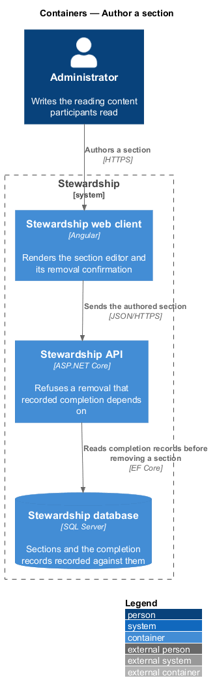
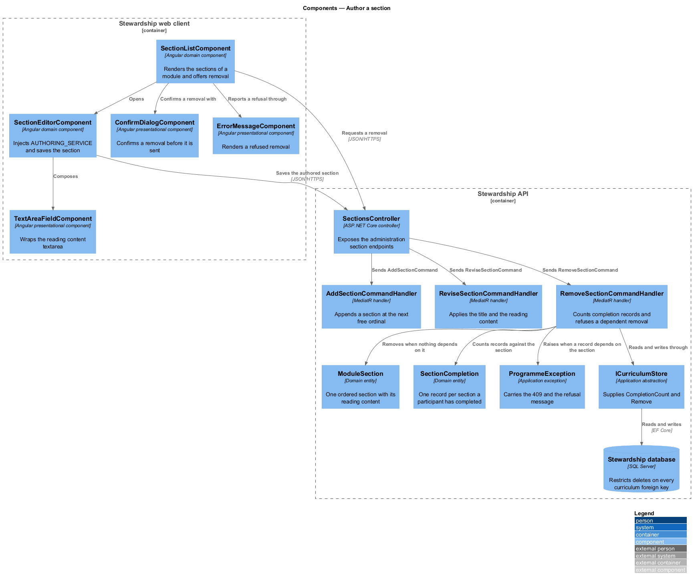
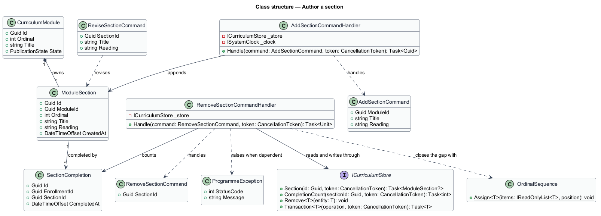
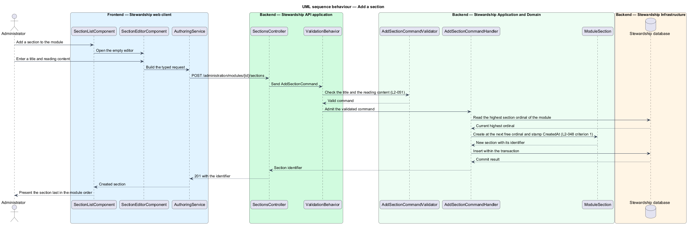
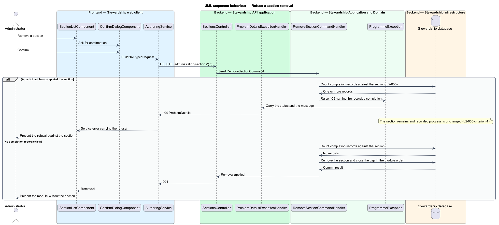

# Author a section

## Overview

A section is the smallest unit of a Stewardship curriculum a participant acts on. It
carries the reading for one part of a module, and it is the thing a participant marks
complete. Every progress figure in the application counts section completions, which makes
the section the one authored object with recorded history attached to it. This feature is
the section editor, and it is where the rule protecting that history is enforced.

**section** — one ordered part of a module, carrying a title and its reading content

**reading content** — the prose a participant reads within a section

**completion record** — row recording that one participant completed one section at one
time

Sections are created within a module, take a title and reading content, and are placed
last in the module's order (L2-048 criterion 1). A revision reaches a participant on their
next read of a published module. Removing a section closes the gap it leaves, so the
remaining sections keep a contiguous order and a participant never reads a numbering with a
hole in it.

The governing rule is that recorded participant history outranks authoring convenience
(L2-050). A section at least one participant has marked complete is not removable. The
attempt is refused, the refusal names the recorded completion, and the section remains. The
same rule reaches upward: a module containing such a section is not removable either, and a
preparation prompt a participant has answered in a note is not removable. Content a
participant has acted on shall not be deleted out from under the record of that action.

Enforcement is explicit rather than incidental. Every curriculum foreign key is configured
`DeleteBehavior.Restrict`, so the database refuses a cascading delete on its own. The
handler does not rely on that refusal to produce a usable message; it counts the dependent
records first and raises a `ProgrammeException` carrying `409` and a sentence naming what
depends on the content. The database constraint remains as the backstop that makes the rule
true even if a handler is added later that forgets it.

Section content survives republication untouched. Revising the text of a section a
participant has already completed does not reopen their completion, because completion is
recorded against the section identifier rather than against its text. Adding a *new* section
to a completed module does reopen that module, which is designed in
`modules/complete-section` and consumed rather than changed here.

The module a section belongs to is authored in `administration/author-module`. Reordering
sections belongs to `administration/order-curriculum`. When authored content becomes
visible belongs to `administration/publish-curriculum`. How a participant records a
completion belongs to `modules/complete-section`.

## Description

**Web client.**

- **`SectionEditorComponent`** — component in the `domain` library. It calls
  `inject(AUTHORING_SERVICE)`, holds the authored section in a signal, and saves
  revisions. It belongs in `domain` because it injects an `api` contract.
- **`SectionListComponent`** — component in the `domain` library rendering the sections of
  a module with their positions and offering the removal action.
- **`TextAreaFieldComponent`** — presentational component in the `components` library used
  for the reading content. It injects nothing.
- **`ConfirmDialogComponent`** — presentational component in the `components` library over
  a native `dialog`, shown before a removal.
- **`ErrorMessageComponent`** — existing presentational component in the `components`
  library. It renders the refusal returned when a removal is declined.
- **`SectionDraftResult`** — `api` result type carrying one authored section.

**API.**

- **`SectionsController`** — controller in `Api/Controllers/Administration` exposing
  `POST /administration/modules/{id}/sections`, `PUT /administration/sections/{id}`, and
  `DELETE /administration/sections/{id}`. It carries the administration policy.
- **`AddSectionCommand`**, **`AddSectionCommandHandler`**, and
  **`AddSectionCommandValidator`** — the creation slice. The handler appends the section at
  the next free ordinal and stamps `CreatedAt` from `ISystemClock`.
- **`ReviseSectionCommand`**, **`ReviseSectionCommandHandler`**, and
  **`ReviseSectionCommandValidator`** — the revision slice over the title and the reading
  content.
- **`RemoveSectionCommand`** and **`RemoveSectionCommandHandler`** — the removal slice. The
  handler counts completion records against the section, refuses when any exist, and
  otherwise removes the section and closes the gap in the module order.
- **`ModuleSection`** — domain entity for one section, owning its ordinal, title, reading
  content, and creation time.
- **`SectionCompletion`** — domain entity recording that one participant completed one
  section. These records are what a removal is checked against.
- **`ICurriculumStore`** — application abstraction. It supplies
  `CompletionCount(sectionId, token)` and `Remove<T>(entity)`, the two operations this
  slice needs beyond the participant store.
- **`ProgrammeException`** — existing application exception carrying an HTTP status code
  and a message. A refused removal raises it with `409`.
- **`OrdinalSequence`** — domain service assigning contiguous positions after a removal,
  described in `administration/order-curriculum`.

`ModuleSection.CreatedAt` already exists and already matters: the participant progress
calculation filters completion by it so that appending a section does not retroactively
rewrite history. This feature sets it and otherwise leaves that behaviour alone.

## Requirements

The feature realises the following level-2 (L2) requirements. Each L2 requirement refines
a level-1 (L1) requirement, cited by identifier. Requirement text is quoted from
`docs/specs/L2.md` unchanged.

| L2 ID | Refines (L1) | Requirement |
|-------|--------------|-------------|
| `L2-048` | `L1-012` | Sections carry the reading content of a module and are authored within it. |
| `L2-050` | `L1-012` | Recorded participant history outranks authoring convenience. Content a participant has completed or answered cannot be deleted out from under that record. |

## Diagrams

### Containers

The section editor writes to the same table a participant reads from, and the completion
records that constrain a removal live beside it. A context view is omitted: the
administrator is the only party to this feature, so the view would restate the container
view with less detail.

### Components

`RemoveSectionCommandHandler` is the enforcement point for L2-050, and it reads completion
records before it removes anything. The `DeleteBehavior.Restrict` configuration on the
foreign key stands behind it as a backstop.

### Class structure

`ModuleSection` is owned by its module and referenced by every `SectionCompletion` recorded
against it. That reference is what a removal is checked against, and it is why the section
is the object the history rule protects.

### Behaviour — add a section

The handler appends the section at the next free ordinal and stamps its creation time, so
the progress calculation can tell new content from old (L2-048 criterion 1).

### Behaviour — refuse a removal

The handler counts completion records before removing anything, and refuses with a message
naming the recorded completion. The section remains and the participant's progress is
unchanged (L2-050 criteria 1 and 4).

