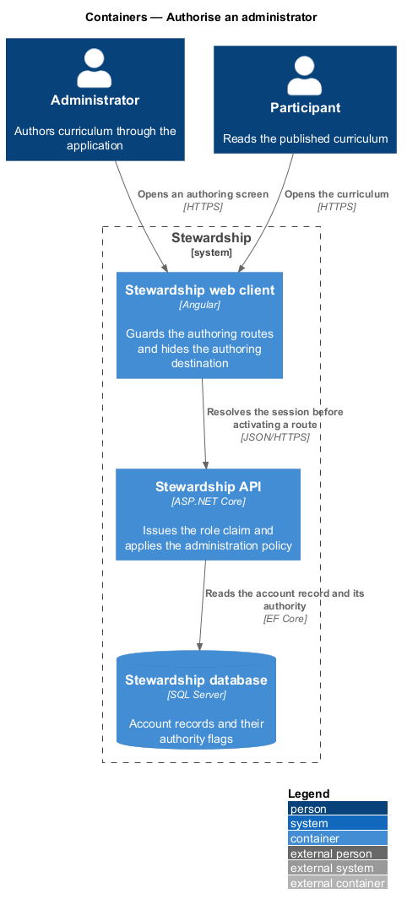
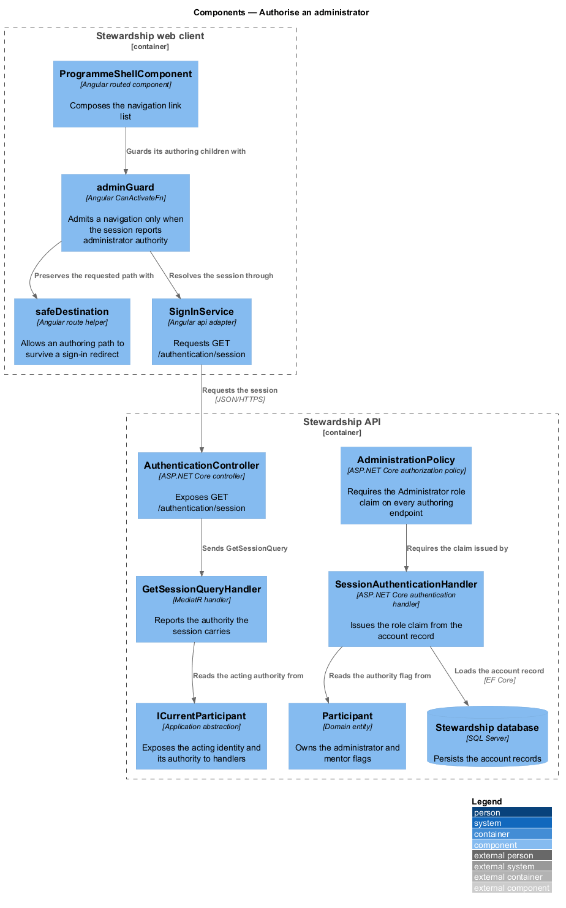
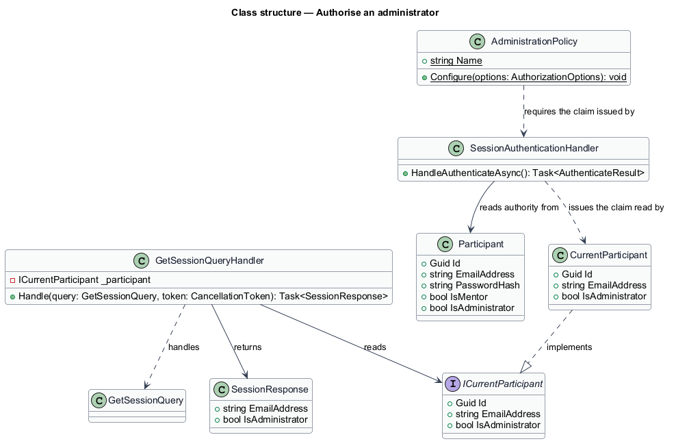
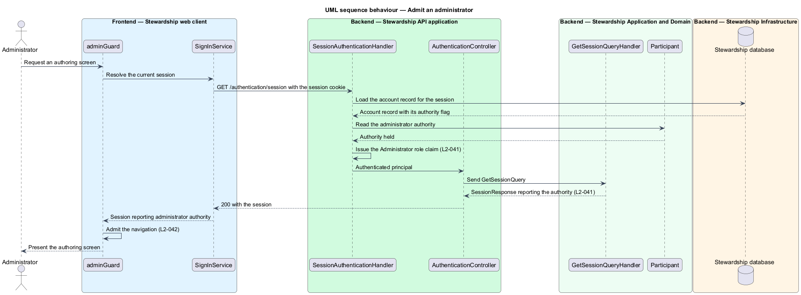
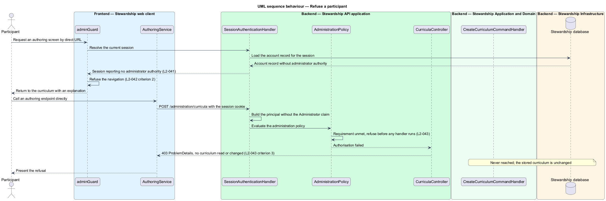

# Authorise an administrator

## Overview

Stewardship has carried one kind of account since it was built: a participant, optionally
flagged as a mentor. Curriculum authoring introduces a second kind of authority over the
same account record, and every authoring screen and endpoint in the `administration`
subsystem rests on it. This feature establishes that authority, reports it, and enforces
it.

**administrator authority** — permission to author curriculum, held by an account and
carried by the authenticated session

**authoring endpoint** — API endpoint under `/administration` that reads or changes
authored curriculum

**role claim** — claim on the authenticated principal naming the authority an account
holds

Authority is resolved from the authenticated session and from nothing else. The session
cookie already identifies the account; the handler that reads it adds a role claim when
the account record carries administrator authority. A value in a request body, a query
string, or a header shall not grant authority, and shall not be read when authority is
decided (L2-041 criterion 3). This keeps one rule in one place: the principal the
framework builds is the only source.

Enforcement happens twice, and both times deliberately. The API refuses an authoring call
that carries no administrator authority before any handler runs, answering `401` to an
unauthenticated client and `403` to a signed-in participant (L2-043). The web client
refuses to render an authoring screen for the same account, and refuses it whether the
screen is reached by navigation or by a pasted URL (L2-042). The client check is a
courtesy to the reader; the API check is the guarantee. A defect in the first shall not
expose curriculum, because the second still answers `403`.

An account without administrator authority is offered no authoring destination at all.
The navigation renders from a list the shell composes, and the authoring entry is absent
from that list unless the session reports the authority (L2-042 criterion 4). Hiding a
destination is presentation, not protection, and the design does not treat it as such.

How the session itself is established, maintained, and ended belongs to `access/sign-in`
and `access/maintain-session`. The redirect that carries an unauthenticated visitor to
sign-in and returns them afterwards belongs to `access/guard-routes`; this feature adds
the authoring paths to the destinations that guard considers safe. What an administrator
may then do belongs to the five sibling features of this subsystem.

## Description

**Web client.**

- **`adminGuard`** — `CanActivateFn` in the application project, applied as
  `canActivateChild` on the authoring route branch. It calls
  `inject(SIGN_IN_SERVICE).session()`, admits the navigation when the result reports
  administrator authority, and otherwise redirects. It sits beside the existing
  `authGuard` and runs after it.
- **`safeDestination`** — existing allow-list function in the application project that
  decides which `returnUrl` values survive a sign-in redirect. It gains the authoring
  paths, so an administrator who deep-links to an authoring screen returns to it after
  signing in (L2-042 criterion 5).
- **`ProgrammeShellComponent`** — existing shell that owns the navigation link list. It
  reads administrator authority from the session and includes the authoring destination
  in `links` only when the authority is present.
- **`SessionResult`** — existing `api` result type for `GET /authentication/session`. It
  gains `isAdministrator: boolean`.
- **`ISignInService`** / **`SIGN_IN_SERVICE`** / **`SignInService`** — the existing
  contract, its `InjectionToken`, and the HTTP implementation. The contract is unchanged;
  the result it returns carries one further field.

**API.**

- **`SessionAuthenticationHandler`** — existing authentication handler in `Infrastructure`.
  It builds the `ClaimsPrincipal` for the session cookie and adds a role claim naming
  `Administrator` when the `Participant` record holds the authority.
- **`AdministrationPolicy`** — static class holding the policy name, registered in the
  composition root through `AddAuthorization`. Every authoring controller carries
  `[Authorize(Policy = AdministrationPolicy.Name)]`.
- **`ICurrentParticipant`** — existing application abstraction over the acting identity.
  It gains `bool IsAdministrator`, read from the role claim, so a handler can state the
  authority without reaching for `HttpContext`.
- **`CurrentParticipant`** — existing `Infrastructure` implementation, which reads the
  claim the handler issued.
- **`GetSessionQueryHandler`** and **`SessionResponse`** — the existing query handler and
  its response record. `SessionResponse` gains `bool IsAdministrator`, answering L2-041.
- **`Participant`** — existing domain entity. It gains `bool IsAdministrator` beside the
  `IsMentor` flag it already carries.

An account may hold administrator authority and participate in a cohort at the same time.
The two flags are independent, and neither implies the other. Nothing in this design
grants a mentor authority over curriculum.

## Requirements

The feature realises the following level-2 (L2) requirements. Each L2 requirement refines
a level-1 (L1) requirement, cited by identifier. Requirement text is quoted from
`docs/specs/L2.md` unchanged.

| L2 ID | Refines (L1) | Requirement |
|-------|--------------|-------------|
| `L2-041` | `L1-011` | An account either holds administrator authority or it does not, and the authenticated session must report which. Authority is resolved from the session alone. |
| `L2-042` | `L1-011` | Every authoring screen requires administrator authority, whether reached by navigation or by direct URL. |
| `L2-043` | `L1-011` | The API refuses authoring calls from participants and from unauthenticated clients, and refuses them before any change is made. |
| `L2-061` | `L1-009` | Authoring endpoints carry every protection the participant endpoints carry, and the role check besides. |

## Diagrams

### Containers

The administrator reaches the same web client and the same API as a participant, over the
same session cookie. Authority is a property of the account row, so the database is what
separates the two. A context view is omitted: the administrator and the participant both
sit outside one system with no third party involved, so the view would restate the
container view with less detail.

### Components

The guard and the policy are the two enforcement points, and they sit on opposite sides
of the network boundary. `SessionAuthenticationHandler` is the single place a role claim
is issued, which is what makes L2-041 criterion 3 hold.

### Class structure

`Participant` carries two independent flags, and the session response carries the one that
governs authoring. `ICurrentParticipant` exposes the authority to handlers so that no
handler reads `HttpContext` directly.

### Behaviour — admit an administrator

The guard resolves the session before the authoring route activates, and the API applies
the policy before the handler runs. Both checks consult the same claim, which is issued
once from the account record (L2-041, L2-042).

### Behaviour — refuse a participant

A signed-in participant is refused at both boundaries. The client returns them to the
curriculum with an explanation, and the API answers `403` without reaching a handler, so
no authored curriculum is read or changed (L2-043 criteria 2 and 3).

