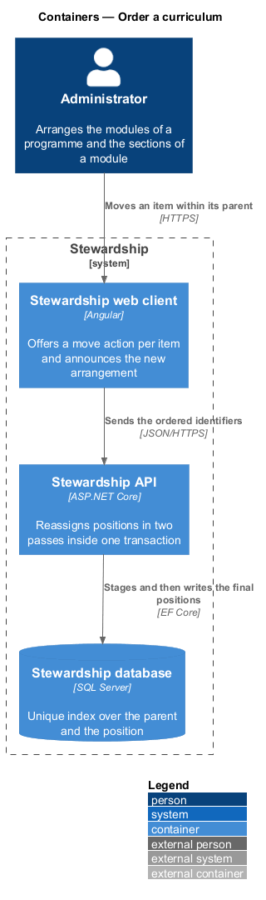
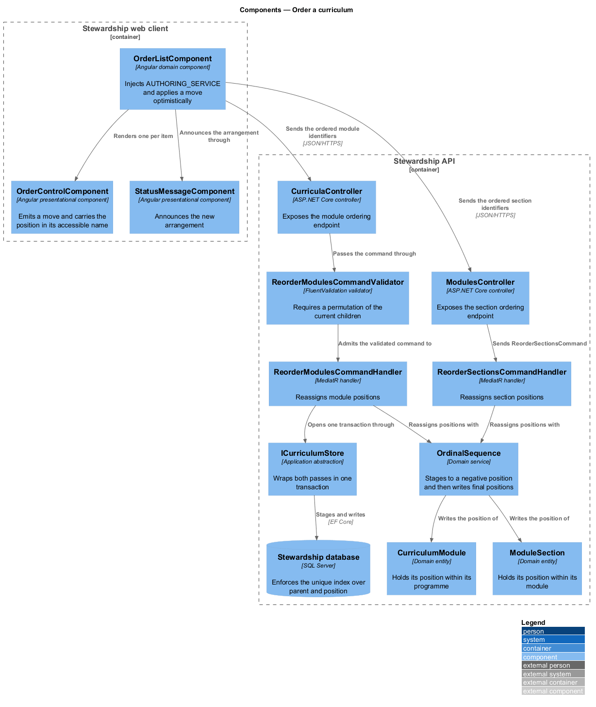
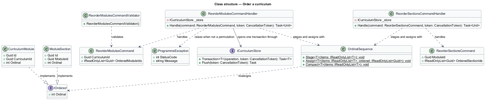
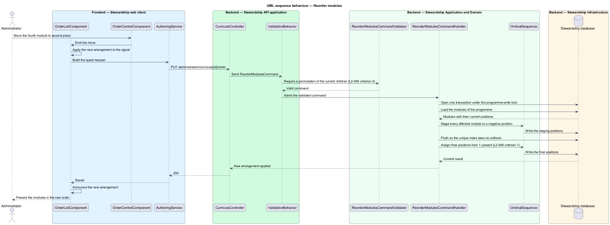

# Order a curriculum

## Overview

Order carries meaning in a Stewardship programme. Modules unlock sequentially, the current
module is the first incomplete one, and a participant resumes at the first incomplete
section. Every one of those rules reads a position, so the positions have to be authored,
unique, and contiguous. This feature is where an administrator arranges them.

**position** — the ordinal a module holds within its programme, or a section holds within
its module

**contiguous order** — arrangement in which positions run from 1 with no gap and no
duplicate

**staged reassignment** — two-pass write that moves every affected row to a temporary
position before writing its final one

Order is authored, and every position within a programme and within a module is unique and
contiguous (L2-049). Moving the fourth module to second place leaves four modules occupying
positions 1 through 4, not a set with two seconds or a hole at four. The same holds for
sections within a module, and for the practice steps and prompts authored in
`administration/author-module`.

The database enforces uniqueness, which is what makes a naive reordering fail. Both
`CurriculumModule` and `ModuleSection` carry a unique index over the parent and the
position, so swapping positions 3 and 4 in one pass collides the moment the first row is
written. The design answers this with staged reassignment: every affected row is first
written to a temporary position outside the valid range, and then to its final position,
both passes inside one transaction. The unique index is never violated at any point the
database checks it, and the constraint stays in place rather than being relaxed to
accommodate the editor.

Because both passes share one transaction, a reorder that fails partway leaves the order
that held before it began (L2-049 criterion 3). There is no state in which a participant
reads a curriculum staged halfway through a move. The existing programme-write application
lock serialises the transaction against other authoring writes, so two administrators
reordering the same programme cannot interleave their passes.

A reorder changes positions and nothing else. It does not touch titles, reading content,
publication state, or any completion record, because completion is recorded against a
section identifier rather than a position. Moving a completed section does not reopen it.

What the ordered objects contain belongs to `administration/author-module` and
`administration/author-section`. How order governs what a participant may open belongs to
`curriculum/unlock-and-resume`, which consumes these positions and is unchanged by this
feature.

## Description

**Web client.**

- **`OrderListComponent`** — component in the `domain` library. It calls
  `inject(AUTHORING_SERVICE)`, holds the current arrangement in a signal, applies a move
  optimistically, and reverts the signal if the save is refused.
- **`OrderControlComponent`** — presentational component in the `components` library. It
  takes a label and its position within the set as inputs, emits a move-up or move-down
  output, and injects nothing. It carries the position in its accessible name so the
  arrangement is legible without sight of the layout.
- **`StatusMessageComponent`** — existing presentational component in the `components`
  library. It announces the new arrangement after a move, which is what satisfies L2-060
  criterion 2.
- **`OrderRequest`** — `api` request type carrying the parent identifier and the ordered
  list of child identifiers.

**API.**

- **`CurriculaController`** — exposes `PUT /administration/curricula/{id}/order` for the
  modules of a programme.
- **`ModulesController`** — exposes `PUT /administration/modules/{id}/order` for the
  sections of a module.
- **`ReorderModulesCommand`**, **`ReorderModulesCommandHandler`**, and
  **`ReorderModulesCommandValidator`** — the module ordering slice. The validator requires
  the submitted identifiers to be a permutation of the programme's current children, which
  is what stops a partial or foreign list from producing a gap.
- **`ReorderSectionsCommand`**, **`ReorderSectionsCommandHandler`**, and
  **`ReorderSectionsCommandValidator`** — the section ordering slice, with the same rule.
- **`OrdinalSequence`** — domain service holding the staged reassignment. It writes each
  affected row to a negative staging position, flushes, and then writes the final positions
  from 1 upward. It is the single place the two-pass rule lives, so the module and section
  handlers cannot drift apart. It also exposes `Compact`, which renumbers the remaining
  children from 1 after a removal. Compaction needs no staging pass, because a removal frees
  its position before any remaining row claims it, so the unique index is never contested.
  `administration/author-section` and `administration/author-module` use `Compact` for that
  reason and never the two-pass path.
- **`ICurriculumStore`** — application abstraction. `Transaction` wraps both passes in one
  unit of work and takes the existing programme-write application lock.
- **`ProgrammeException`** — raised with `409` when the submitted list is not a permutation
  of the current children.

`OrdinalSequence` stages to negative positions rather than to high positive ones because
the valid range has no upper bound. A programme may hold any number of modules, so no
positive staging value can be guaranteed free; every negative value is.

## Requirements

The feature realises the following level-2 (L2) requirements. Each L2 requirement refines
a level-1 (L1) requirement, cited by identifier. Requirement text is quoted from
`docs/specs/L2.md` unchanged.

| L2 ID | Refines (L1) | Requirement |
|-------|--------------|-------------|
| `L2-049` | `L1-012` | Order is authored, and every position within a programme and within a module is unique and contiguous. |

## Diagrams

### Containers

Ordering is a write against the same database the participant reads, and the unique index
on that database is the constraint the design works within. A context view is omitted: the
administrator is the only party to this feature, so the view would restate the container
view with less detail.

### Components

Both handlers delegate the two-pass write to `OrdinalSequence`, so the rule that satisfies
L2-049 lives in one place. The validators reject a submitted list that is not a permutation
of the current children before either pass begins.

### Class structure

`OrdinalSequence` operates over anything holding a position, which is why one service
serves both modules and sections. The unique index it works around is a property of the
two entities it reassigns.

### Behaviour — reorder modules

The handler stages every affected module to a negative position, flushes, and then writes
the final positions from 1 upward. Both passes share one transaction, so the unique index
holds throughout and a failure leaves the previous order intact (L2-049 criteria 1 and 3).

