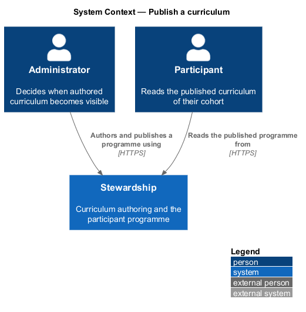
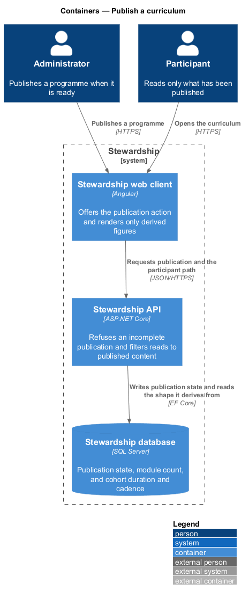
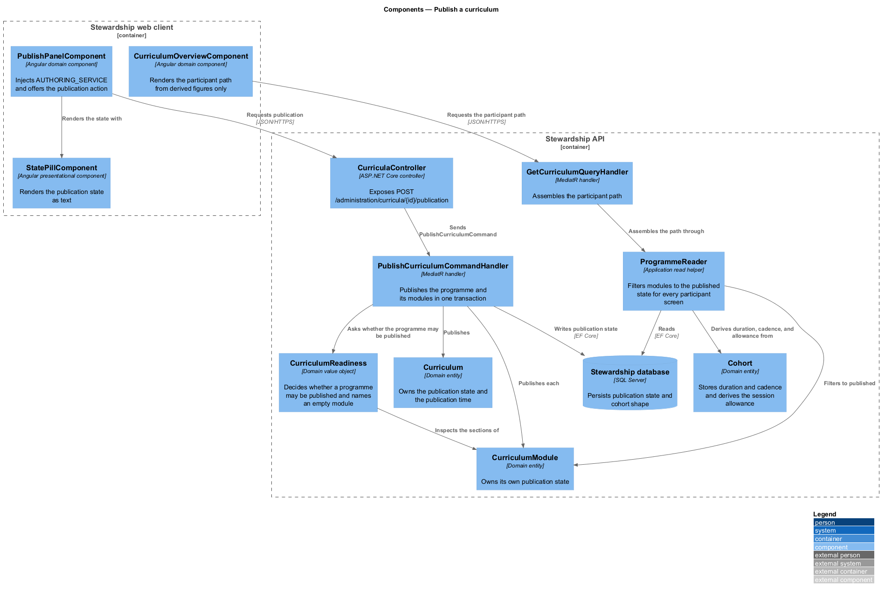
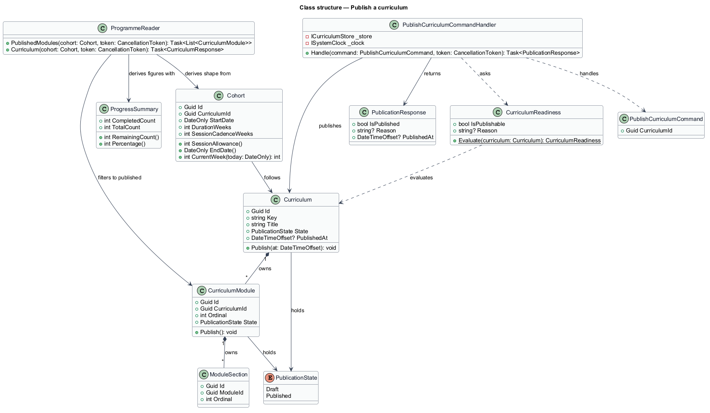
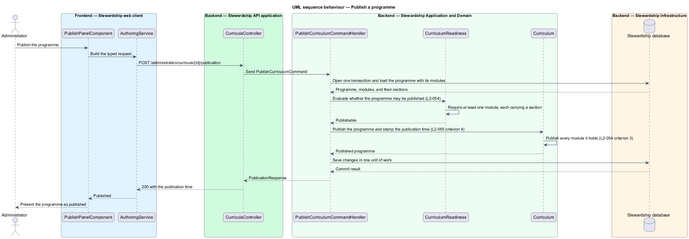
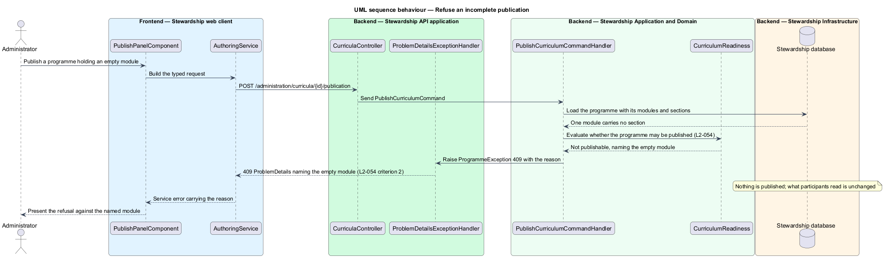
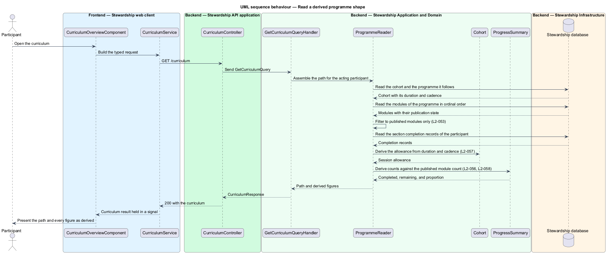

# Publish a curriculum

## Overview

Authoring and reading are separate acts, and this feature is the boundary between them. An
administrator revises a programme freely; a participant reads only what has been published.
The same feature settles a second question that runs through the whole application: how
many modules a programme has, how long a cohort runs, and how many sessions it allows are
facts read from records rather than constants written in code.

**publication state** — one of two values a programme or a module holds: `Draft` or
`Published`

**publication** — act by which an administrator makes the current content of a programme,
and every module it holds, visible to participants

**programme shape** — the module count of a programme together with the duration, cadence,
and session allowance of a cohort

A programme and each of its modules carry a publication state, and newly created content is
draft (L2-052). Draft content is invisible to participants: a cohort following a draft
programme is told the programme is not yet available, a draft module does not appear in a
participant's path or count toward their totals, and a draft module requested by direct URL
is refused (L2-053).

Publication is refused while it would give a participant nothing to read (L2-054). A
programme with no modules cannot be published, and neither can one holding a module with no
sections; the refusal names the empty module. A programme that passes both checks is
published together with every module it holds.

The line between publishing and revising is drawn deliberately. Content added after a
programme is published stays invisible until the administrator publishes again, so adding a
module to a running cohort does not disturb it mid-week. Revising the text of an
already-published section is not a new publication and reaches participants on their next
read (L2-055 criterion 3). The distinction is between *what exists* for a participant,
which publication governs, and *what it says*, which it does not.

Shape follows from records. The module count is a fact about the programme, and a
participant reading a programme of 8 modules sees 8 markers and totals against 8 (L2-056).
Duration and cadence are columns on the cohort, set when the cohort is created, and the
session allowance divides one by the other (L2-057). Every count, remainder, proportion, and
allowance the application displays derives from those records and the participant's own
completion (L2-058). This is what removes the `DurationWeeks => 12` and
`SessionCadenceWeeks => 2` expression-bodied constants from `Cohort`, the twelve-module
check from cohort creation, and the literal twelves from the client templates, the
Playwright mock store, and the browser page objects.

Readiness is shown before it is tested. `CurriculumReadiness` decides whether a programme
may be published, and the same value is carried on the draft response the editor already
reads, so the programme screen states what stands in the way of publication continuously
rather than only in answer to a refused attempt. An administrator sees that two modules
carry no section while authoring them, not after pressing an action that fails. The rule is
evaluated in one place, so what the screen reports and what the command enforces cannot
drift apart.

The publication panel also reports how many active cohorts follow the programme. Publishing
changes what those cohorts read on their next request, and L1-013 requires the act to be
deliberate; an administrator cannot act deliberately without knowing who is affected.

The module count and the cohort duration are independent, and the publication panel reports
where they differ. A cohort runs for the weeks its record carries and a participant advances
by completing modules, so a fifteen-module programme published to a twelve-week cohort is
permitted and produces no contradiction: the week number and the module position are
separate figures and neither is derived from the other. It is still worth an administrator
knowing, because the pace a programme was written for is one module per week, so the panel
names any cohort whose duration differs from the module count it would be publishing.

One consequence of publishing deserves its own warning, because it moves a participant
rather than merely adding to what they read. The current module is the first incomplete
module by position, so publishing a module into a position a participant has already passed
makes that new module their current one. Their completed modules stay complete and their
totals grow, but their next action moves backwards through the path (L2-055 criterion 5).
That is the correct outcome for content an administrator has decided is required, and it is
still a surprise worth stating before it happens: the panel names how many enrolled
participants a publication would move backwards, and which position it would move them to.
An administrator who did not intend it can move the module to the end of the order before
publishing.

What is published is authored in `administration/author-programme`,
`administration/author-module`, and `administration/author-section`. How a participant reads
a published path belongs to `curriculum/view-path`, how unlocking follows the order belongs
to `curriculum/unlock-and-resume`, and how the allowance governs booking belongs to
`sessions/book-session`. Each of those consumes the derived shape this feature establishes.

## Description

**Web client.**

- **`PublishPanelComponent`** — component in the `domain` library. It calls
  `inject(AUTHORING_SERVICE)`, offers the publication action, and renders the refusal when
  publication is declined. It belongs in `domain` because it injects an `api` contract.
- **`StatePillComponent`** — presentational component in the `components` library rendering
  a publication state as text, so the state survives greyscale and a screen reader. The
  design-system tokens it requires are settled in `administration/author-programme`.
- **`CurriculumOverviewComponent`** — existing `domain` component rendering the participant
  path. Its template loses the literal week count, the "Twelve weeks of practice" heading,
  and the module-12 title used as a fallback, each replaced by a value from the response.
- **`SignInPageComponent`** — existing routed page component. Its lead reads "Twelve
  modules, six sessions, one cohort", which is the only literal shape stated to a visitor who
  has not signed in and therefore has no cohort whose shape could be read. It cannot be
  replaced by a derived figure, because there is nothing yet to derive one from, so the
  sentence describes the programme without counting it.
- **`ProgrammeMockStore`** — mock data source in the `api` library testing entry point. Its
  hard-coded twelve module titles, fixed five sections, and `12 - completed` arithmetic are
  replaced by a fabricated programme whose size the test states.
- **`CohortServiceMock`**, **`SessionServiceMock`**, and **`CurriculumServiceMock`** — the
  three service mocks bound to the tokens beside that store. Each carries a shape literal of
  its own rather than reading one from the store: a `sessionAllowance` of 6 and an end date
  twelve weeks after the start in the first, an `allowance` of 6 in the second, and a
  fallback ordinal of 12 in the second and third. Correcting the store alone would leave the
  figures the sessions screen is asserted against untouched, so each takes its shape from the
  fabricated cohort instead (L2-057).
- **`PublicationResult`** — `api` result type carrying the outcome and, when publication is
  refused, the reason.
- **`ReadinessResult`** — `api` result type carried on the draft response, holding whether
  the programme may be published, the reason it may not, the number of active cohorts that
  follow it, and the number of enrolled participants a publication would move backwards. It
  is what lets the panel report readiness, and consequence, before an attempt.

**API.**

- **`CurriculaController`** — exposes `POST /administration/curricula/{id}/publication`.
- **`PublishCurriculumCommand`**, **`PublishCurriculumCommandHandler`**, and
  **`PublishCurriculumCommandValidator`** — the publication slice. The handler evaluates
  readiness, publishes the programme and its modules in one transaction, and stamps the
  publication time.
- **`CurriculumReadiness`** — domain value object over a programme. It answers whether the
  programme may be published and, when it may not, which module is empty. Holding the rule
  in the domain keeps L2-054 out of the handler and out of the controller, and lets
  `GetCurriculumDraftQueryHandler` report the same answer the command enforces.
- **`Progress`** — existing domain service resolving the current module as the first
  incomplete module by position. Publication changes what it resolves to, which is the
  mechanism behind L2-055 criterion 5; this feature reads it to report the consequence and
  does not alter it.
- **`Curriculum`** — domain entity owning `State` and `PublishedAt`.
- **`CurriculumModule`** — domain entity owning its own `State`, which is what lets a new
  module stay invisible inside a published programme.
- **`Cohort`** — existing domain entity. `DurationWeeks` and `SessionCadenceWeeks` change
  from expression-bodied constants to stored properties; `SessionAllowance`, `EndDate`, and
  `CurrentWeek` continue to derive from them and so become correct for any cohort.
- **`ProgrammeReader`** — existing shared read helper. It filters modules to the published
  state and reads the module count from the programme, which is what makes L2-053 and
  L2-056 hold for every participant screen at once.
- **`EnrollmentResponse`** — existing response record carrying `IsEnrolled` and the cohort
  summary. It gains a flag stating whether the cohort programme has been published. Without
  one there are two states where the application needs three: a participant enrolled on a
  draft programme is enrolled, so the gate admits them, and the filtered path is empty, so
  the curriculum reads nothing complete of nothing. L2-053 criterion 1 requires them to be
  told the programme is not yet available instead.
- **`EnrollmentGateComponent`** — existing `domain` component branching on enrollment. It
  gains the third branch. `NotEnrolledNoticeComponent` already takes the sentence it renders
  as an input, so the same component states either absence and only the wording differs.
- **`GetCurriculumQueryHandler`** and **`GetModuleQueryHandler`** — existing participant
  handlers. They gain no new rule; they inherit the filtering `ProgrammeReader` applies.
- **`CreateCohortCommandHandler`** — existing handler. The twelve-module check is here
  rather than in the validator beside it: the handler counts the modules of the named
  curriculum and refuses anything but twelve. It refuses an unpublished curriculum instead.
- **`CreateCohortCommandValidator`** — existing validator. Duration and cadence become
  required inputs on the command it checks, because neither is a constant any longer.
- **`BookingOperations`** — existing scheduling helper. Its guard already compares the
  bookings held against `cohort.SessionAllowance`, so the condition is derived and correct;
  the message it raises reads "All six sessions in this cohort have been used." A cohort of
  eight weeks at a fortnightly cadence allows four, and a participant who used all four would
  be told six. The message states the allowance it just compared against (L2-058).

Filtering in `ProgrammeReader` rather than in each handler is deliberate. The reader is the
one place the participant path, the module screen, the progress figures, and the session
allowance all pass through, so a single filter covers every screen and no future handler can
forget it.

That single filter reaches further than the application. Four places build a curriculum and
then read it as a participant would, and each gains a publication step or reads nothing:
`ApiFixture` and the acceptance tests that seed modules directly, the performance harness
that imports the starter curriculum before measuring participant endpoints, and
`scripts/prepare-live-demo.ps1`, which drives the same sequence for the recorded
walkthrough. A fixture that creates a curriculum and omits the publication returns an empty
path rather than an error, so the failure reads as missing content rather than as a missing
step (L2-053). Each also supplies a cohort duration and cadence, which stopped being
constants (L2-057).

## Requirements

The feature realises the following level-2 (L2) requirements. Each L2 requirement refines a
level-1 (L1) requirement, cited by identifier. Requirement text is quoted from
`docs/specs/L2.md` unchanged.

| L2 ID | Refines (L1) | Requirement |
|-------|--------------|-------------|
| `L2-052` | `L1-013` | A programme and each of its modules carry a publication state. Newly created content is draft, and draft content is invisible to participants. |
| `L2-053` | `L1-013` | A participant reads the published modules of their cohort's published programme, and nothing else. |
| `L2-054` | `L1-013` | Publication is refused while it would give a participant nothing to read. |
| `L2-055` | `L1-013` | Content added after a programme is published stays invisible until the administrator publishes again. Revising already-published content is not a new publication. |
| `L2-056` | `L1-014` | How many modules a programme has is a fact about the programme, not a constant. |
| `L2-057` | `L1-014` | Duration and cadence are properties of a cohort record, set when the cohort is created. |
| `L2-058` | `L1-014` | No count, remainder, proportion, or allowance the system displays is authored as content or fixed as a literal. |

## Diagrams

### System context

Publication is the one feature in this subsystem where both parties matter: the
administrator decides what becomes visible, and the participant is who it becomes visible
to. The context view is kept here for that reason, where it is omitted from the sibling
features.

### Containers

One publication write changes what every participant screen reads, because all of them pass
through the same reader. The database holds both the publication state and the cohort
columns the shape derives from.

### Components

`CurriculumReadiness` holds the refusal rule of L2-054, and `ProgrammeReader` holds the
filter of L2-053. Putting each in one place is what stops the rules being restated per
screen.

### Class structure

`Curriculum` and `CurriculumModule` each hold a `PublicationState`, which is what lets a
draft module sit inside a published programme. `Cohort` stores its duration and cadence and
derives the allowance from them, so no figure is a constant (L2-057, L2-058).

### Behaviour — publish a programme

The handler asks `CurriculumReadiness` before it writes, publishes the programme and every
module it holds in one transaction, and stamps the publication time (L2-054 criterion 3,
L2-055 criterion 4).

### Behaviour — refuse an incomplete publication

A programme holding a module with no sections is refused, and the refusal names that module.
Nothing is published, and what participants read is unchanged (L2-054 criteria 2 and 4).

### Behaviour — read a derived shape

The participant path is assembled from published modules only, and every figure is derived
from that count and the participant's completion records. A draft module added since the
last publication is absent from both (L2-053, L2-056, L2-058).

