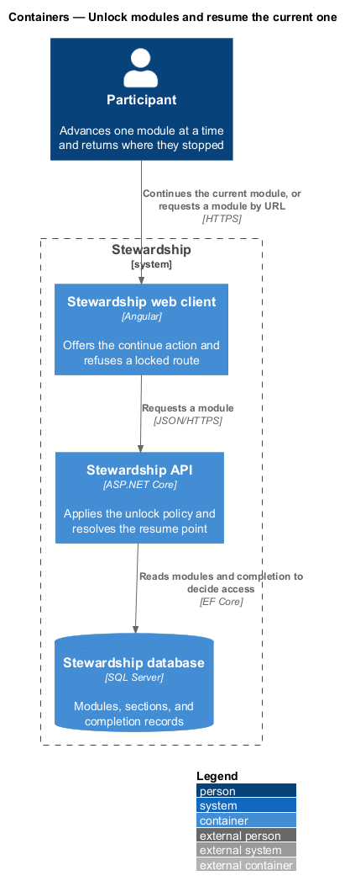
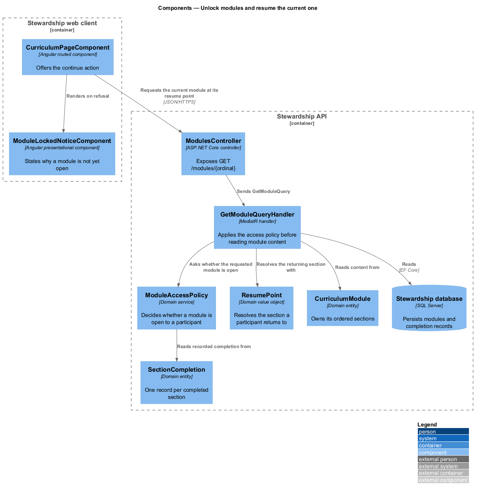
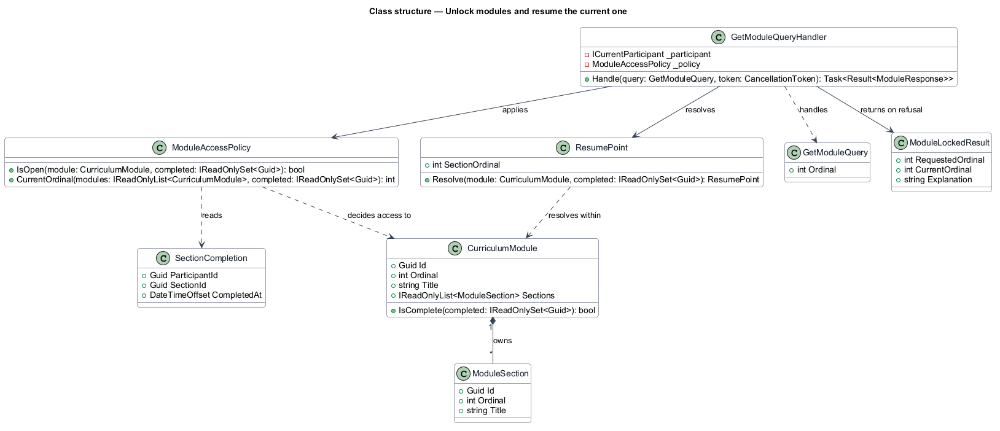
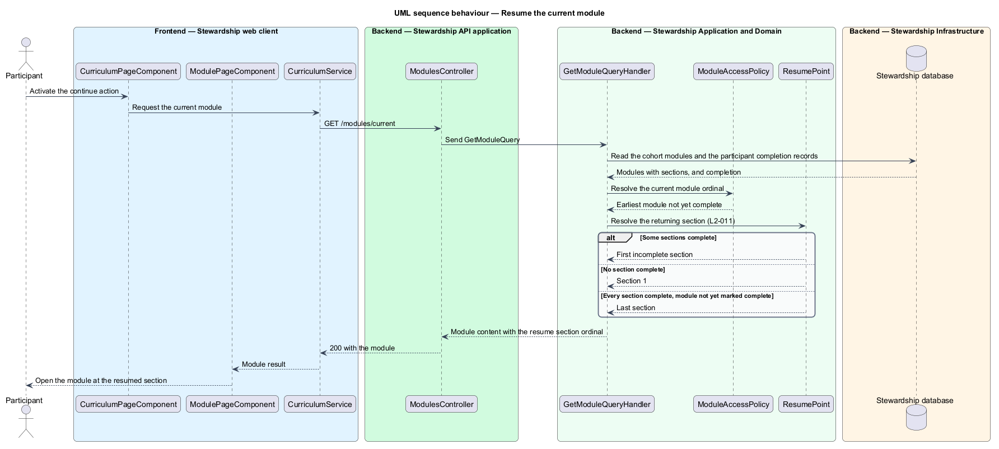
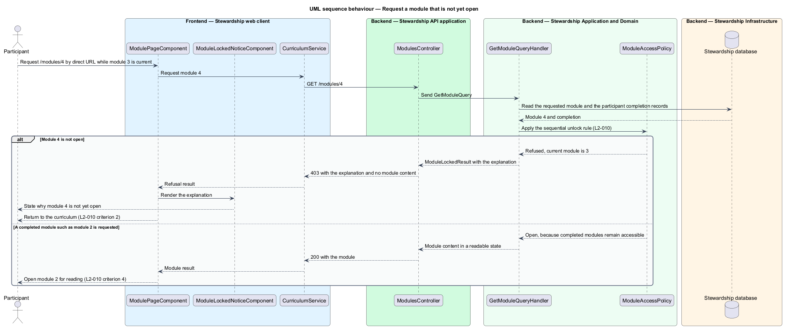

# Unlock modules and resume the current one

## Overview

A Stewardship cohort runs one module per week for its authored duration, and the modules build on
one another. The programme therefore opens them in order: a participant works through
module N before module N+1 becomes available. This feature owns that rule and the
related question of where a participant lands when they come back.

**sequential unlock** — rule by which module N+1 becomes available exactly when module N
is complete

**current module** — earliest module in the cohort that a participant has not yet
completed

**resume point** — section at which the continue action opens the current module

Module 1 is available from enrollment; every later module opens on the completion of its
predecessor. Completed modules stay open, so a participant can reread module 2 while
module 3 is current. Only modules ahead of the current one are closed.

The rule is enforced on the API, not only in the client. A participant who types the URL
of a module that is not yet open is refused and returned to the curriculum with an
explanation of why. That refusal is deliberately distinguishable from the not-found
answer that `access/guard-routes` gives for another cohort's module: a locked module
belongs to this participant's cohort and exists, and saying so is useful rather than
disclosing.

The resume point answers a smaller question with three cases. A partly finished module
opens at its first incomplete section. An unopened module opens at section 1. A module
whose sections are all complete but which is not yet recorded as complete opens at its
last section, so the participant reaches the completion action rather than an empty
position past the end.

How states are displayed on the path belongs to `curriculum/view-path`. What completion
means and how it is recorded belongs to `modules/complete-section`.

## Description

**Web client.**

- **`CurriculumPageComponent`** — routed page in the application project. It offers the
  continue action and navigates to the module route the API resolves.
- **`ModulePageComponent`** — routed page for a single module. It requests the module
  and renders either its content or the refusal.
- **`ModuleLockedNoticeComponent`** — presentational component in the `components`
  library, taking the requested and current ordinals plus the explanation as inputs.
- **`ICurriculumService`** / **`CURRICULUM_SERVICE`** / **`CurriculumService`** — shared
  with `curriculum/view-path`; the pages call `inject(CURRICULUM_SERVICE)`.

**API.**

- **`ModulesController`** — exposes `GET /modules/{ordinal}` and `GET /modules/current`.
- **`GetModuleQuery`** and **`GetModuleQueryHandler`** — the query and the MediatR
  handler. The handler applies the access policy before it reads any module content, so
  a refused request never loads the material it was refused.
- **`ModuleAccessPolicy`** — domain service holding both rules: `IsOpen` decides access
  for one module, and `CurrentOrdinal` finds the earliest incomplete module. Placing
  both on one type keeps the definition of "current" identical wherever it is asked for.
- **`ResumePoint`** — domain value object resolving the returning section from the module
  and the participant's completion records. Its `Resolve` method covers the three cases
  in one place.
- **`ModuleLockedResult`** — the refusal, carrying the requested ordinal, the current
  ordinal, and the explanation the client renders.
- **`CurriculumModule`**, **`ModuleSection`**, **`SectionCompletion`** — the domain
  entities shared across the `curriculum` and `modules` subsystems.

`CurriculumModule.IsComplete` takes the set of completed section identifiers rather than
querying for them, so the policy, the resume point, and the path all decide completion
from one loaded set instead of issuing a query each.

## Requirements

The feature realises the following level-2 (L2) requirements. Each L2 requirement
refines a level-1 (L1) requirement, cited by identifier. Requirement text is quoted from
`docs/specs/L2.md` unchanged.

| L2 ID | Refines (L1) | Requirement |
|-------|--------------|-------------|
| `L2-010` | `L1-003` | Module N+1 becomes available when module N is complete. Module 1 is available on enrollment. |
| `L2-011` | `L1-003` | The curriculum's primary action continues the current module at the first incomplete section. |

## Diagrams

### Containers

Both the continue action and a typed module URL arrive at the API as a module request,
and the API decides access from stored completion. A context view is omitted: the
participant is the only party, so it would restate the container view with less detail.

### Components

`GetModuleQueryHandler` consults `ModuleAccessPolicy` first and `ResumePoint` second.
The client renders `ModuleLockedNoticeComponent` when the policy refuses.

### Class structure

`ModuleAccessPolicy` and `ResumePoint` are separate types over the same two inputs — the
module and the set of completed sections — so the access rule and the landing rule stay
independently testable.

### Behaviour — resume the current module

The handler resolves the current module, then asks `ResumePoint` for the section. The
three branches are the three cases of L2-011: first incomplete, section 1, and last
section.

### Behaviour — request a module that is not yet open

The policy applies L2-010 before content is read. A module ahead of the current one is
refused with an explanation and the participant returns to the curriculum; a completed
module opens for reading, as criterion 4 requires.

