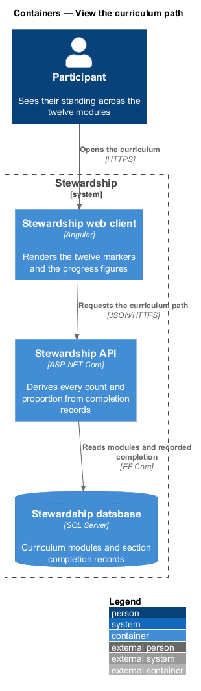
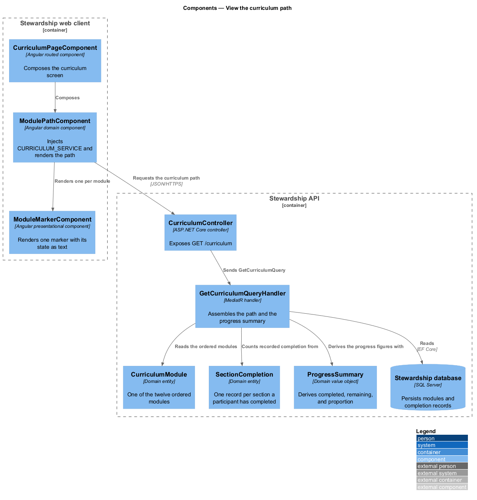
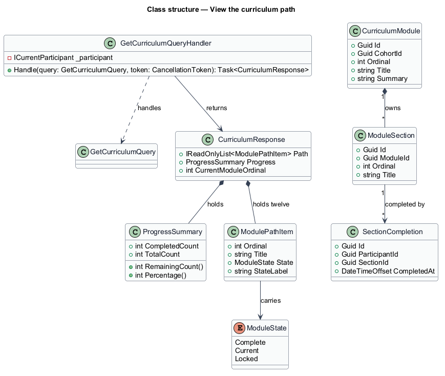
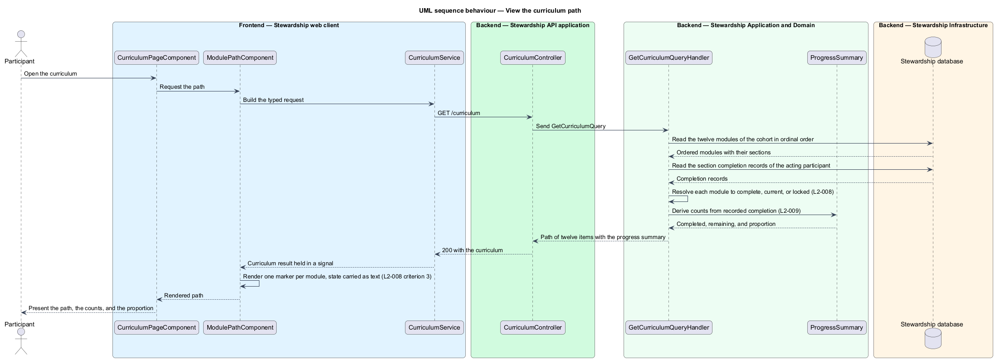

# View the curriculum path

## Overview

The curriculum is the spine of a Stewardship cohort: twelve learning modules taken one
per week over twelve weeks. The curriculum screen shows the whole path at once, so a
participant sees not only what to read next but where that sits in the twelve.

**module path** — ordered display of the twelve modules of a cohort, each carrying its
state

**module state** — one of three values a module holds for a given participant:
`Complete`, `Current`, or `Locked`

**progress summary** — the counts and proportion describing how far through the path a
participant is

Every marker on the path carries exactly one state. Modules already finished are
`Complete`, the earliest unfinished module is `Current`, and everything after it is
`Locked`. A participant who has finished all twelve sees twelve complete markers and no
current one, which is the end state of the path rather than a special case.

The rule that shapes this design most is that every figure about progress is derived.
The completed count, the remaining count, and the proportion are computed from
completion records at the moment of display; none of them is authored as content, stored
as a counter, or written by hand into a template. Authored figures drift — a path
showing "2 of 12 complete" beside "nine modules remain" is the kind of contradiction
that derivation makes impossible.

State reaches the participant as text and not by colour alone. A marker's state is
rendered in its accessible name, so it survives greyscale, screen readers, and a
participant who does not distinguish the palette.

Which modules a participant is permitted to open, and where the continue action leads,
belong to `curriculum/unlock-and-resume`. What a module contains belongs to
`modules/read-module`.

## Description

**Web client.**

- **`CurriculumPageComponent`** — routed page component in the application project. It
  composes the screen and owns the route.
- **`ModulePathComponent`** — component in the `domain` library. It calls
  `inject(CURRICULUM_SERVICE)`, holds the result in a signal, and renders one marker per
  module. It belongs in `domain` rather than `components` because it injects an `api`
  contract.
- **`ModuleMarkerComponent`** — presentational component in the `components` library. It
  takes the ordinal, the title, and the state as inputs, emits a selection output, and
  injects nothing. Its leaf position is what allows the `components` library to publish
  independently.
- **`ICurriculumService`** / **`CURRICULUM_SERVICE`** / **`CurriculumService`** — the
  contract, its `InjectionToken`, and the HTTP implementation, each in its own file in
  the `api` library.

**API.**

- **`CurriculumController`** — exposes `GET /curriculum`.
- **`GetCurriculumQuery`** and **`GetCurriculumQueryHandler`** — the query and the
  MediatR handler. The handler reads the cohort's modules in ordinal order, reads the
  acting participant's completion records, resolves each module to one state, and
  derives the summary.
- **`CurriculumResponse`** — carries the twelve `ModulePathItem` values, the
  `ProgressSummary`, and the ordinal of the current module.
- **`ModulePathItem`** — one marker, carrying its ordinal, title, state, and the state
  label the client renders as text.
- **`ModuleState`** — enumeration of `Complete`, `Current`, and `Locked`. A module holds
  exactly one, so no marker can render in two states or none.
- **`CurriculumModule`** — domain entity for one of the twelve modules, owning its
  ordinal, title, summary, and its sections.
- **`ModuleSection`** — domain entity for one ordered section of a module.
- **`SectionCompletion`** — domain entity recording that one participant completed one
  section at one time. These records are the sole source of every progress figure.
- **`ProgressSummary`** — domain value object over a completed count and a total. It
  exposes `RemainingCount` and `Percentage` as calculations, so a remainder cannot be
  supplied separately from the count it complements.

Module completion is itself derived from section completion rather than stored, which is
designed in `modules/complete-section`. This feature consumes that derivation and adds
nothing of its own to it.

## Requirements

The feature realises the following level-2 (L2) requirements. Each L2 requirement
refines a level-1 (L1) requirement, cited by identifier. Requirement text is quoted from
`docs/specs/L2.md` unchanged.

| L2 ID | Refines (L1) | Requirement |
|-------|--------------|-------------|
| `L2-008` | `L1-003` | The curriculum path shows all 12 modules in order, each in exactly one of three states: complete, current, or locked. |
| `L2-009` | `L1-003` | Counts, remainders, and proportions displayed about progress must be computed from completion records. No progress figure is authored as content. |

## Diagrams

### Containers

The web client requests one curriculum payload, and the API derives every figure in it
from rows in the database. A context view is omitted: the participant is the only party,
so it would restate the container view with less detail.

### Components

The three client components divide by what they know: the page owns the route, the
domain component injects the service, and the marker takes inputs only. Inside the API,
`ProgressSummary` is where the counts come from.

### Class structure

A `CurriculumModule` owns its `ModuleSection` values, and each section accumulates
`SectionCompletion` records. `CurriculumResponse` holds twelve `ModulePathItem` values
and one `ProgressSummary`, so the path and its figures travel together and are computed
together.

### Behaviour — view the curriculum path

The handler reads modules and completion records, resolves the three states of L2-008,
and derives the counts of L2-009 before returning. The client renders the state as text
on each marker, which satisfies L2-008 criterion 3.

