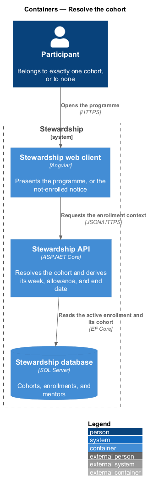
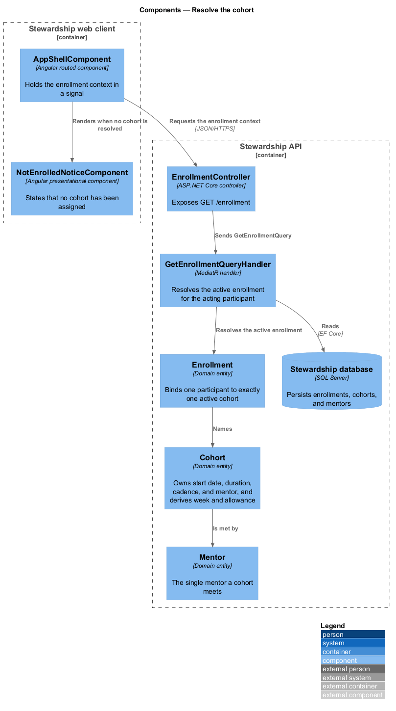
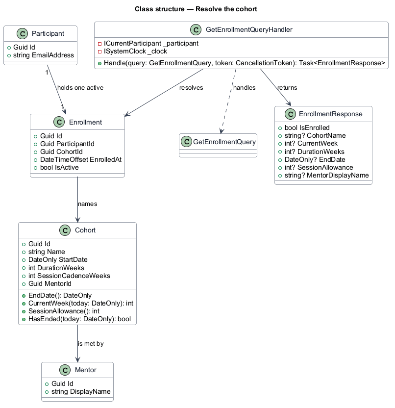
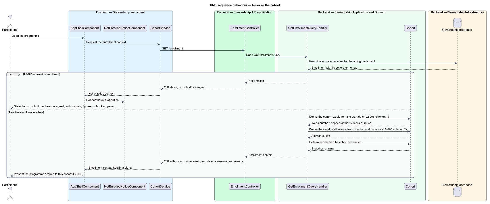

# Resolve the cohort

## Overview

Stewardship runs as a series of cohorts. A participant joins one, follows its curriculum
for twelve weeks, and meets its mentor. Almost every other feature needs to know which
cohort is in play before it can answer anything, so resolving the cohort is the first
read the application performs after identifying the participant.

**cohort** — group of participants following one curriculum over one fixed period with
one mentor

**enrollment** — binding of one participant to one cohort, of which a participant holds
exactly one active instance

**cadence** — interval between consecutive 1-on-1 sessions, expressed in weeks

**session allowance** — number of 1-on-1 sessions a cohort includes, derived from its
duration and cadence rather than authored

A cohort carries a start date, a duration of twelve weeks, a cadence of one session
every other week, and exactly one mentor. Three figures follow from those four facts and
are computed rather than stored: the current week, the cohort end date, and the session
allowance of six. Deriving them is what keeps the programme shape consistent — a change
to the duration or the cadence moves every dependent figure at once, and no screen can
drift from the cohort it describes.

A participant who belongs to no cohort is told so explicitly. The application presents a
notice rather than a curriculum with nothing in it, because an empty path is
indistinguishable from a broken one.

A cohort past its end date stays readable. Completed modules remain open and no new
session is bookable, so the record of what a participant did survives the programme
ending.

The curriculum path that a cohort supplies is designed in `curriculum/view-path`, and
the way the allowance limits booking is designed in `sessions/view-availability`.

## Description

**Web client.**

- **`AppShellComponent`** — routed shell in the application project. It requests the
  enrollment context once and holds it in a signal that the curriculum, sessions, and
  notes screens read.
- **`ICohortService`** / **`COHORT_SERVICE`** / **`CohortService`** — the contract, its
  `InjectionToken`, and the HTTP implementation, each in its own file in the `api`
  library.
- **`NotEnrolledNoticeComponent`** — presentational component in the `components`
  library. It takes the notice text as an input and injects no service, which is what
  keeps it in `components` rather than `domain`.

**API.**

- **`EnrollmentController`** — exposes `GET /enrollment`. It binds, dispatches, returns.
- **`GetEnrollmentQuery`** and **`GetEnrollmentQueryHandler`** — the query and the
  MediatR handler. The handler resolves the active enrollment for the acting participant
  taken from `ICurrentParticipant`, then asks the cohort for its derived figures.
- **`EnrollmentResponse`** — the response. Every cohort-dependent field is nullable, so
  the not-enrolled case is one shape of the same response rather than a separate
  endpoint or an error.
- **`Enrollment`** — domain entity binding a participant to a cohort, carrying the
  enrolment time and whether it is active.
- **`Cohort`** — domain entity owning `StartDate`, `DurationWeeks`,
  `SessionCadenceWeeks`, and `MentorId`, and the four derivations `EndDate`,
  `CurrentWeek`, `SessionAllowance`, and `HasEnded`. The derivations are methods on the
  entity rather than logic in the handler, so every caller reaches the same answer.
- **`Mentor`** — domain entity holding the display name a participant sees.
- **`ISystemClock`** — application abstraction supplying today's date, so a cohort
  boundary is exercised in a test without waiting for it.

`CurrentWeek` counts whole weeks since the start date and adds one, capped at
`DurationWeeks`. `SessionAllowance` divides `DurationWeeks` by `SessionCadenceWeeks`.
Neither figure is stored, so neither can disagree with the cohort it comes from.

## Requirements

The feature realises the following level-2 (L2) requirements. Each L2 requirement
refines a level-1 (L1) requirement, cited by identifier. Requirement text is quoted from
`docs/specs/L2.md` unchanged.

| L2 ID | Refines (L1) | Requirement |
|-------|--------------|-------------|
| `L2-005` | `L1-002` | Enrollment places a participant in exactly one cohort, which supplies their curriculum, programme dates, session cadence, and mentor. |
| `L2-006` | `L1-002` | A cohort carries a start date, a 12-week duration, a session cadence of one session every other week, and exactly one mentor. |
| `L2-007` | `L1-002` | A participant not yet in a cohort must be told so, not shown an empty programme. |

## Diagrams

### Containers

The web client requests one enrollment context, and the API reads the active enrollment
and its cohort. A context view is omitted: the participant is the only party, so it
would restate the container view with less detail.

### Components

`AppShellComponent` renders either the programme or `NotEnrolledNoticeComponent` from
one response. Inside the API, `Cohort` is where the derived week and allowance come
from, not the handler.

### Class structure

A participant holds exactly one active `Enrollment`, which names one `Cohort`, which is
met by one `Mentor`. The four derivations sit on `Cohort` as methods.

### Behaviour — resolve the cohort

One query answers both cases. With no active enrollment the response states so and the
shell renders the notice, satisfying L2-007. With an enrollment, the handler asks the
cohort for its current week and allowance — L2-006 criteria 1 and 2 — and the shell
scopes the programme to that cohort.

