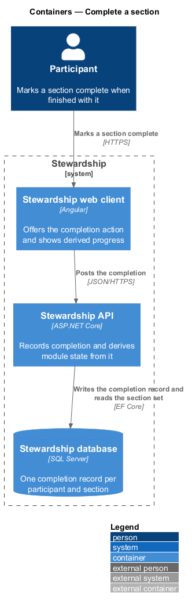
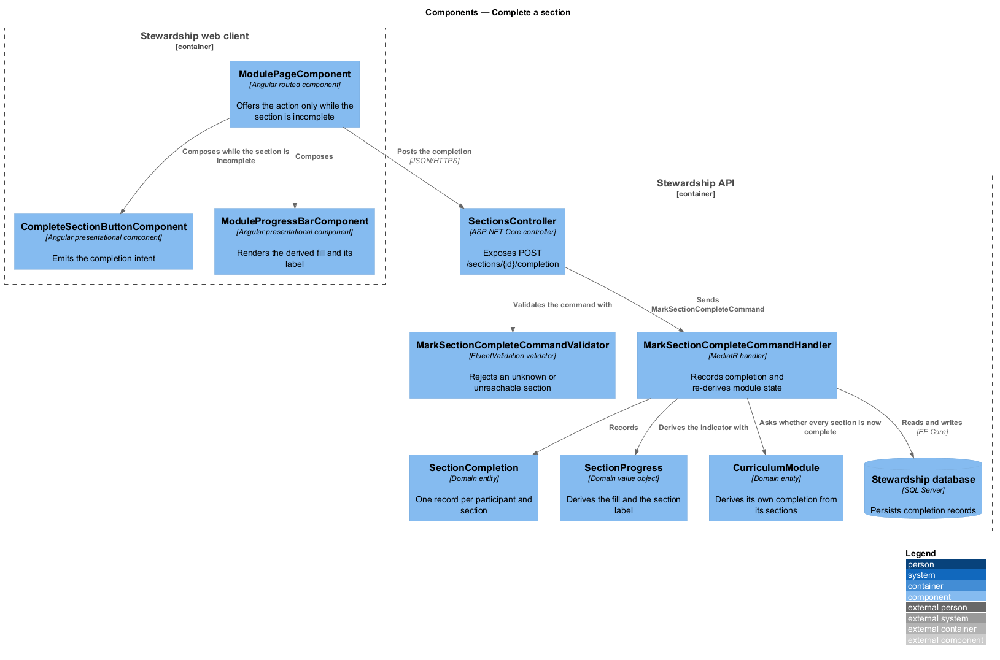
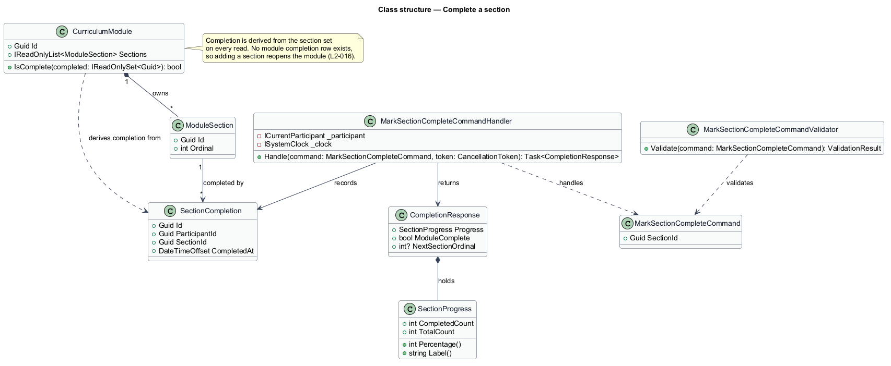
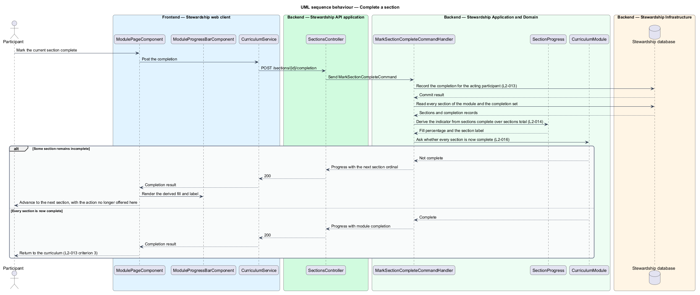

# Complete a section

## Overview

Progress through Stewardship is recorded by the participant, one section at a time.
Marking a section complete is the only act that moves the programme forward: it advances
the module, it advances the curriculum path, and it eventually unlocks the next module.
Every figure the application shows about progress traces back to the records this
feature writes.

**completion record** — statement that one participant finished one section at one time

**section progress** — sections complete over sections total for one module, expressed
as a fill and a label

**derived completion** — module state computed from its section records at the moment of
reading, rather than stored

A participant reading a section marks it complete when finished. The record persists, so
returning to the module days later shows the section still complete. A section already
complete no longer offers the action, because completing it a second time would mean
nothing.

Completing the final section of a module completes the module, and the participant
returns to the curriculum to see the path move. That module completion is never written
down. It is recomputed from the section records whenever anything asks, which has a
consequence worth stating: if a module later gains a section, the module ceases to be
complete until that section is completed too. A stored flag would have gone on claiming
completion for material the participant never saw.

The progress indicator follows the same discipline. Its fill is sections complete
divided by sections total, and its label counts the current section against the total.
Neither is authored, and neither can disagree with the records, because both come from
the same division at the same moment.

What a section contains belongs to `modules/read-module`. How completion moves the path
and unlocks the next module belongs to `curriculum/view-path` and
`curriculum/unlock-and-resume`.

## Description

**Web client.**

- **`ModulePageComponent`** — routed page in the application project. It holds the
  module in a signal, offers the completion action only while the section in view is
  incomplete, and applies the response to that signal without a further read.
- **`CompleteSectionButtonComponent`** — presentational component in the `components`
  library. It takes a disabled input and emits a completion output; it injects no
  service.
- **`ModuleProgressBarComponent`** — presentational component in the `components`
  library. It takes the completed count and the total as inputs and renders the fill and
  the label from them, so the client cannot display a fill that disagrees with the
  counts beside it.
- **`ICurriculumService`** / **`CURRICULUM_SERVICE`** / **`CurriculumService`** — shared
  with the `curriculum` subsystem.

**API.**

- **`SectionsController`** — exposes `POST /sections/{id}/completion`.
- **`MarkSectionCompleteCommand`** — carries the section identifier only. The
  participant comes from the session through `ICurrentParticipant`, never from the
  request.
- **`MarkSectionCompleteCommandValidator`** — refuses an unknown section, and a section
  in a module that is not open to the acting participant.
- **`MarkSectionCompleteCommandHandler`** — MediatR handler. It records the completion,
  re-reads the module's sections and completion set, derives the progress, and asks the
  module whether it is now complete.
- **`CompletionResponse`** — carries the derived `SectionProgress`, whether the module is
  now complete, and the next section ordinal when one remains.
- **`SectionCompletion`** — domain entity, unique on participant and section. Recording
  an existing completion again changes nothing, so a repeated request is harmless.
- **`SectionProgress`** — domain value object over a completed count and a total,
  exposing `Percentage` and `Label`. Both are calculations, so a fill and a label cannot
  be supplied separately.
- **`CurriculumModule.IsComplete`** — the derivation. It takes the set of completed
  section identifiers and answers whether every section of the module is in it. No
  module completion entity exists anywhere in the model.

The handler returns the derived progress in the same response as the write, so the
client updates its signal without a second request. That keeps the displayed figures in
step with the record that was just written.

## Requirements

The feature realises the following level-2 (L2) requirements. Each L2 requirement
refines a level-1 (L1) requirement, cited by identifier. Requirement text is quoted from
`docs/specs/L2.md` unchanged.

| L2 ID | Refines (L1) | Requirement |
|-------|--------------|-------------|
| `L2-013` | `L1-004` | A participant marks a section complete, and that record persists. |
| `L2-014` | `L1-004` | The module's progress indicator reflects sections completed over sections total. |
| `L2-016` | `L1-004` | Module completion is derived from section completion, never set independently. |

## Diagrams

### Containers

The completion travels from the web client to the API, which writes one record and reads
the section set back to derive what follows. A context view is omitted: the participant
is the only party, so it would restate the container view with less detail.

### Components

The handler writes through `SectionCompletion` and then derives through `SectionProgress`
and `CurriculumModule`. On the client, the progress bar takes counts as inputs and
computes its own fill, so no fill value crosses the wire.

### Class structure

`SectionCompletion` is the only entity written. `CurriculumModule` depends on those
records to answer `IsComplete`, and the note on the diagram states the consequence
required by L2-016: adding a section reopens a module that had been complete.

### Behaviour — complete a section

One request writes the record and derives everything that follows from it. The two
branches are the two outcomes of L2-013: an ordinary section advances to the next, and
the final section completes the module and returns the participant to the curriculum.

