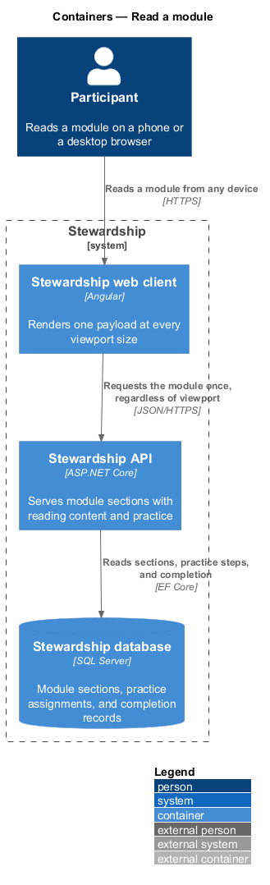
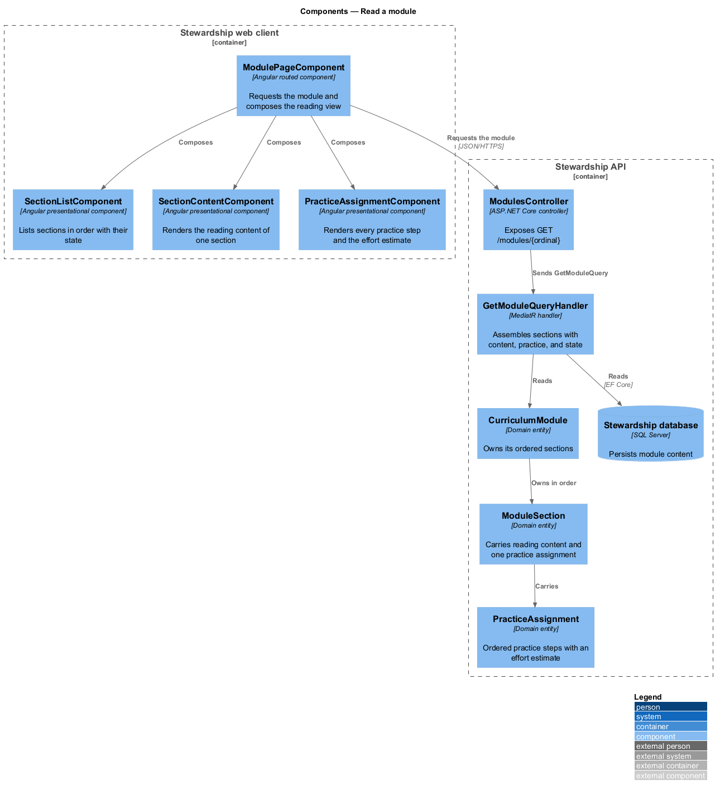
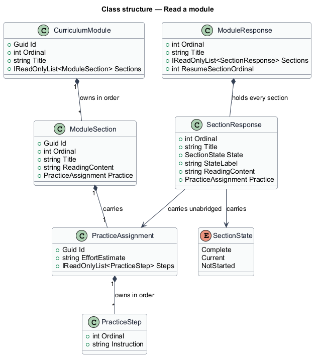
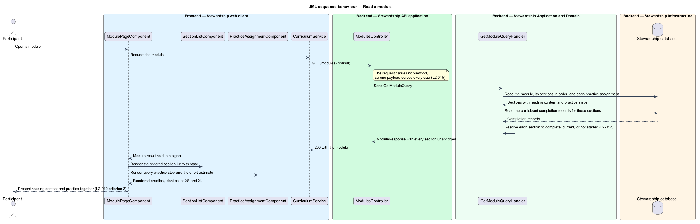

# Read a module

## Overview

A learning module is one week of the Stewardship curriculum. It is not a single page but
an ordered set of sections, each pairing something to read with something to do. This
feature covers delivering that material to a participant.

**section** — ordered unit of a module carrying reading content and one practice
assignment

**practice assignment** — ordered set of steps a participant carries out after reading a
section, with a stated effort estimate

**section state** — one of three values a section holds for a given participant:
`Complete`, `Current`, or `NotStarted`

A module renders its sections in order with the title and state of each, so a
participant reading section 3 can see what came before and what remains. The section in
view presents its reading content and its practice assignment together; neither is
behind a further step, because the practice is what the reading is for.

One rule constrains the presentation more than any other: the content a participant
receives does not depend on the device they read it on. The API is not told the viewport
and does not vary its response by it. The client renders one payload and adapts layout
through stylesheets alone, never by withholding an element at a narrow width. A practice
assignment of three steps has three steps on a phone. This matters because the effort
estimate, the reading, and the practice describe each other — dropping a step at a small
size leaves an estimate describing work the participant cannot see.

Recording that a section is finished belongs to `modules/complete-section`. Which
modules a participant may open belongs to `curriculum/unlock-and-resume`. The layout
rules that adapt this screen across breakpoints belong to `platform/responsive-shell`.

## Description

**Web client.**

- **`ModulePageComponent`** — routed page component in the application project. It
  requests the module through `inject(CURRICULUM_SERVICE)`, holds the result in a
  signal, and composes the three presentational components below.
- **`SectionListComponent`** — presentational component in the `components` library. It
  takes the ordered sections and their states as inputs and emits a selection output.
- **`SectionContentComponent`** — presentational component in the `components` library
  rendering the reading content of one section.
- **`PracticeAssignmentComponent`** — presentational component in the `components`
  library rendering every step of the assignment and the effort estimate. It takes the
  assignment as one input and renders all of its steps unconditionally; no step is bound
  to a media query or a viewport signal.
- **`ICurriculumService`** / **`CURRICULUM_SERVICE`** / **`CurriculumService`** — shared
  with the `curriculum` subsystem.

**API.**

- **`ModulesController`** — exposes `GET /modules/{ordinal}`. The route carries no
  viewport parameter, and no request header varies the response body.
- **`GetModuleQuery`** and **`GetModuleQueryHandler`** — shared with
  `curriculum/unlock-and-resume`. Once access is granted, the handler reads the module,
  its ordered sections, and each practice assignment, then resolves section state from
  the participant's completion records.
- **`ModuleResponse`** and **`SectionResponse`** — the response shapes.
  `SectionResponse` carries the state, the state label rendered as text, the reading
  content, and the complete practice assignment.
- **`SectionState`** — enumeration of `Complete`, `Current`, and `NotStarted`.
- **`CurriculumModule`** — domain entity owning its sections in ordinal order.
- **`ModuleSection`** — domain entity carrying reading content and exactly one practice
  assignment.
- **`PracticeAssignment`** — domain entity owning its ordered `PracticeStep` values and
  the effort estimate. The estimate lives on the assignment rather than on the section,
  so it cannot be presented apart from the steps it measures.
- **`PracticeStep`** — domain entity for one instruction at one ordinal.

The composition relationships carry the parity rule structurally: a section owns one
assignment, and an assignment owns all of its steps, so serialising a section serialises
every step. There is no shape of the response in which some steps are present and others
are not.

## Requirements

The feature realises the following level-2 (L2) requirements. Each L2 requirement
refines a level-1 (L1) requirement, cited by identifier. Requirement text is quoted from
`docs/specs/L2.md` unchanged.

| L2 ID | Refines (L1) | Requirement |
|-------|--------------|-------------|
| `L2-012` | `L1-004` | A module presents its sections in order, showing which are complete, which is current, and the title of each. |
| `L2-015` | `L1-004` | The reading content and the practice assignment of a section are the same for a given participant regardless of device or viewport size. |

## Diagrams

### Containers

One request returns one payload whatever the device, which is where the parity rule of
L2-015 is enforced. A context view is omitted: the participant is the only party, so it
would restate the container view with less detail.

### Components

The page composes three presentational components, none of which injects a service.
Inside the API, the ownership chain from module to section to assignment to step is what
the handler reads.

### Class structure

The composition arrows are the parity guarantee: `ModuleSection` owns one
`PracticeAssignment`, which owns all of its `PracticeStep` values, and
`SectionResponse` carries the assignment unabridged.

### Behaviour — read a module

The request carries no viewport, the handler resolves section state from completion
records, and the client renders every step. L2-012 governs the ordered list and its
states; L2-015 is satisfied by there being only one payload to render.

