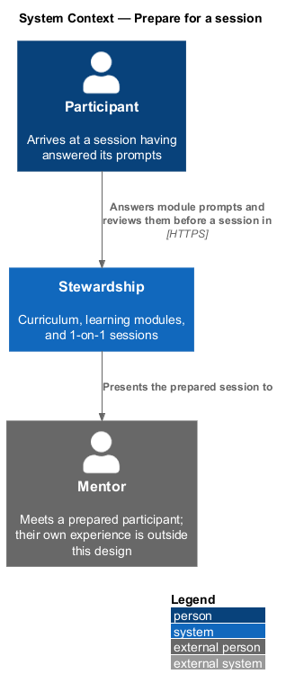
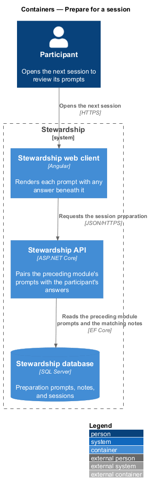
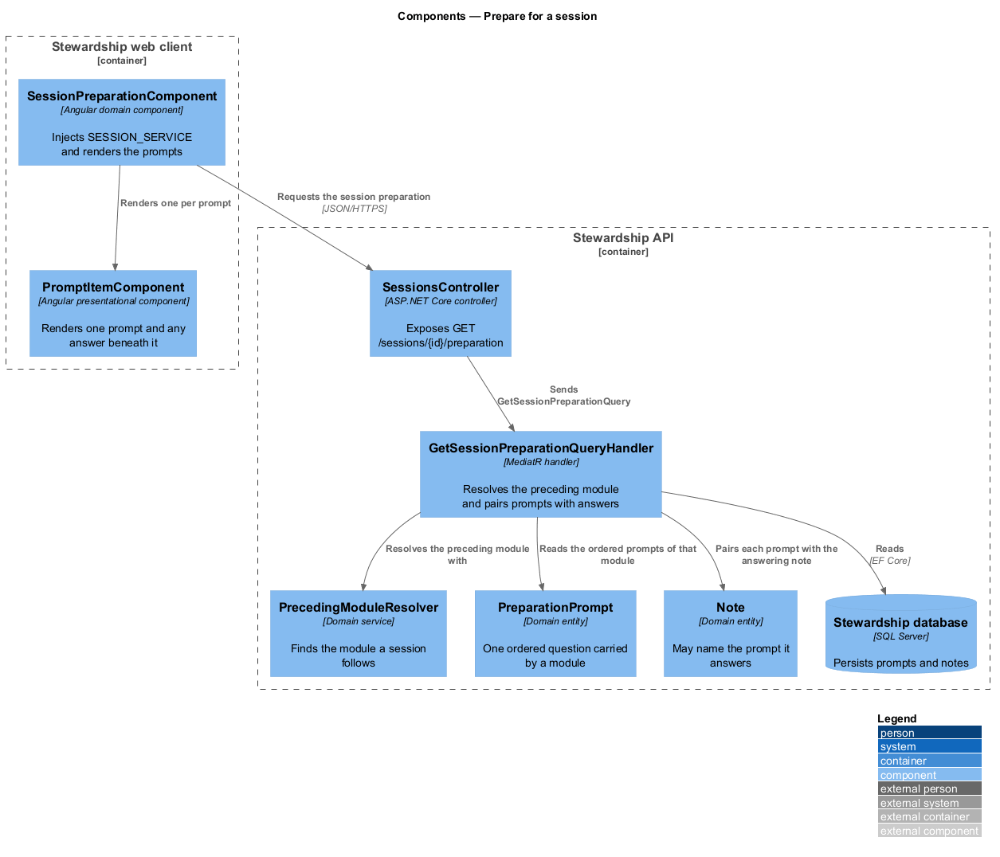
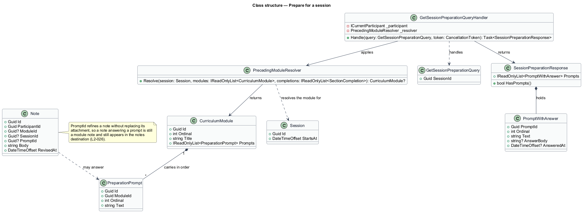
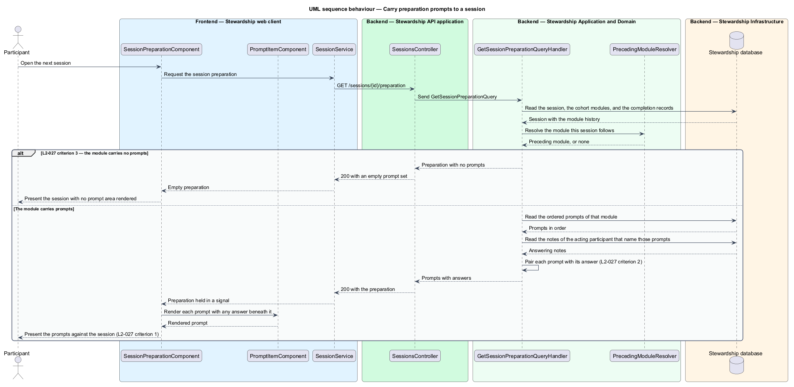

# Prepare for a session

## Overview

A 1-on-1 session is worth more when the participant arrives with something to say. Each
module therefore carries a small set of questions meant for the conversation that
follows it, and this feature is what carries them there.

**preparation prompt** — question a module poses for the 1-on-1 session that follows it

**preceding module** — module a participant was working through in the period before a
given session

**answer** — note a participant has written that names the prompt it responds to

The curriculum screen already tells a participant to bring questions to their next
session. This feature makes that instruction concrete: opening the session shows the
prompts from the module it follows, and beneath each prompt, whatever the participant
has already written in answer to it.

A prompt and its answer stay two things. The prompt belongs to the module and is the
same for everyone in the cohort; the answer is a note belonging to one participant.
Pairing them at read time rather than copying the prompt into the note means revising an
answer changes one record, and revising a prompt changes one record, and neither leaves
a stale copy of the other behind.

A note that answers a prompt is still an ordinary note. It names the prompt in addition
to its attachment, not instead of it, so it appears in the notes destination alongside
everything else the participant has written.

A module carrying no prompts produces no prompt area at all. An empty heading over
nothing is a defect, not an empty state — there is no absence for the participant to act
on, so nothing is rendered.

Writing and revising the notes that serve as answers belongs to `notes/write-note`. The
session these prompts attach to is booked in `sessions/book-session`.

## Description

**Web client.**

- **`SessionPreparationComponent`** — component in the `domain` library. It calls
  `inject(SESSION_SERVICE)`, holds the preparation in a signal, and renders the prompt
  list only when the response reports prompts.
- **`PromptItemComponent`** — presentational component in the `components` library. It
  takes one prompt and its optional answer as inputs and renders the answer beneath the
  prompt.
- **`ISessionService`** / **`SESSION_SERVICE`** / **`SessionService`** — shared with the
  `sessions` subsystem.

**API.**

- **`SessionsController`** — exposes `GET /sessions/{id}/preparation`.
- **`GetSessionPreparationQuery`** and **`GetSessionPreparationQueryHandler`** — the
  query and the MediatR handler. It resolves the preceding module, reads its prompts in
  order, reads the acting participant's answering notes, and pairs them.
- **`SessionPreparationResponse`** and **`PromptWithAnswer`** — the response and one
  pairing, carrying the prompt text and the answer body with its revision time when one
  exists. `HasPrompts` is what the client renders on, so the no-prompts case is a stated
  property of the response rather than an inference from a list length.
- **`PrecedingModuleResolver`** — domain service resolving which module a session
  follows, from the session start and the participant's completion timestamps. It shares
  the approach of `CurrentModuleAtResolver` in `sessions/review-session-history`:
  position in the curriculum at a past instant is derived, never stored on the session.
- **`PreparationPrompt`** — domain entity carrying the module it belongs to, its
  ordinal, and its text. Prompts are curriculum content, identical for everyone in the
  cohort.
- **`Note.PromptId`** — optional reference from a note to the prompt it answers. It
  refines the note rather than replacing its attachment, so an answer is still a module
  note.

The handler reads prompts and answers in two queries and pairs them in memory, rather
than issuing a query per prompt.

## Requirements

The feature realises the following level-2 (L2) requirement. The L2 requirement refines a
level-1 (L1) requirement, cited by identifier. Requirement text is quoted from
`docs/specs/L2.md` unchanged.

| L2 ID | Refines (L1) | Requirement |
|-------|--------------|-------------|
| `L2-027` | `L1-006` | A module's preparation prompts appear against the session that follows it. |

## Diagrams

### System context

Preparation is for the mentor as much as the participant: the prompts shape the
conversation the session exists to hold.

### Containers

One request returns prompts and answers already paired, so the client renders without
resolving anything itself.

### Components

`PrecedingModuleResolver` answers which module the session follows, and the handler does
the pairing. `PromptItemComponent` takes a prompt and an optional answer and injects
nothing.

### Class structure

`PreparationPrompt` belongs to the module; `Note` may name a prompt it answers. The note
on the diagram records why that reference refines the note rather than replacing its
attachment.

### Behaviour — carry preparation prompts to a session

The resolver finds the preceding module first. A module with no prompts yields a
response the client renders as nothing at all, per L2-027 criterion 3; a module with
prompts yields each one paired with its answer, per criteria 1 and 2.

