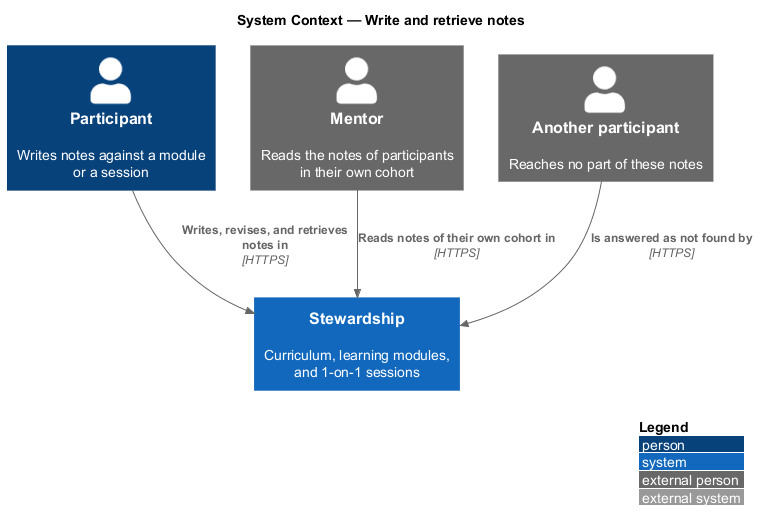
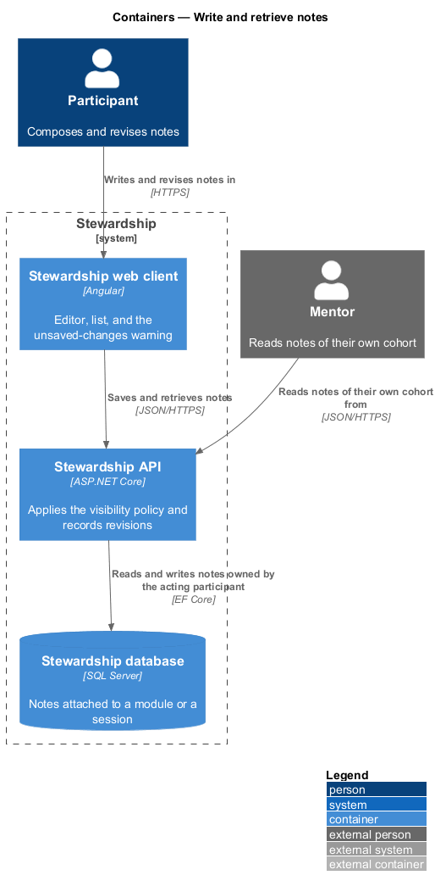
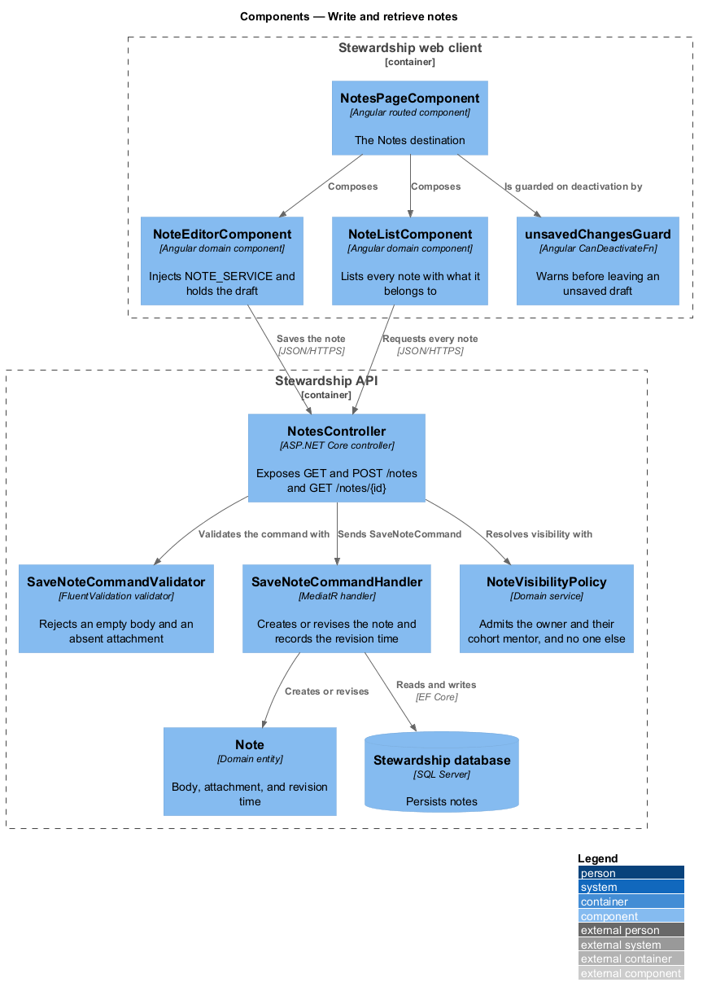
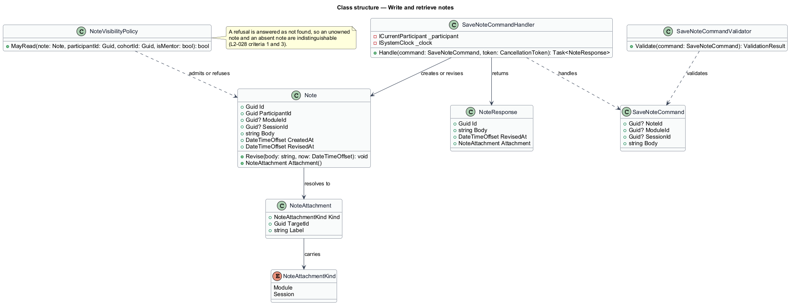
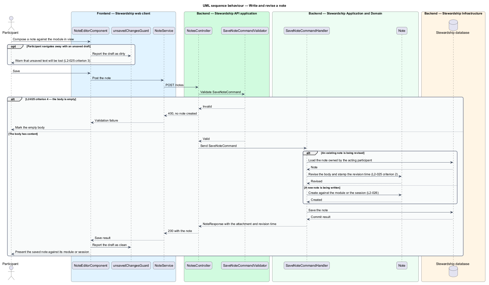
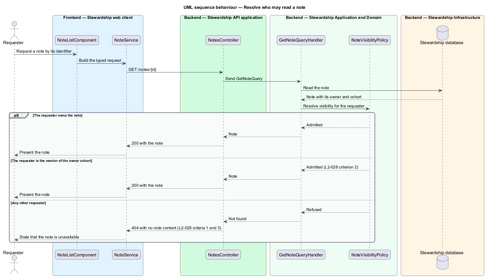

# Write and retrieve notes

## Overview

Notes are where a participant's own thinking lives. A passage in a module prompts a
question; a session produces something worth keeping. This feature covers writing those
notes, revising them, finding them again, and keeping them private.

**note** — passage of text a participant writes, attached to exactly one module or one
session

**attachment** — the module or session a note belongs to, which determines where the
note appears alongside its subject

**notes destination** — the single screen listing every note a participant has written,
whatever it is attached to

Every note belongs to something. A note written while reading a module attaches to that
module; a note written about a session attaches to that session. Attachment is what lets
a note be found twice — beside its subject, where it was written, and in the notes
destination, where everything a participant has written is listed most recent first.

Revising a note replaces its text and stamps the revision time. An empty note is not
created at all, because a note with no text records nothing. Leaving an unsaved draft
warns first, since the cost of losing composed text is higher than the cost of a prompt.

Privacy has exactly two admissions: the participant who wrote the note, and the mentor
of that participant's cohort. Every other request is answered as not found rather than
refused. A refusal would confirm that the note exists, and existence is itself something
a participant has not agreed to share.

The preparation prompts that link a module's notes to the session that follows belong to
`notes/prepare-for-session`. Rejecting oversized or marked-up note text at the boundary
belongs to `platform/secure-boundary`.

## Description

**Web client.**

- **`NotesPageComponent`** — routed page component in the application project, and the
  Notes destination the header points at. It composes the list and the editor.
- **`NoteListComponent`** — component in the `domain` library. It calls
  `inject(NOTE_SERVICE)`, holds the notes in a signal, and renders each with the module
  or session it belongs to, or the empty state when there are none.
- **`NoteEditorComponent`** — component in the `domain` library. It holds the draft in a
  signal, reports whether the draft is dirty, and saves through the same token.
- **`unsavedChangesGuard`** — `CanDeactivateFn` in the application project. It asks the
  editor whether the draft is dirty and warns before the route is left.
- **`EmptyStateComponent`** — presentational component in the `components` library,
  shared with the sessions history.
- **`INoteService`** / **`NOTE_SERVICE`** / **`NoteService`** — the contract, its
  `InjectionToken`, and the HTTP implementation, each in its own file in the `api`
  library.

**API.**

- **`NotesController`** — exposes `GET /notes`, `GET /notes/{id}`, and `POST /notes`.
- **`SaveNoteCommand`** — carries the note identifier when revising, the attachment when
  creating, and the body. It carries no participant identifier; ownership comes from the
  session.
- **`SaveNoteCommandValidator`** — refuses an empty body, and refuses a command naming
  neither a module nor a session, or both.
- **`SaveNoteCommandHandler`** — MediatR handler. It creates or revises, stamping the
  revision time from `ISystemClock`.
- **`GetNoteQuery`** and **`GetNotesQuery`** with their handlers — the single note and
  the full list, the latter ordered by revision time descending.
- **`NoteResponse`** — the saved note with its attachment and revision time, so the
  client updates its signal without a second read.
- **`Note`** — domain entity carrying the owner, a nullable module identifier, a
  nullable session identifier, the body, and both timestamps. Its `Attachment` method
  resolves the two nullable fields into one `NoteAttachment`, so no caller decides which
  field to read.
- **`NoteAttachment`** and **`NoteAttachmentKind`** — the resolved attachment and its
  kind, `Module` or `Session`.
- **`NoteVisibilityPolicy`** — domain service deciding who may read a note. Both
  admissions and the refusal live in one type, so the rule is stated once and applied
  identically by the single-note and list paths.

The exactly-one-attachment rule is enforced in the validator rather than by the schema,
because both fields are nullable at the storage level. `Note.Attachment` resolves that
choice once: whatever the storage shape, every caller receives one attachment.

## Requirements

The feature realises the following level-2 (L2) requirements. Each L2 requirement
refines a level-1 (L1) requirement, cited by identifier. Requirement text is quoted from
`docs/specs/L2.md` unchanged.

| L2 ID | Refines (L1) | Requirement |
|-------|--------------|-------------|
| `L2-025` | `L1-006` | A participant creates and edits notes, and revisions persist. |
| `L2-026` | `L1-006` | Notes are retrievable both in the place they were written and from a single notes destination. |
| `L2-028` | `L1-006` | No other participant reaches a participant's notes. |

## Diagrams

### System context

Three parties bear on a note and only two reach it: the participant who wrote it and
their cohort mentor. Anyone else is answered as though it does not exist.

### Containers

The web client owns the draft and the warning; the API owns the visibility policy. A
note leaves the database only after the policy has admitted the requester.

### Components

Both `domain` components inject `NOTE_SERVICE`, and `unsavedChangesGuard` sits in the
application project with the route it guards. `NoteVisibilityPolicy` is consulted on
every read path.

### Class structure

`Note` resolves its two nullable attachment fields into one `NoteAttachment`. The note
on the diagram records why a refusal is answered as not found.

### Behaviour — write and revise a note

The guard warns before an unsaved draft is abandoned, per L2-025 criterion 3. Validation
refuses an empty body, per criterion 4. Creating and revising differ only in whether a
note is loaded first, and both stamp the revision time.

### Behaviour — resolve who may read a note

One policy answers for every requester. The owner and the cohort mentor receive the
note; every other requester receives the same not-found answer they would receive for a
note that does not exist.

