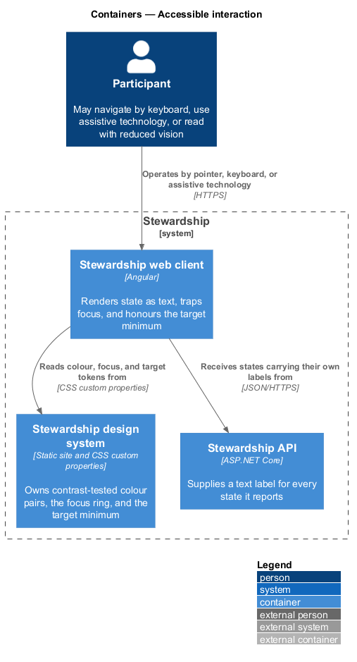
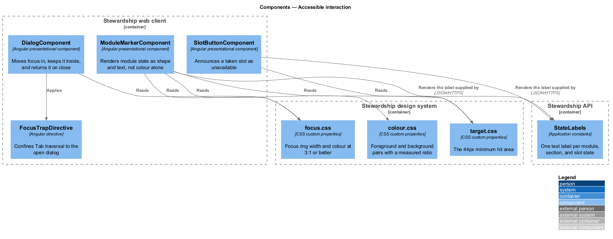
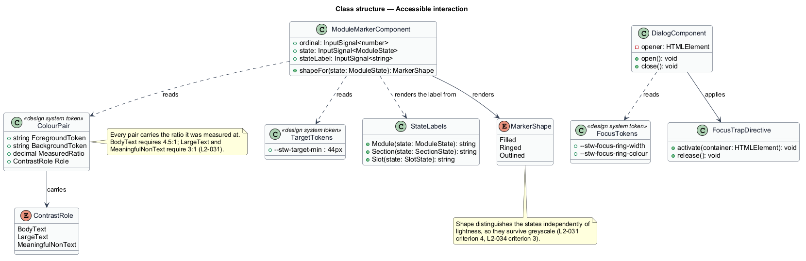
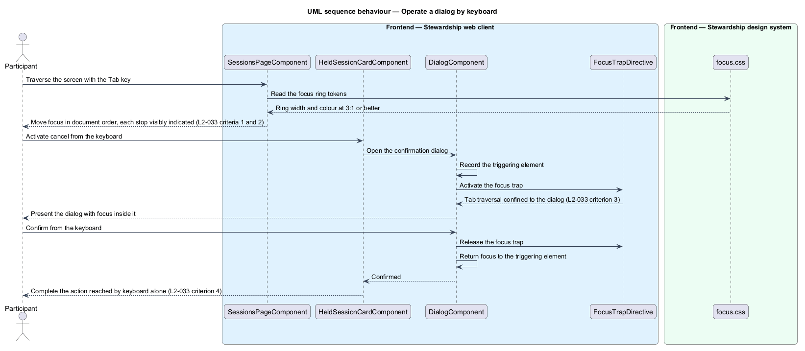

# Accessible interaction

## Overview

Stewardship is read closely, on small screens, over the weeks of a cohort. Some participants
navigate by keyboard, some use a screen reader, and some read with reduced vision. This
feature owns what the application does to remain operable for all of them: contrast,
target size, keyboard operation, and the rule that meaning is never carried by colour
alone.

**contrast ratio** — measured relationship between a foreground colour and the
background it sits on

**meaningful non-text mark** — graphic element whose appearance carries information, such
as a module path marker or a slot state

**hit area** — region that activates an interactive element, which may exceed the drawn
element

**focus trap** — confinement of keyboard traversal to an open dialog until it closes

Four rules hold across every screen. Body text meets 4.5:1 against its background and
larger text 3:1. Marks that carry meaning meet 3:1. Every interactive target has a hit
area of at least 44px by 44px, except a link inside running prose, which is exempt
because it sits in a line of text. Every action available by pointer completes by
keyboard, in document order, with each stop visibly indicated.

The fourth rule is the one that shapes components rather than stylesheets: state is
available in text or shape, not only in colour. A module marker distinguishes complete,
current, and locked by shape as well as by fill, so the three survive greyscale, and it
carries a text label that a screen reader announces. A taken slot announces its
unavailability rather than relying on being dimmer than the others. The API supplies the
label with the state, so the client is never in the position of inventing wording for a
state it received as an enumeration.

The design system owns the tokens, and each colour pair carries the ratio it was measured
at rather than a hex value alone. That is what makes a contrast failure a defect in a
named token rather than a property of a screen nobody re-checked. The tokens drawn from
the current screen mockups include several whose measured ratio falls below the minimum;
their replacement values are `<TO SUPPLY>` and are settled in the mockup correction pass.

The authoring screens carry the same obligations, and two of them bite harder there than
anywhere in the participant experience (L2-060). Ordering is the first: a control that
moves a module or a section shall be operable by keyboard alone, and the resulting
arrangement shall be announced, because an administrator who cannot see the list move has
no other evidence the move happened. Validation is the second: a refused field shall
announce its message and take focus, so the failure is not left as a colour beside a
control the keyboard has already passed. Publication state follows the same rule as every
other state and is conveyed as text rather than by colour alone.

Layout across breakpoints belongs to `platform/responsive-shell`. The states themselves
are defined in `curriculum/view-path`, `modules/read-module`, and
`sessions/view-availability`; this feature governs how they are conveyed. The authoring
controls it governs are designed in `administration/order-curriculum` and the sibling
authoring features.

## Description

**Design system.**

- **`colour.css`** — foreground and background pairs as `--stw-*` custom properties.
  Each pair records its role — body text, large text, or meaningful non-text — and the
  ratio it was measured at, so the minimum that applies to it is unambiguous.
- **`focus.css`** — the focus ring width and colour, at 3:1 or better against both the
  focused element and the surrounding background.
- **`target.css`** — `--stw-target-min` at 44px, applied as a minimum block and inline
  size on every interactive element.

A hard-coded hex, dimension, or font stack in a component stylesheet is a defect. The
correction is to add the missing token to the design system first.

**Web client.**

- **`ModuleMarkerComponent`** — presentational component in the `components` library. It
  takes the ordinal, the state, and the state label as inputs, renders a `MarkerShape`
  per state, and puts the label in the accessible name.
- **`MarkerShape`** — enumeration of `Filled`, `Ringed`, and `Outlined`, giving the three
  module states three silhouettes.
- **`SlotButtonComponent`** — presentational component in the `components` library. A
  taken slot is disabled and announces its unavailability rather than signalling it by
  appearance.
- **`DialogComponent`** — presentational component in the `components` library. It
  records the triggering element on open, moves focus inside, and returns focus there on
  close.
- **`FocusTrapDirective`** — Angular directive confining Tab traversal to the open
  dialog.

**API.**

- **`StateLabels`** — application constants mapping each `ModuleState`, `SectionState`,
  and `SlotState` to its text label. The label travels with the state in every response
  that carries one.

Keyboard order follows document order, so the DOM is authored in the reading order of
the screen and layout is achieved with grid and flex placement rather than by reordering
markup.

## Requirements

The feature realises the following level-2 (L2) requirements. Each L2 requirement
refines a level-1 (L1) requirement, cited by identifier. Requirement text is quoted from
`docs/specs/L2.md` unchanged.

| L2 ID | Refines (L1) | Requirement |
|-------|--------------|-------------|
| `L2-031` | `L1-008` | Text and meaningful non-text marks meet WCAG 2.1 AA contrast against their background. |
| `L2-032` | `L1-008` | Every interactive target is large enough to hit reliably on a touch screen. |
| `L2-033` | `L1-008` | Every action is reachable and operable without a pointing device. |
| `L2-034` | `L1-008` | Module state, section state, and slot state are each available in text or shape. |
| `L2-060` | `L1-008` | Authoring is reachable by keyboard and legible to assistive technology. |

## Diagrams

### Containers

Three containers take part: the design system owns the measured values, the client
applies them, and the API supplies the text that accompanies each state. A context view
is omitted: the participant is the only party, so it would restate the container view
with less detail.

### Components

The two state-bearing components read tokens for colour and target size and render
labels the API supplied. The dialog and the focus trap are the keyboard-specific pair.

### Class structure

`ColourPair` carries its role and its measured ratio, so the applicable minimum is part
of the token rather than knowledge held elsewhere. `MarkerShape` is what makes the three
module states distinguishable without colour.

### Behaviour — operate a dialog by keyboard

Traversal follows document order with a visible indicator, per L2-033 criteria 1 and 2.
The dialog moves focus in, the trap keeps it there, and focus returns to the trigger on
close, per criterion 3 — and the whole action completes without a pointer, per criterion
4.

