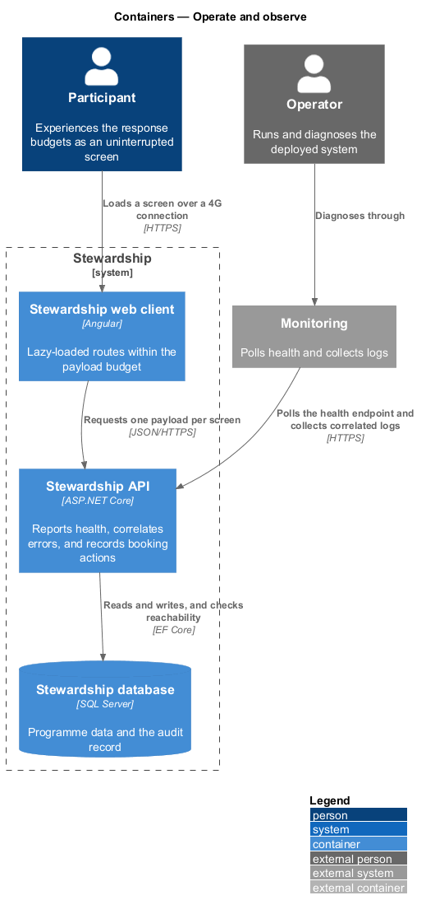
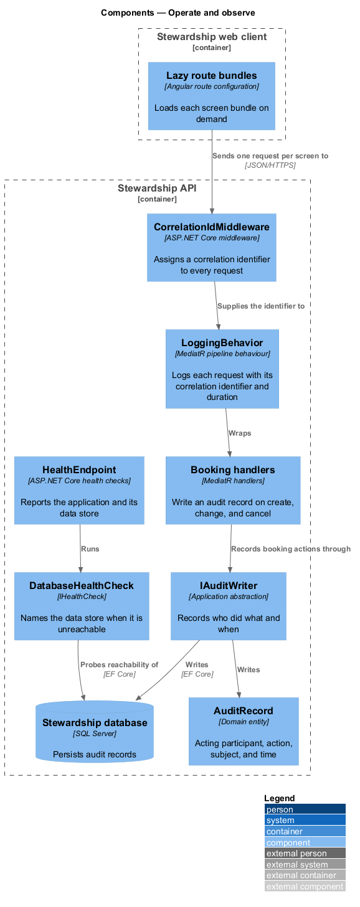
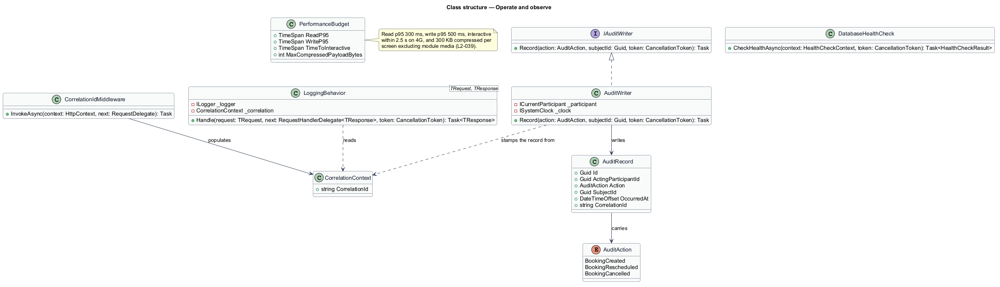
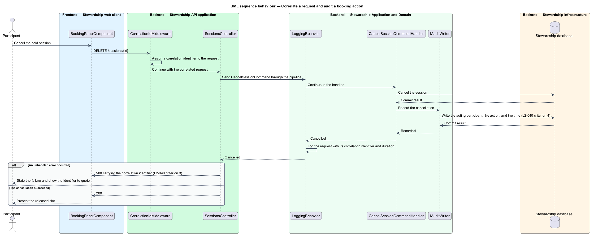
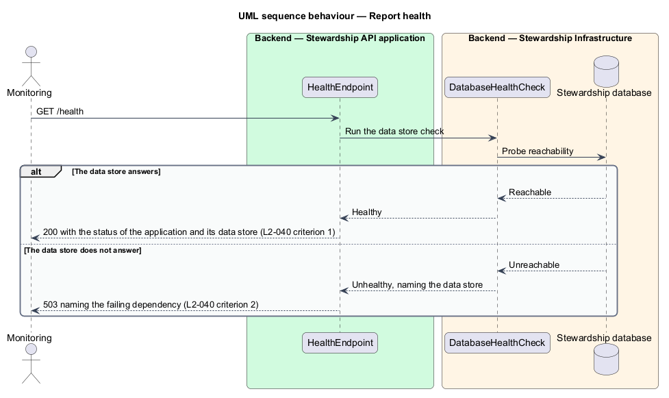

# Operate and observe

## Overview

Two obligations sit outside any single screen. Stewardship responds quickly enough that
reading a module and booking a session feel uninterrupted, and it reports enough about
itself to be run and diagnosed once deployed. This feature owns both.

**response budget** — stated upper bound on how long an operation takes, measured at the
95th percentile

**correlation identifier** — value assigned to one request and carried through its logs
and its client-facing error, so a reported failure can be found

**audit record** — statement of which participant took which action on which subject, at
what time

The budgets are specific: a read completes within 300 ms at the 95th percentile, a write
within 500 ms, a screen becomes interactive within 2.5 seconds on a mid-tier device over
4G, and a screen transfers no more than 300 KB compressed excluding module media. They
are met by design rather than by tuning afterwards. Each screen is served by one query
returning everything it displays — the curriculum path with its progress figures, the
booking panel with its days, slots, and allowance — so a screen costs one round trip
rather than several. Each route loads its own bundle on demand, so the payload for the
first screen carries no code for the others.

Observation has three parts. A health endpoint reports the application and its data
store, answering 503 and naming the dependency when the store is unreachable, so a
monitor learns what failed rather than only that something did. Every request carries a
correlation identifier through its logs, and an unhandled error returns that identifier
to the client — a participant reporting a problem can quote something that finds the log
line. Booking actions are recorded: creating, changing, and cancelling a session each
write who acted, what they did, and when.

The authoring endpoints hold to the same budgets as the participant endpoints, and one
authoring action is measured on its own: publishing a programme touches every module it
holds, so it carries a stated ceiling rather than inheriting the ordinary write budget
(L2-062). Authoring writes also join the audit record, so a change to stored curriculum
names the administrator who made it, the action, and the time.

Sanitising the error that carries the correlation identifier belongs to
`platform/secure-boundary`. The one-query-per-screen shape those budgets rely on is
designed in the feature owning each screen. What each authoring action does belongs to
the `administration` subsystem.

## Description

**API — observation.**

- **`CorrelationIdMiddleware`** — assigns a correlation identifier to every request and
  populates `CorrelationContext`.
- **`CorrelationContext`** — scoped type carrying the identifier, injected wherever it is
  needed rather than passed through call signatures.
- **`LoggingBehavior<TRequest, TResponse>`** — MediatR pipeline behaviour logging each
  request with its correlation identifier and its duration. Registered as a behaviour, so
  a handler added later is logged without being changed.
- **`HealthEndpoint`** — the ASP.NET Core health check endpoint reporting the
  application and its dependencies.
- **`DatabaseHealthCheck`** — `IHealthCheck` probing the data store and naming it in the
  unhealthy result.
- **`IAuditWriter`** in `Application` and **`AuditWriter`** in `Infrastructure` — the
  abstraction and its implementation. It takes the acting participant from
  `ICurrentParticipant`, the time from `ISystemClock`, and the identifier from
  `CorrelationContext`, so a caller supplies only the action and its subject.
- **`AuditRecord`** — domain entity holding the acting participant, the action, the
  subject, the time, and the correlation identifier.
- **`AuditAction`** — enumeration of `BookingCreated`, `BookingRescheduled`, and
  `BookingCancelled`.

**API and client — performance.**

- **`PerformanceBudget`** — the four figures as a single stated type, so the budgets are
  named in one place rather than restated across features.
- **Response compression** — configured in the API, which is what makes the 300 KB
  figure a compressed measurement.
- **Lazy route bundles** — each screen's route loads its own bundle on demand.
- **One query per screen** — the shape already adopted by the curriculum, module, and
  sessions features. Each screen's response carries its derived figures alongside its
  content, so nothing displayed costs a second request.

The load-testing method, the mid-tier device, and the environment the percentiles are
measured in are `<TO SUPPLY>`; the figures they are measured against are stated above.

## Requirements

The feature realises the following level-2 (L2) requirements. Each L2 requirement
refines a level-1 (L1) requirement, cited by identifier. Requirement text is quoted from
`docs/specs/L2.md` unchanged. L2-039 states its obligation entirely through its
acceptance criteria, so its section title is quoted as the requirement.

| L2 ID | Refines (L1) | Requirement |
|-------|--------------|-------------|
| `L2-039` | `L1-010` | Respond within stated budgets. |
| `L2-040` | `L1-010` | The system reports its own health and records what happened. |
| `L2-062` | `L1-010` | Administration screens meet the budgets the participant screens meet. |

## Diagrams

### Containers

Two audiences read this feature's output. The participant experiences the budgets, and
an operator reads health and logs through monitoring. A context view is omitted: both
parties already appear here, alongside the containers they reach.

### Components

Correlation and logging wrap every request as middleware and a pipeline behaviour, so
neither is something a handler remembers to do. The audit writer is the one component a
handler calls deliberately.

### Class structure

`AuditWriter` assembles the record from three ambient sources, leaving callers to supply
only the action and its subject. The note states the four figures of L2-039 in one place.

### Behaviour — correlate a request and audit a booking action

The identifier is assigned before any handler runs, travels into the audit record and
the log line, and returns to the client on an unhandled error — the third and fourth
criteria of L2-040 in one path.

### Behaviour — report health

The endpoint runs the data store check and reports both outcomes distinctly: 200 with
the status of each part, or 503 naming the dependency that failed.

