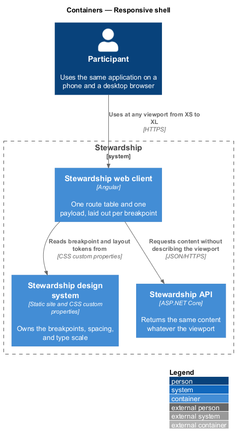
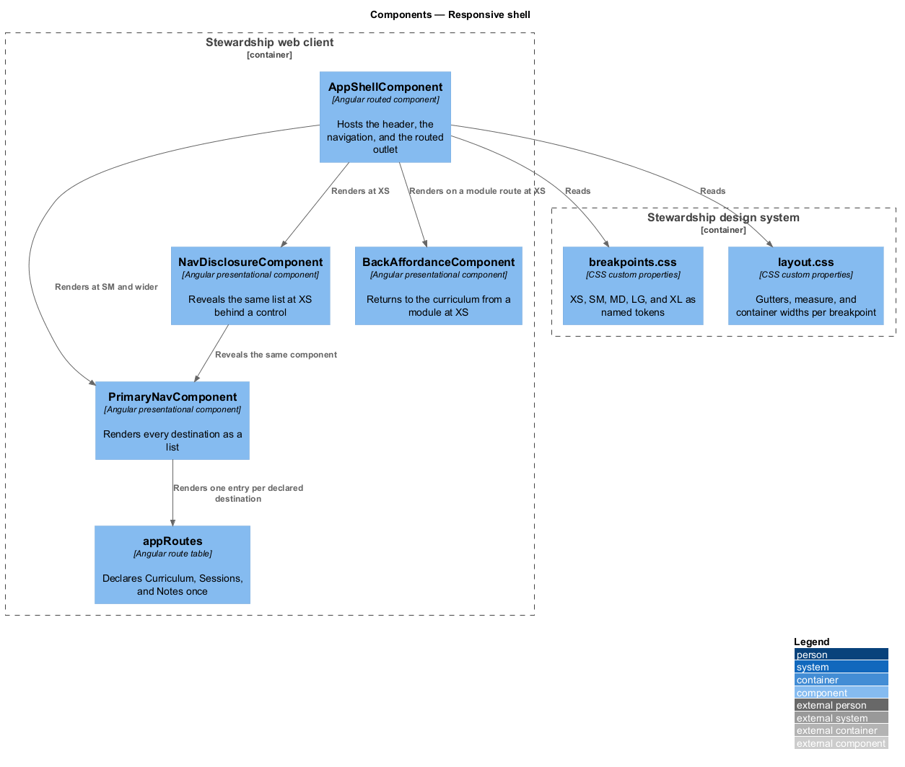
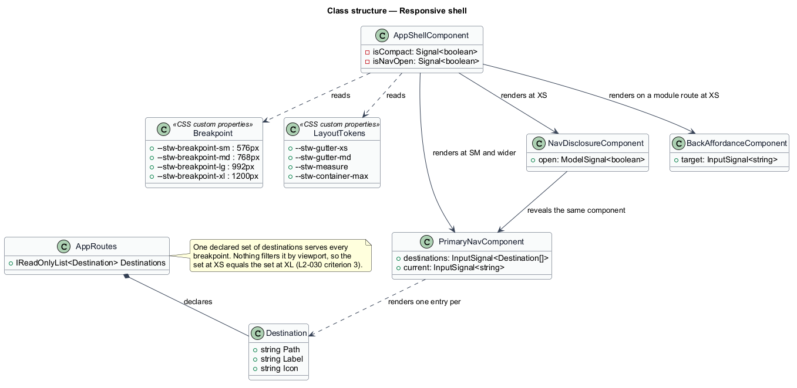
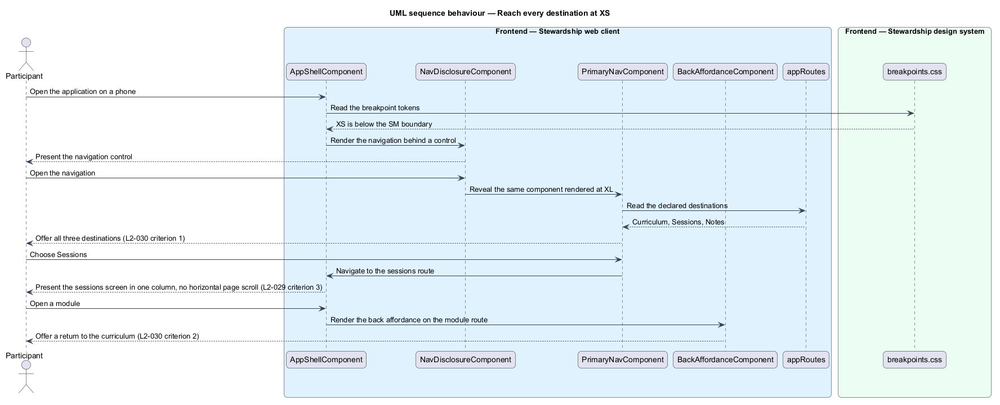

# Responsive shell

## Overview

Stewardship is a responsive web application, which here carries a precise meaning: the
same application, with the same content and the same destinations, laid out differently
at different widths. This feature owns the shell that makes that true — the header, the
navigation, the layout tokens, and the rule that nothing disappears as the viewport
narrows.

**breakpoint** — named viewport width at which the layout changes: XS below 576px, SM
from 576px, MD from 768px, LG from 992px, XL from 1200px

**destination** — top-level place a participant can navigate to: Curriculum, Sessions,
or Notes

**disclosure** — control that reveals navigation at XS which is permanently visible at
wider sizes

Layout adapts; content does not. A screen at XS is a single column where XL is two, and
the day strip and slot grid reflow rather than scroll sideways, but every element
present at one width is present at every other. The page body never scrolls
horizontally; where content is genuinely wide, the element itself scrolls inside its own
bounds rather than pushing the page.

The destination set is the sharper version of the same rule. There is one route table,
and the navigation renders one entry per declared destination. At XS the same navigation
component sits behind a disclosure control instead of along the header, so the set a
participant can reach is identical by construction — nothing filters destinations by
width, because there is no filter to write. A module opened at XS also offers a return
to the curriculum, since a narrow screen shows one place at a time and the way back has
to be visible.

The design system owns the breakpoints and the layout tokens, and the front end reads
them. A component stylesheet that hard-codes a width or a gutter is a defect; the fix is
to add the token to `design-system/` first.

The administration screens obey the same rule and the same tokens. An administrator
authors from a phone as readily as from a desktop: the programme list, the module editor,
and the ordering controls each hold their content at XS without the page body scrolling
sideways, and the set of authoring actions offered at XS equals the set offered at XL
(L2-059). Authoring adds no breakpoint of its own, because the layout tokens the shell
already reads cover it.

Content parity within a single screen — the practice steps and the effort estimate
staying whole at every width — belongs to `modules/read-module`. Contrast, target size,
and keyboard operation belong to `platform/accessible-interaction`. What the authoring
screens contain belongs to the `administration` subsystem.

## Description

**Web client.**

- **`AppShellComponent`** — routed shell in the application project. It hosts the
  header, the navigation, and the routed outlet, and holds the compact and open states
  in signals.
- **`appRoutes`** — the route table, declaring Curriculum, Sessions, and Notes once. It
  is the single source of the destination set.
- **`PrimaryNavComponent`** — presentational component in the `components` library. It
  takes the destinations and the current path as inputs and renders one entry each.
- **`NavDisclosureComponent`** — presentational component in the `components` library.
  It takes an open model and reveals `PrimaryNavComponent`. It reveals the same
  component rendered at wider sizes rather than a reduced copy of it.
- **`BackAffordanceComponent`** — presentational component in the `components` library,
  rendered on a module route at XS.

**Design system.**

- **`breakpoints.css`** — the five breakpoints as `--stw-breakpoint-*` custom
  properties. The values match the requirement exactly, so a stylesheet and a spec never
  disagree about where XS ends.
- **`layout.css`** — gutters, measure, and container widths per breakpoint as
  `--stw-*` custom properties.

The design system is a deliverable in its own right at `design-system/`, beside
`backend/` and `frontend/`, with its own build and no runtime dependency on the
application. Its copy of the tokens is authoritative and the front end mirrors it.

**API.**

The API takes no part. It is told nothing about the viewport and varies nothing by it,
which is why layout can change freely without content changing with it.

## Requirements

The feature realises the following level-2 (L2) requirements. Each L2 requirement
refines a level-1 (L1) requirement, cited by identifier. Requirement text is quoted from
`docs/specs/L2.md` unchanged.

| L2 ID | Refines (L1) | Requirement |
|-------|--------------|-------------|
| `L2-029` | `L1-007` | Layouts adapt across the breakpoints without loss of content or horizontal scrolling of the page body. |
| `L2-030` | `L1-007` | Curriculum, Sessions, and Notes are reachable at XS as they are at XL. |
| `L2-059` | `L1-007` | Authoring is usable on a phone as it is on a desktop. |

## Diagrams

### Containers

Three containers bear on layout, and only two of them change with the viewport. The API
is not told the width, so it cannot vary content by it. A context view is omitted: the
participant is the only party, so it would restate the container view with less detail.

### Components

The disclosure reveals the same `PrimaryNavComponent` used at wider sizes, and both
render from one route table. The breakpoint and layout tokens come from the design
system rather than from component stylesheets.

### Class structure

`AppRoutes` declares the destinations once and nothing filters them by width, as the
note records. The shell reads tokens rather than holding literal widths.

### Behaviour — reach every destination at XS

The disclosure reveals the same navigation, listing all three destinations, which is
L2-030 criterion 1. The chosen screen renders in one column without horizontal page
scroll, and a module route offers the way back that criterion 2 requires.

