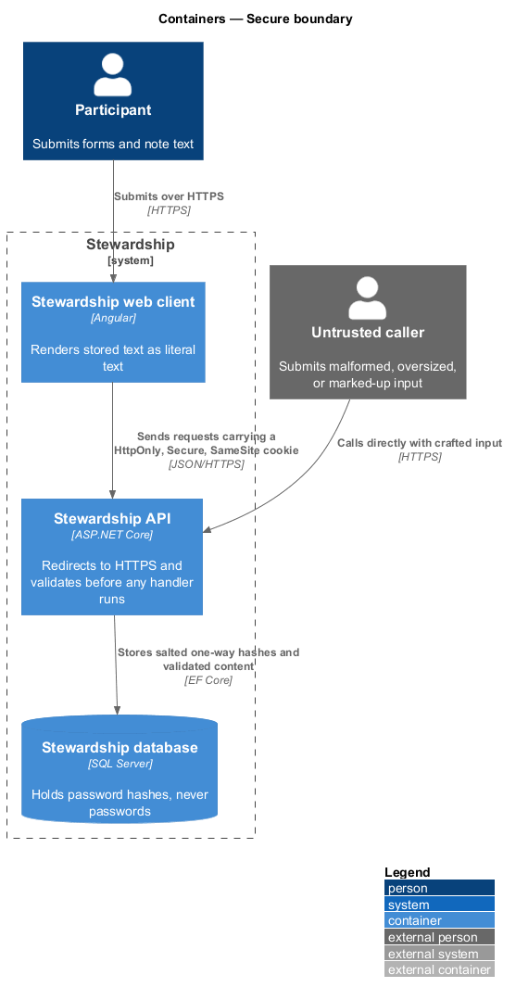
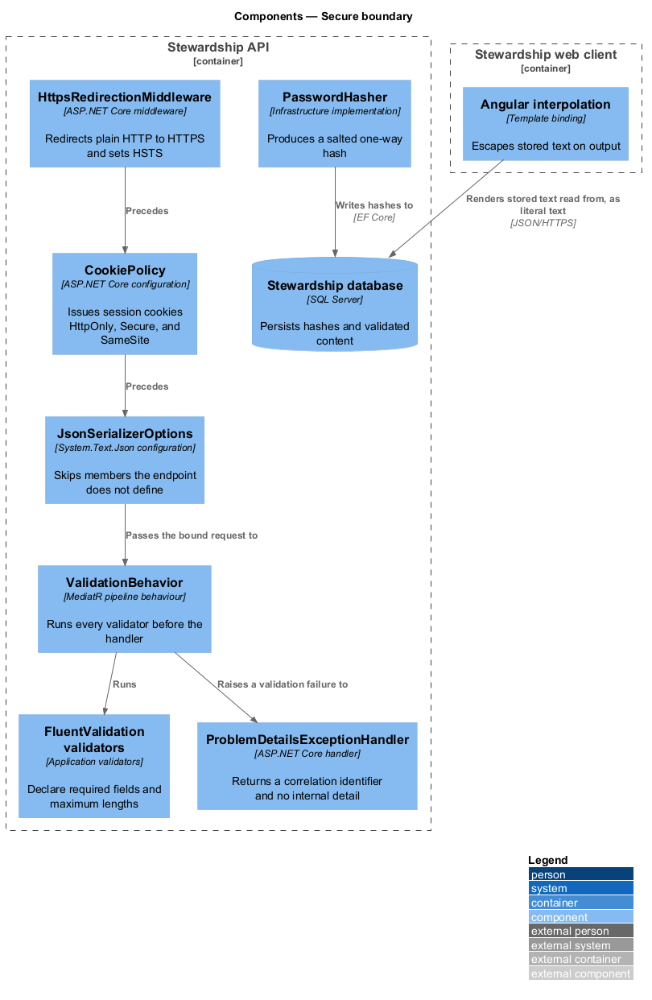
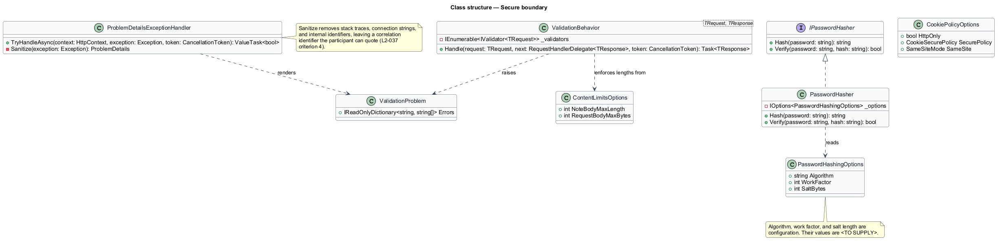
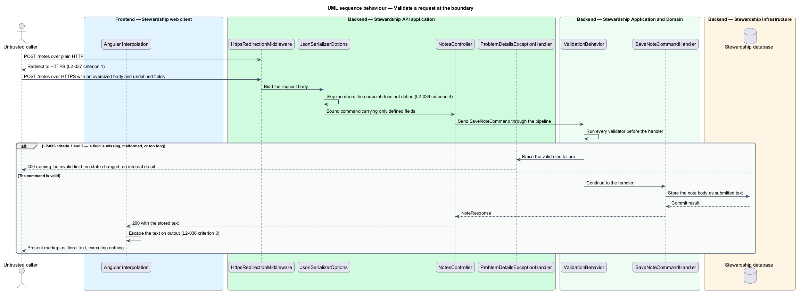

# Secure boundary

## Overview

Everything a client sends is untrusted, including everything sent by the application's
own web client. This feature owns the edge where that input is admitted or refused, and
the protections applied to credentials and data on the way in and out.

**boundary** — point at which a request is bound, validated, and either admitted to the
application or refused

**pipeline behaviour** — MediatR component that runs around every request, before and
after the handler

**sanitised error** — client-facing message stripped of stack traces, connection
strings, and internal identifiers

Validation happens before domain logic, not inside it. A request whose body is missing a
required field, malformed, or over length is refused with the field named, and no state
changes. Because validation runs as a pipeline behaviour around every request rather
than as a call at the top of each handler, an endpoint added later inherits it rather
than remembering it.

Fields the endpoint does not define are dropped at binding rather than rejected. A caller
that adds a field it hopes will be honoured finds it was never bound, so it cannot alter
stored state by any route.

Note text is stored as submitted and escaped on output. Markup a participant types is
their text, and it renders as the characters they typed. Escaping at render rather than
stripping at write means the participant's words survive intact and nothing executes.

Credentials never exist at rest. A stored password is a salted one-way hash from a
current algorithm; the password itself is not written anywhere. Plain HTTP is redirected
to HTTPS, and the session cookie carries `HttpOnly`, `Secure`, and `SameSite`. An error
reaching the client carries a correlation identifier and nothing internal — enough for a
participant to quote when reporting a problem, and not enough to describe the system to
someone probing it.

Deciding who may reach which data belongs to `access/guard-routes`. Slowing repeated
sign-in attempts belongs to `access/sign-in`. Emitting the correlation identifier into
logs belongs to `platform/operate-and-observe`.

## Description

**API — request path, in order.**

- **`HttpsRedirectionMiddleware`** — redirects plain HTTP and sets HSTS.
- **`CookiePolicy`** — issues session cookies with `HttpOnly`, `Secure`, and `SameSite`
  set through `CookiePolicyOptions`.
- **`JsonSerializerOptions`** — configured so members the endpoint does not define are
  skipped during binding.
- **`ValidationBehavior<TRequest, TResponse>`** — MediatR pipeline behaviour resolving
  every registered `IValidator<TRequest>` and running it before the handler. A failure
  short-circuits the pipeline, so no handler runs and no state changes.
- **FluentValidation validators** — one per command, declaring required fields and
  maximum lengths. They live in `Application` beside the commands they validate.
- **`ProblemDetailsExceptionHandler`** — maps a failure to `ProblemDetails`. Its
  `Sanitize` method is where internal detail is removed and the correlation identifier
  is attached.
- **`ValidationProblem`** — the field-level errors returned on a validation failure.

**API — credentials and content.**

- **`IPasswordHasher`** in `Application` and **`PasswordHasher`** in `Infrastructure` —
  the abstraction and its implementation. The handler in `access/sign-in` verifies
  through the abstraction and never compares password text.
- **`PasswordHashingOptions`** — the algorithm, work factor, and salt length, bound from
  configuration. The values are `<TO SUPPLY>`.
- **`ContentLimitsOptions`** — the note body maximum and the request body maximum, bound
  from configuration and enforced by the validators. The values are `<TO SUPPLY>`.

**Web client.**

- **Angular interpolation** — the rendering path for all stored text. Template binding
  escapes on output. No component binds stored text through `innerHTML` or passes it
  through `bypassSecurityTrustHtml`, which is what keeps the escaping in force.

Configuration rather than constants throughout: the hashing parameters and the content
limits are Options types, so raising a work factor or a length limit is a deployment
change rather than a code change.

## Requirements

The feature realises the following level-2 (L2) requirements. Each L2 requirement
refines a level-1 (L1) requirement, cited by identifier. Requirement text is quoted from
`docs/specs/L2.md` unchanged. L2-037 states its obligation entirely through its
acceptance criteria, so its section title is quoted as the requirement.

| L2 ID | Refines (L1) | Requirement |
|-------|--------------|-------------|
| `L2-036` | `L1-009` | The API rejects malformed, oversized, and unexpected input before it reaches domain logic. |
| `L2-037` | `L1-009` | Protect credentials and data in transit and at rest. |

## Diagrams

### Containers

Two callers reach the API: the application's web client and anything else. The boundary
treats them identically, which is why a crafted direct call is refused by the same
components that serve the client.

### Components

The request path runs in order: redirect, cookie policy, binding, validation, handler.
`ProblemDetailsExceptionHandler` is the single exit for failures, and Angular
interpolation is the single exit for stored text.

### Class structure

`ValidationBehavior` is generic over the request, so every command inherits validation
by registration. The notes record what `Sanitize` removes and which hashing parameters
remain to be supplied.

### Behaviour — validate a request at the boundary

Plain HTTP is redirected, undefined fields are dropped at binding, and the validator
runs before the handler. The valid path stores the text as submitted and escapes it on
output, which is how L2-036 criterion 3 is met without altering what the participant
wrote.

