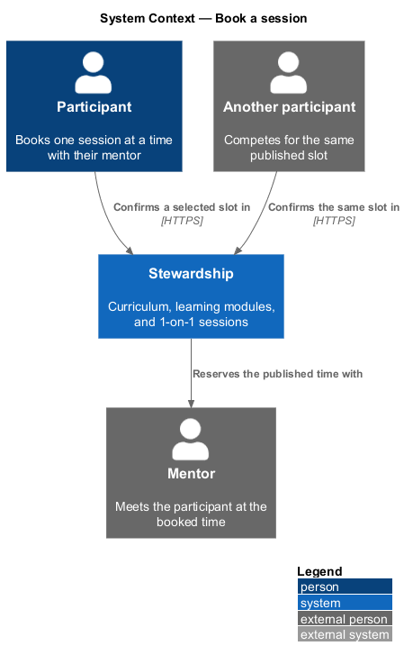
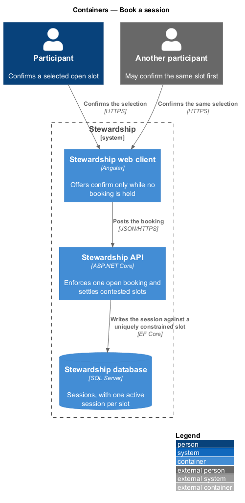
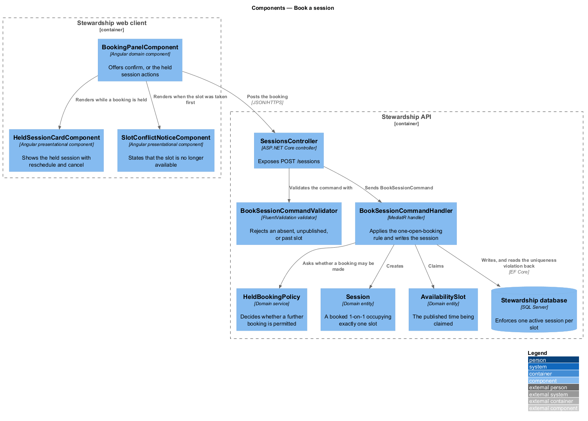
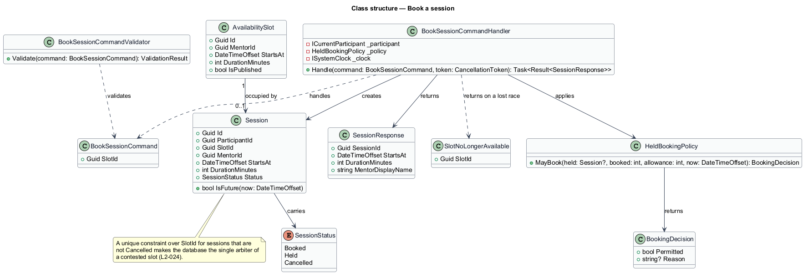
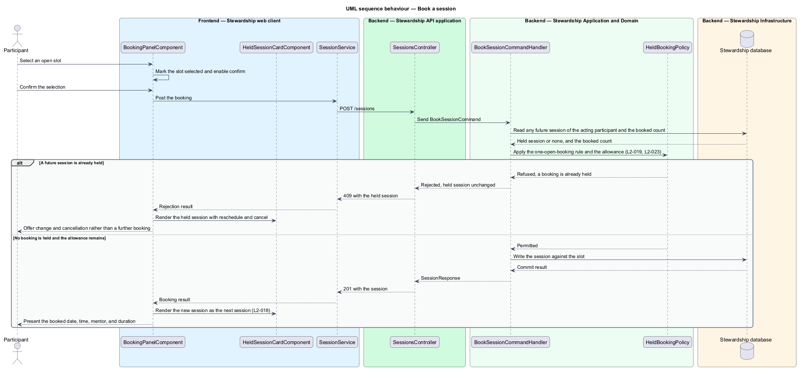
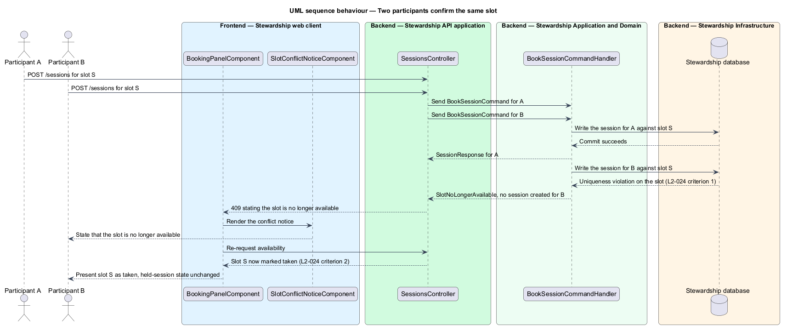

# Book a session

## Overview

A Stewardship cohort includes six 1-on-1 sessions with its mentor, and a participant
claims each one by confirming a published slot. This feature covers that confirmation
and the two rules that constrain it.

**booking** — session a participant holds at a future time, occupying one published slot

**one-open-booking rule** — constraint by which a participant holds at most one future
session at a time

**contested slot** — published slot two participants attempt to claim before either
claim is recorded

The first rule keeps the panel honest. While a participant holds a future session, the
panel offers change and cancellation rather than a further confirmation, and the API
refuses a second booking however it arrives. A participant with nothing booked sees
slots to book; a participant holding one sees the session they hold. The two states are
mutually exclusive, so the screen never shows a confirm action beside a session that
already exists.

The rule applies again once the held session has passed or been cancelled: the panel
returns to offering slots. Holding at most one at a time constrains what is open, not
how many a participant may book over the cohort. The total is the cohort allowance,
designed in `sessions/view-availability`.

The second rule settles a race. Two participants may see the same slot as open and
confirm within moments of each other; exactly one obtains it. The database is the
arbiter — a unique constraint over the slot for sessions that are not cancelled — so the
outcome does not depend on a read-then-write check that another request can slip
between. The participant who loses is told the slot is no longer available, sees it
marked taken when the panel refreshes, and finds their own booking state untouched.

Rescheduling and cancelling a held session belong to `sessions/change-booking`.

## Description

**Web client.**

- **`BookingPanelComponent`** — component in the `domain` library, shared with
  `sessions/view-availability`. It calls `inject(SESSION_SERVICE)`, tracks the selected
  slot in a signal, and enables the confirm action only when a slot is selected and no
  session is held.
- **`HeldSessionCardComponent`** — presentational component in the `components` library.
  It takes the held session as an input and emits reschedule and cancel outputs.
- **`SlotConflictNoticeComponent`** — presentational component in the `components`
  library stating that a slot is no longer available.
- **`ISessionService`** / **`SESSION_SERVICE`** / **`SessionService`** — shared with the
  rest of the `sessions` subsystem.

**API.**

- **`SessionsController`** — exposes `POST /sessions`.
- **`BookSessionCommand`** — carries the slot identifier only. The participant is taken
  from the session through `ICurrentParticipant`.
- **`BookSessionCommandValidator`** — refuses an absent slot, an unpublished slot, and a
  slot whose start has passed.
- **`BookSessionCommandHandler`** — MediatR handler. It reads any future session and the
  booked count, applies the policy, then writes.
- **`HeldBookingPolicy`** — domain service returning a `BookingDecision`. It holds both
  constraints on booking — an existing future session, and an exhausted allowance — so
  the reason for a refusal is decided in one place and travels with it.
- **`BookingDecision`** — the decision and, on refusal, its reason.
- **`SessionResponse`** — the created session with its start, duration, and mentor name.
  The same values appear on the curriculum screen, because both read this one record.
- **`SlotNoLongerAvailable`** — the result returned when the write loses the race.
- **`Session`** — domain entity carrying the participant, the slot, the mentor, the
  start, the duration, and its `SessionStatus`.
- **`SessionStatus`** — enumeration of `Booked`, `Held`, and `Cancelled`. Cancellation
  is a status rather than a deletion, which is what allows a cancelled session to
  release its slot while remaining auditable.
- **`AvailabilitySlot`** — domain entity for the published time being claimed.

The uniqueness constraint covers the slot for sessions that are not `Cancelled`. A
cancelled session therefore stops blocking its slot without being removed, and the
constraint keeps meaning exactly one live claim per slot.

The handler translates the uniqueness violation into `SlotNoLongerAvailable` rather than
letting it surface as an error. A lost race is an expected outcome of two people
choosing well, not a fault.

## Requirements

The feature realises the following level-2 (L2) requirements. Each L2 requirement
refines a level-1 (L1) requirement, cited by identifier. Requirement text is quoted from
`docs/specs/L2.md` unchanged.

| L2 ID | Refines (L1) | Requirement |
|-------|--------------|-------------|
| `L2-018` | `L1-005` | Confirming a selected open slot creates a session for the participant with their cohort's mentor. |
| `L2-019` | `L1-005` | A participant has at most one future session at a time. While one is held, the panel offers change and cancellation rather than a further booking. |
| `L2-024` | `L1-005` | Two participants racing for one slot must not both obtain it. |

## Diagrams

### System context

Three people bear on a booking: the participant confirming, another participant who may
confirm the same slot, and the mentor whose time is reserved.

### Containers

Both confirmations reach the same API and the same uniquely constrained table, which is
what makes the outcome deterministic rather than dependent on timing in the client.

### Components

`HeldBookingPolicy` decides before anything is written, and the database settles the
contested case. The client renders one of three things: the confirm action, the held
session, or the conflict notice.

### Class structure

`SessionStatus` is what lets cancellation release a slot without deleting a record, and
the note states the constraint that implements L2-024.

### Behaviour — book a session

The policy is applied before the write. A participant already holding a future session
is refused and shown the held session with its change actions, per L2-019; otherwise the
session is created and presented as the next session, per L2-018.

### Behaviour — two participants confirm the same slot

Both writes reach the database and the constraint decides. The second participant
receives a rejection, sees the slot as taken on refresh, and keeps their own booking
state — the three criteria of L2-024.

