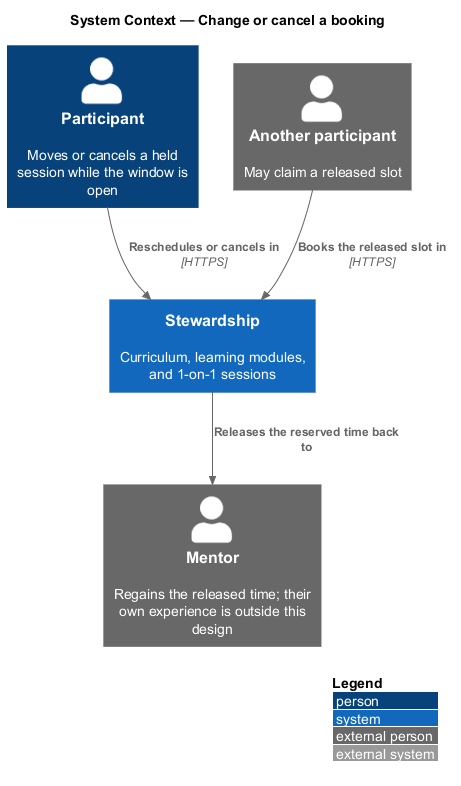
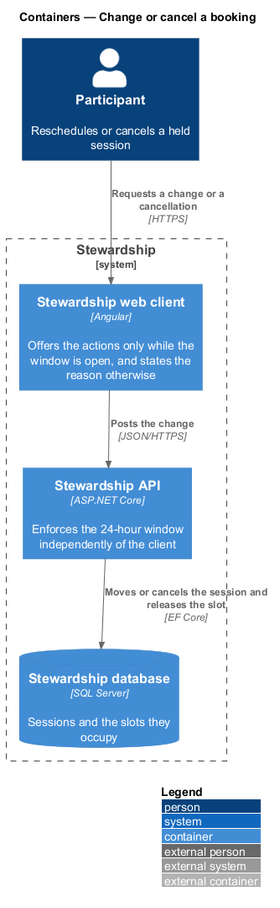
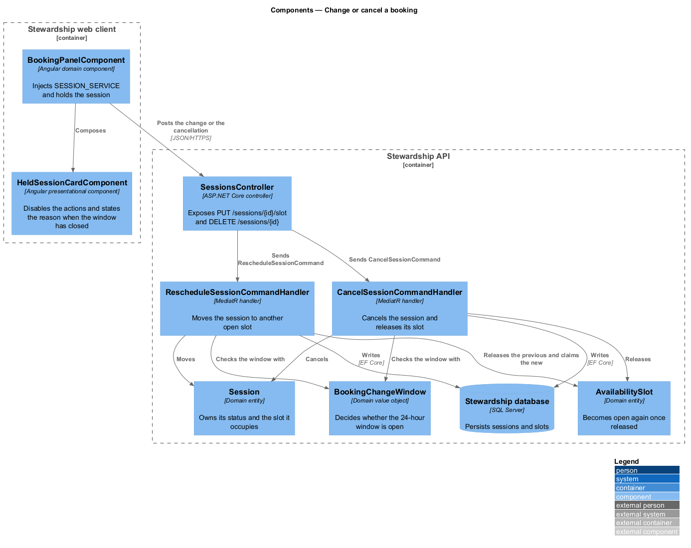
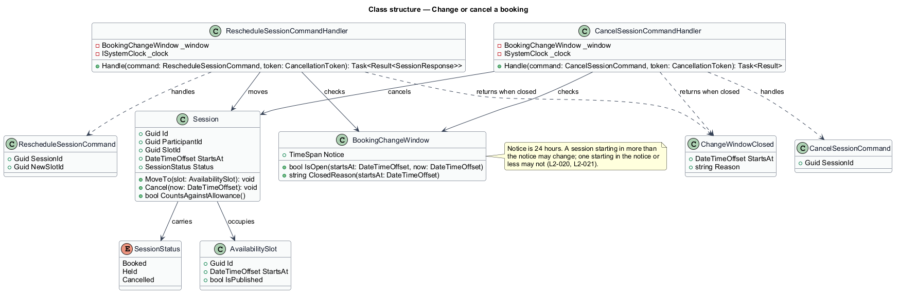
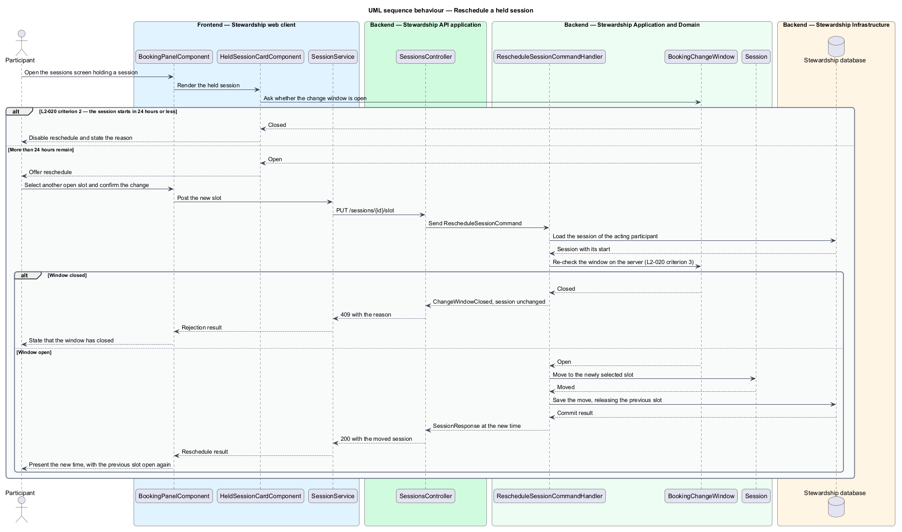
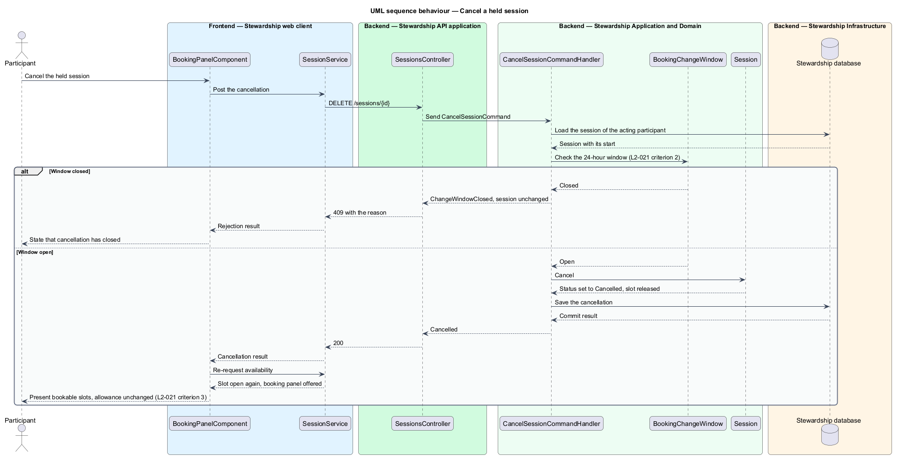

# Change or cancel a booking

## Overview

Plans change over the weeks of a cohort. A participant who has booked a 1-on-1 session can move
it to another time or give it up altogether, provided they do so far enough ahead that
the mentor can use the time. This feature owns both actions and the window that bounds
them.

**change window** — interval before a session starts during which it may be rescheduled
or cancelled

**notice** — length of that interval, being 24 hours

**released slot** — availability slot that returns to the mentor's open times when the
session occupying it moves or is cancelled

A session starting in more than 24 hours may be rescheduled to another open slot or
cancelled. A session starting in 24 hours or less may be neither; the actions are
unavailable and the screen states why rather than failing silently when pressed. The
boundary is strict: a session 24 hours and one minute away can still be changed, and one
23 hours away cannot.

Both actions release the slot they held. A rescheduled session frees its previous time
as it claims the new one, and a cancelled session frees its time outright. The released
slot is open to anyone, which is the point of a notice period — time given back early
enough to be used.

Cancelling costs a participant nothing against the cohort's six sessions. The allowance
counts sessions held and held-in-future, not sessions ever created, so a cancellation
returns the opportunity as well as the time.

The window is enforced twice, and the second time is the one that matters. The client
disables the actions and gives the reason, which is a courtesy; the API re-checks the
window when the request arrives, which is the constraint. A direct call to the endpoint
past the window is refused and the session is left as it was.

Creating a booking belongs to `sessions/book-session`. Listing sessions already held
belongs to `sessions/review-session-history`.

## Description

**Web client.**

- **`BookingPanelComponent`** — component in the `domain` library, shared across the
  `sessions` subsystem. It holds the session in a signal and posts the change.
- **`HeldSessionCardComponent`** — presentational component in the `components` library.
  It takes the session and the open-or-closed state of the window as inputs, disables
  the actions when the window has closed, and renders the stated reason.
- **`ISessionService`** / **`SESSION_SERVICE`** / **`SessionService`** — shared with the
  rest of the subsystem.

**API.**

- **`SessionsController`** — exposes `PUT /sessions/{id}/slot` for a reschedule and
  `DELETE /sessions/{id}` for a cancellation.
- **`RescheduleSessionCommand`** and **`RescheduleSessionCommandHandler`** — the request
  carrying the session and the new slot, and the MediatR handler that checks the window
  and moves the session.
- **`CancelSessionCommand`** and **`CancelSessionCommandHandler`** — the request and the
  handler that checks the window and cancels.
- **`BookingChangeWindow`** — domain value object holding the notice and answering
  `IsOpen` and `ClosedReason`. One type answers for both actions, so the two windows
  cannot drift apart, and the notice is a single value to change if it ever moves.
- **`ChangeWindowClosed`** — the refusal, carrying the start time and the reason.
- **`Session.MoveTo`**, **`Session.Cancel`**, and **`Session.CountsAgainstAllowance`** —
  the entity methods. `Cancel` sets the status rather than deleting the row, so the
  session stays auditable while releasing its slot, and `CountsAgainstAllowance` answers
  false once cancelled.
- **`AvailabilitySlot`** — domain entity. A slot is open whenever no live session
  references it, so releasing one is a consequence of changing the session rather than a
  separate write.
- **`ISystemClock`** — application abstraction supplying the current instant, so the
  24-hour boundary is exercised in a test at the minute either side of it.

Both handlers load the session scoped to the acting participant, so a request naming
another participant's session is not found rather than refused, as
`access/guard-routes` requires.

## Requirements

The feature realises the following level-2 (L2) requirements. Each L2 requirement
refines a level-1 (L1) requirement, cited by identifier. Requirement text is quoted from
`docs/specs/L2.md` unchanged.

| L2 ID | Refines (L1) | Requirement |
|-------|--------------|-------------|
| `L2-020` | `L1-005` | A held session moves to another open slot while more than 24 hours remain before its start. |
| `L2-021` | `L1-005` | Cancellation follows the same window as rescheduling and returns the slot to the mentor's availability. |

## Diagrams

### System context

A change gives time back. The mentor regains the reserved time and another participant
may claim the released slot, which is why the notice period exists at all.

### Containers

The client offers or withholds the actions, and the API decides. Both checks read the
same notice, but only the API's is a constraint.

### Components

Two handlers share one `BookingChangeWindow`, and both reach `Session` and
`AvailabilitySlot`. Releasing a slot is a consequence of the session changing rather
than a separate operation.

### Class structure

`BookingChangeWindow` is the single home of the 24-hour rule, as the note records.
`Session.Cancel` sets the status, which releases the slot while keeping the record.

### Behaviour — reschedule a held session

The window is consulted twice: once by the card, to decide what to offer, and again by
the handler, to decide what to permit. The second check is what L2-020 criterion 3
requires, since a direct API call bypasses the first.

### Behaviour — cancel a held session

Cancellation runs the same window check, sets the status, and releases the slot. The
panel returns to offering slots and the allowance is unchanged, per L2-021 criterion 3.

