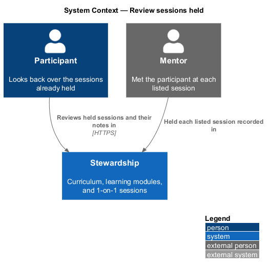
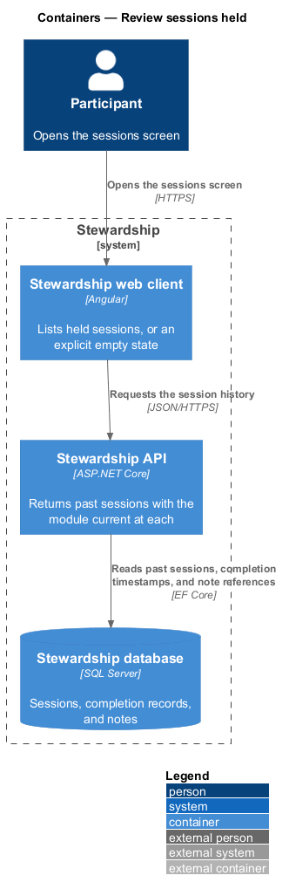
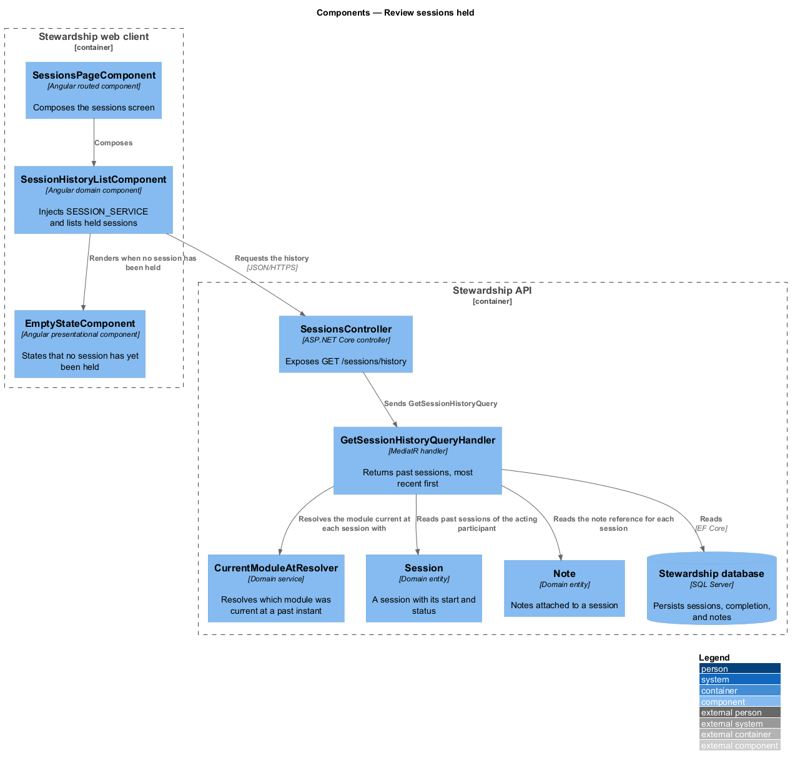
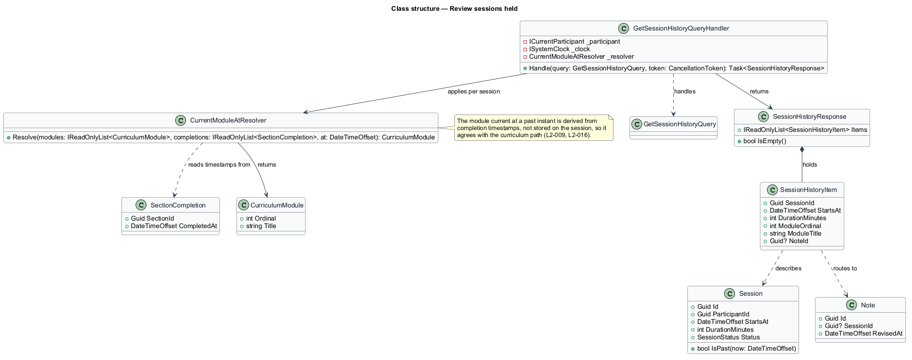
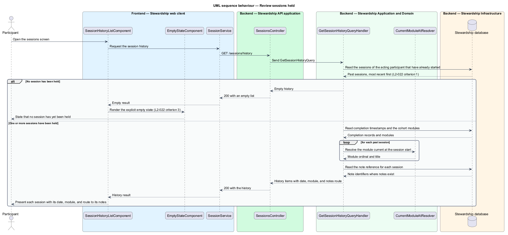

# Review sessions held

## Overview

Six 1-on-1 sessions accumulate over a Stewardship cohort, each attached to whatever the
participant was working through at the time. The sessions screen keeps that record
beneath the booking panel, so a participant can see what has already happened as well as
what is next.

**held session** — session whose start time has passed

**session history** — list of held sessions, most recent first, each with the module
current when it took place

Each entry carries three things: when the session was, which module the participant was
in, and a route to the notes belonging to it. The module is what makes the list
meaningful — a date alone says little, while a date beside the module title places the
conversation in the curriculum.

That module is derived rather than stored on the session. Completion records carry the
time they were made, so the module current at any past instant is the earliest module
not yet complete as of that instant. Deriving it keeps the history in agreement with the
curriculum path, which is derived from the same records. A snapshot written at booking
time would be a second account of the same fact, free to disagree with the first.

A participant who has held no sessions sees an explicit empty state rather than a blank
band, for the same reason the not-enrolled notice exists: an empty list and a broken one
look alike.

Only sessions that have started appear. A future session is the held booking shown in
the panel above, not a line in the history, so no entry in this list ever carries a date
still to come.

Booking belongs to `sessions/book-session`; changing a booking to
`sessions/change-booking`. Writing and reading the notes this list routes to belongs to
`notes/write-note`.

## Description

**Web client.**

- **`SessionsPageComponent`** — routed page component in the application project,
  composing the booking panel and the history list.
- **`SessionHistoryListComponent`** — component in the `domain` library. It calls
  `inject(SESSION_SERVICE)`, holds the history in a signal, and renders one row per held
  session or the empty state.
- **`EmptyStateComponent`** — presentational component in the `components` library. It
  takes the message as an input and injects nothing, so it serves this screen and the
  notes destination alike.
- **`ISessionService`** / **`SESSION_SERVICE`** / **`SessionService`** — shared with the
  rest of the subsystem.

**API.**

- **`SessionsController`** — exposes `GET /sessions/history`.
- **`GetSessionHistoryQuery`** and **`GetSessionHistoryQueryHandler`** — the query and
  the MediatR handler. It reads the acting participant's sessions whose start has
  passed, ordered most recent first, resolves the module for each, and attaches any note
  reference.
- **`SessionHistoryResponse`** and **`SessionHistoryItem`** — the response and one row of
  it, carrying the session, its start, its duration, the module ordinal and title, and
  the note identifier when one exists.
- **`CurrentModuleAtResolver`** — domain service resolving which module was current at a
  given instant from the cohort's modules and the participant's completion timestamps.
- **`Session.IsPast`** — the entity method deciding membership of the list, taken
  against `ISystemClock` rather than a stored flag, so no session can be listed before
  it has happened.
- **`Note`** — domain entity, referenced here only by identifier. Note content is not
  returned with the history; the row carries a route, and the note is read when it is
  opened.

The handler reads completion records and modules once and applies the resolver per
session, rather than issuing a query for each row.

## Requirements

The feature realises the following level-2 (L2) requirement. The L2 requirement refines a
level-1 (L1) requirement, cited by identifier. Requirement text is quoted from
`docs/specs/L2.md` unchanged.

| L2 ID | Refines (L1) | Requirement |
|-------|--------------|-------------|
| `L2-022` | `L1-005` | Past sessions are listed with their date, the module they accompanied, and a route to their notes. |

## Diagrams

### System context

The participant reviews the record; the mentor is the other party to every session in
it, from outside the scope of this design.

### Containers

One request returns the whole history, including the module for each row, so the client
makes no follow-up call per session.

### Components

`SessionHistoryListComponent` is the only client component here that injects a service.
In the API, `CurrentModuleAtResolver` is what turns a session start into a module.

### Class structure

`SessionHistoryItem` describes a `Session` and routes to a `Note` without embedding
either. The note on the diagram records why the module is derived from completion
timestamps rather than stored.

### Behaviour — review sessions held

The handler reads only sessions that have started, which satisfies L2-022 criterion 4
structurally. With none, the client renders the empty state of criterion 3; with some,
each row is resolved to its module and its notes route.

