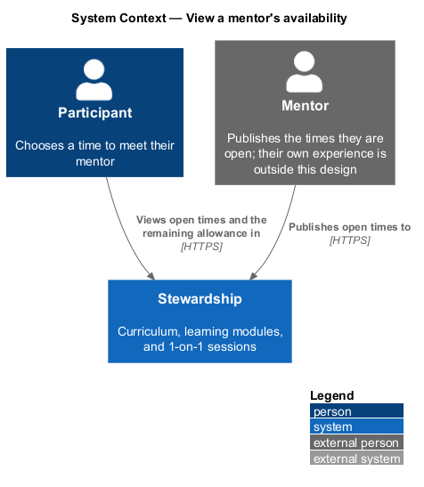
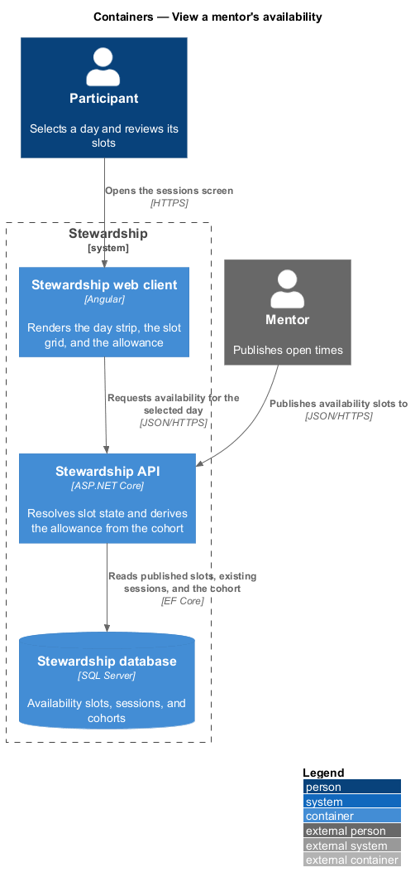
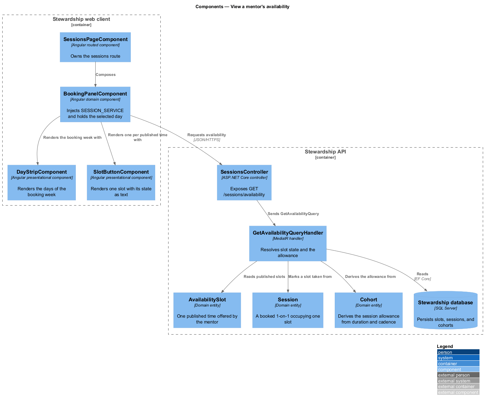
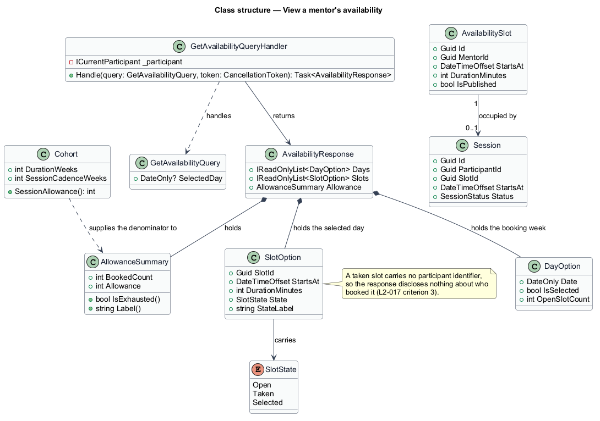
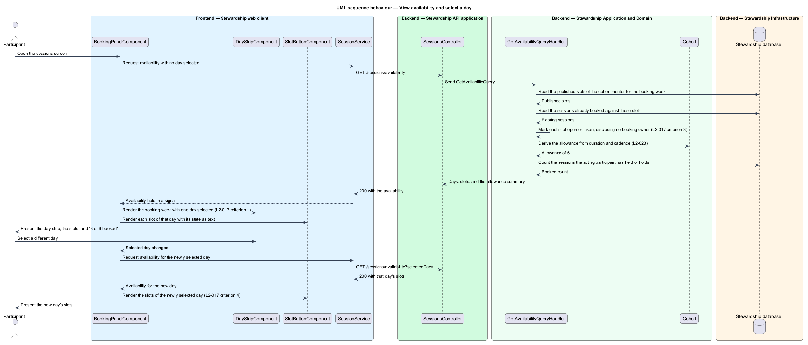

# View a mentor's availability

## Overview

Alongside the modules of its programme, a Stewardship cohort includes 1-on-1 sessions with its
mentor. Booking one begins with seeing when the mentor is free, and this feature covers
that view: the days available, the times within a chosen day, and how much of the
cohort's session allowance remains.

**availability slot** — one time the mentor has published as open for a 1-on-1 session

**booking week** — span of days the day strip offers for selection

**slot state** — one of three values a slot holds in the panel: `Open`, `Taken`, or
`Selected`

**session allowance** — number of sessions a cohort includes, derived from its duration
and cadence

The panel presents a strip of days with one selected, and the slots of that day beneath
it. Choosing another day replaces the slots without leaving the screen. Each slot carries
exactly one state, rendered as text as well as by appearance, so the difference between
a time that can be chosen and one that cannot survives greyscale and a screen reader.

A slot another participant has booked is marked taken and cannot be selected. It
discloses nothing further. The response carries no identifier, name, or hint of who
holds it — a participant learns only that the time is unavailable, which is all that
choosing another time requires.

The allowance is derived rather than authored. A cohort meeting every other week includes
one session per two weeks of its authored duration, so a twelve-week cohort includes six
and an eight-week cohort includes four. The figure shown is that division, not a number
written into content. The booked count is likewise counted from the participant's own sessions.
Presenting "3 of 6 booked" is therefore a statement about records rather than a caption
that can drift from them.

The mentor publishes the slots this feature reads. That publishing is outside the scope
of this design, which covers the participant experience; the mentor appears here as an
external party.

Turning a selected slot into a session belongs to `sessions/book-session`. Changing or
cancelling one belongs to `sessions/change-booking`.

## Description

**Web client.**

- **`SessionsPageComponent`** — routed page component in the application project. It
  owns the sessions route and composes the panel and the history band.
- **`BookingPanelComponent`** — component in the `domain` library. It calls
  `inject(SESSION_SERVICE)`, holds the availability and the selected day in signals, and
  re-requests when the day changes. It belongs in `domain` because it injects an `api`
  contract.
- **`DayStripComponent`** — presentational component in the `components` library. It
  takes the days as an input and emits the selected day as an output.
- **`SlotButtonComponent`** — presentational component in the `components` library. It
  takes one slot and its state as inputs, renders the state label as text, and is
  disabled when the state is `Taken`.
- **`ISessionService`** / **`SESSION_SERVICE`** / **`SessionService`** — the contract,
  its `InjectionToken`, and the HTTP implementation, each in its own file in the `api`
  library.

**API.**

- **`SessionsController`** — exposes `GET /sessions/availability`, taking an optional
  selected day.
- **`GetAvailabilityQuery`** and **`GetAvailabilityQueryHandler`** — the query and the
  MediatR handler. It reads the mentor's published slots for the booking week, reads the
  sessions booked against them, marks each slot, and derives the allowance.
- **`AvailabilityResponse`** — carries the days of the booking week, the slots of the
  selected day, and the allowance summary.
- **`SlotOption`** — one slot in the response, carrying its identifier, start, duration,
  state, and the state label. It carries no participant field at all, which is what
  makes non-disclosure structural rather than a matter of remembering to omit it.
- **`DayOption`** — one day of the strip, carrying its date, whether it is selected, and
  how many slots on it are open.
- **`SlotState`** — enumeration of `Open`, `Taken`, and `Selected`.
- **`AllowanceSummary`** — value object over the booked count and the derived allowance,
  exposing `IsExhausted` and `Label`.
- **`AvailabilitySlot`** — domain entity for one published time, owned by the mentor.
- **`Session`** — domain entity for a booked 1-on-1, referencing the slot it occupies.
- **`Cohort.SessionAllowance`** — the derivation, designed in
  `enrollment/resolve-cohort` and consumed here.

Slot state is resolved in the handler from the two sets it has already read, rather than
stored on the slot. A slot is therefore never persistently marked taken; it is taken
exactly while a session references it, which is what keeps a cancellation from leaving a
stale mark behind.

## Requirements

The feature realises the following level-2 (L2) requirements. Each L2 requirement
refines a level-1 (L1) requirement, cited by identifier. Requirement text is quoted from
`docs/specs/L2.md` unchanged.

| L2 ID | Refines (L1) | Requirement |
|-------|--------------|-------------|
| `L2-017` | `L1-005` | The booking panel shows a day strip and the time slots for the selected day, each slot in exactly one of three states: open, taken, or selected. |
| `L2-023` | `L1-005` | The number of sessions a cohort includes is computed from the cohort's own authored duration and cadence, never from a constant: a 12-week cohort at one session every other week yields 6. |

## Diagrams

### System context

Two people take part. The participant views availability; the mentor publishes it from
outside the scope of this design.

### Containers

The web client requests availability for one day at a time, and the API resolves state
by reading slots and sessions together.

### Components

The panel is the only client component that injects a service; the day strip and the
slot button take inputs and emit outputs. In the API, the allowance comes from `Cohort`
rather than from the handler.

### Class structure

An `AvailabilitySlot` is occupied by at most one `Session`, which is what makes taken a
derived state rather than a stored one. The note records why `SlotOption` has no
participant field.

### Behaviour — view availability and select a day

The first exchange loads the booking week with a day selected and the allowance derived
per L2-023. The second shows the day change of L2-017 criterion 4, which replaces the
slots without leaving the screen.

